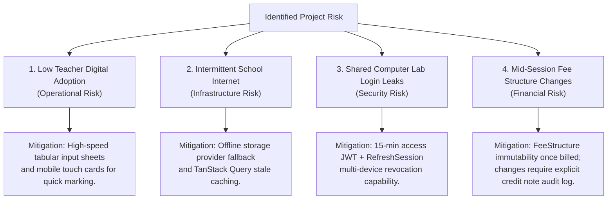

# ASSUMPTIONS, OPEN QUESTIONS & RISK ANALYSIS: LITTLE ANGELS SCHOOL

## 1. Architectural & Operational Assumptions
In accordance with the strict requirement to never fabricate unknown institutional data, the system architecture operates under the following explicit assumptions:

### 1.1. Academic & Curriculum Assumptions
* **Academic Session Calendar Configuration**: Academic session start and end dates are **100% configurable** by the administration. While Indian schools commonly follow April 1 to March 31, April–March is used **only as development seed data** and never hardcoded in domain rules.
* **Grade Levels & Nomenclature**: Assumed to include 13 distinct class levels:
  * Pre-Primary: `Nursery`, `LKG` (Lower Kindergarten), `UKG` (Upper Kindergarten).
  * Primary & Secondary: `Class 1` through `Class 10`.
* **Board Affiliation**: While Little Angels School is in Gohad, MP (potentially MP State Board / MPBSE or CBSE), the grading scale and report card format are treated as **configurable rules (`GradeRule`)** so that either board's marking scheme can be supported without source code changes.

### 1.2. Operational & Financial Assumptions
* **Offline Payment Dominance**: As requested ("Do NOT implement online payment processing initially, but keep the architecture extensible for it"), the fee collection engine is designed around **in-person offline transactions** (Cash, Cheque, Demand Draft, NEFT/IMPS Bank Transfer) recorded by authorized school staff.
* **Fee Installment Cycles**: Assumed that fees can be configured as **Annual**, **Quarterly**, or **Monthly** heads.
* **SMS & Notification Gateway**: Assumed that while initial Phase 1-12 alerts will be in-app portal notifications and email circulars, the event publisher architecture will integrate with **TRAI/DLT-compliant Indian SMS gateways** (e.g., MSG91, TextLocal) and WhatsApp API in a future release.
* **Environment-Configurable Origins & URLs**: Assumed that all production URLs, CORS allowed origins, and CDN endpoints are configured via environment variables (`.env`). No domains are hard-coded.
* **Single-School Scope with Extensibility**: Assumed that the platform is deployed for a single school. While an indexed `schoolId` is retained on domain entities to prevent future schema refactoring, zero multi-tenant SaaS infrastructure (tenant subdomain routing, dynamic schema switching) is implemented.

---

## 2. Open Questions for School Stakeholders (To be Resolved in Phase 1/2)

| # | Domain | Open Question / Clarification Needed | Recommended System Default (If Unresolved) |
| :--- | :--- | :--- | :--- |
| **Q1** | **Academics** | What exact grading scale is currently used for Pre-Primary vs. Class 1-10 (e.g., 5-point letter grades A-E vs. 8-point CBSE scale A1-E)? | Default to 5-point letter grade (`A+, A, B, C, D/Fail`) configurable via `GradeRule`. |
| **Q2** | **Attendance** | Do teachers mark attendance once per day (Section Class Teacher) or period-wise per subject? | Default to **Daily Section-Wise Attendance** marked by the Class Teacher. |
| **Q3** | **Fees** | What are the exact fee concession rules (e.g., sibling discount percentage, staff child concession, merit scholarships)? | Provide a flexible `discountAmount` and `concessionReason` text field per student fee item. |
| **Q4** | **Admissions** | Does an admission inquiry require an entrance test score or application fee before moving to `"ADMITTED"` status? | Default to manual pipeline progression (`New -> Campus Visited -> Application Submitted -> Admitted`). |
| **Q5** | **SMS/WhatsApp**| What is the school's registered DLT (Distributed Ledger Technology) Principal Entity ID for sending SMS in India? | Default to Email + In-App Portal Notifications until DLT credentials are provided. |
| **Q6** | **Deployment**| Will the production deployment run on a cloud VPS (e.g., AWS, Hostinger, DigitalOcean) or a local on-premise school server? | Build with Docker Compose supporting both Cloud VPS and On-Premise deployments. |

---

## 3. Comprehensive Project Risk Analysis & Mitigations

### 3.1. Detailed Risk Mitigation Table

| Risk Category | Risk Scenario | Architectural / Operational Mitigation |
| :--- | :--- | :--- |
| **1. Operational / Adoption** | Teachers in semi-urban areas may resist cumbersome data entry for daily attendance and exam marks. | Design the `<AttendanceSheet />` as a one-click default-to-present toggle list. Design `<MarkEntryTable />` with Excel-like keyboard navigation (`Tab` / `Enter` to next cell) and tabular numbers. |
| **2. Infrastructure / Connectivity** | Intermittent internet connectivity at the school campus in Gohad, MP causing partial form submissions. | Frontend uses TanStack Query optimistic updates and local form state persistence. Backend database transactions ensure that partial mark batches or fee payments never commit in an invalid state. |
| **3. Security / Shared Computers** | Staff or students forgetting to log out on shared library/lab computers, leading to unauthorized account access. | Zero token storage in `localStorage`. Enforce 15-minute access JWT expiration, HTTP-only refresh cookies, and multi-device `RefreshSession` revocation (including an administrative and self-service **"Log out from all devices"** endpoint). |
| **4. Financial / Accounting** | School leadership modifying fee structures mid-session after some students have already paid. | `FeeStructure` items are locked against price edits once referenced by a `StudentFee` record. Price adjustments must be executed via individual student concessions or a new fee head with a mandatory `AuditLog` entry. |
