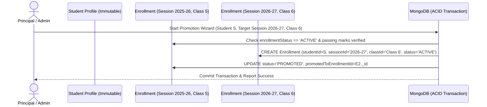

# DATABASE SCHEMA & DATA MODELING: LITTLE ANGELS SCHOOL — SCHOOL ERP

## 1. Data Architecture Principles

The database layer is designed for **MongoDB (Mongoose ODM)** using a **Hybrid Relational-Document Data Model**. 

### Key Design Anti-Pattern Avoidance: "The Giant Student Document"
A naive MongoDB schema embeds attendance, homework, exams, and fee payments inside a single `Student` document. This anti-pattern leads to:
* Document size exceeding the 16MB BSON limit over a student's 12-year academic journey (Pre-Primary to Class 10).
* Unindexable arrays and expensive concurrent write contention.
* Loss of historical data when a student is promoted to a new class.

### Our Solution: Session-Scoped Normalized Enrollments & Normalized Relationships
1. **Immutable Core Identity**: The `Student` collection stores only static profile information (name, DOB, blood group, admission number).
2. **Normalized Family Relationships (`StudentGuardian`)**: Rather than duplicating guardian arrays on Student and children arrays on Guardian, a dedicated `StudentGuardian` join collection models relationship type, primary guardian designation, and granular permissions (`canPickup`, `canReceiveFinancialNotices`, `canViewAcademicReports`).
3. **Multi-Device Auth Sessions (`RefreshSession`)**: Instead of storing a single token hash on `User`, a dedicated `RefreshSession` collection supports multiple devices, IP/User-Agent tracking, TTL expiration, and targeted/global token revocation.
4. **Session-Scoped Academic History**: The `Enrollment` collection represents a student's membership in a specific `AcademicSession + Class + Section`. Attendance, Homework Submissions, Examination Marks, and Student Fee structures reference `Enrollment`, ensuring complete historical preservation.

---

## 2. Entity Relationship & Data Flow Diagram

```mermaid
erDiagram
    User ||--o| Teacher : "authenticates as"
    User ||--o| Student : "authenticates as"
    User ||--o| Guardian : "authenticates as"
    User }|--|| Role : "assigned"
    User ||--|{ RefreshSession : "maintains active"
    Role ||--|{ Permission : "grants"

    Guardian ||--|{ StudentGuardian : "links via"
    Student ||--|{ StudentGuardian : "links via"
    Student ||--|{ Enrollment : "enrolls in session"
    AcademicSession ||--|{ Enrollment : "scopes"
    Class ||--|{ Section : "subdivides into"
    Class ||--|{ Enrollment : "assigns class"
    Section ||--|{ Enrollment : "assigns section"

    Teacher ||--|{ TeachingAssignment : "teaches"
    AcademicSession ||--|{ TeachingAssignment : "scopes"
    Class ||--|{ TeachingAssignment : "targets class"
    Section ||--|{ TeachingAssignment : "targets section"
    Subject ||--|{ TeachingAssignment : "targets subject"

    Enrollment ||--|{ Attendance : "records daily"
    TeachingAssignment ||--|{ Homework : "creates"
    Homework ||--|{ HomeworkSubmission : "receives"
    Enrollment ||--|{ HomeworkSubmission : "submits"

    AcademicSession ||--|{ Exam : "scopes"
    Exam ||--|{ ExamSubject : "includes"
    Subject ||--|{ ExamSubject : "evaluated in"
    ExamSubject ||--|{ Mark : "records marks"
    Enrollment ||--|{ Mark : "receives mark"
    Enrollment ||--|{ ReportCard : "receives term report"

    AcademicSession ||--|{ FeeStructure : "defines"
    Class ||--|{ FeeStructure : "applies to"
    Enrollment ||--|{ StudentFee : "billed via"
    FeeStructure ||--|{ StudentFee : "instantiates"
    StudentFee ||--|{ Payment : "paid through"
    Payment ||--|| Receipt : "generates"
```

---

## 3. Comprehensive Entity Dictionary & Schema Definitions

Every collection includes standard timestamp fields (`createdAt`, `updatedAt`) and an indexed `schoolId` identifier (`default: "LAPS-GOHAD"`) for single-school extensibility.

### 3.1. Identity, Authentication & Session Collections

#### 1. `User`
Central authentication identity for all system actors.
* **Fields**:
  * `_id`: ObjectId
  * `schoolId`: String (Indexed, required, default `"LAPS-GOHAD"`)
  * `username`: String (Unique, lowercase, trimmed)
  * `email`: String (Unique sparse index, lowercase)
  * `phone`: String (Indexed, E.164 format)
  * `passwordHash`: String (Bcrypt/Argon2i hashed, `select: false`)
  * `roleId`: ObjectId -> `Role` (Indexed)
  * `userType`: Enum (`"SUPER_ADMIN" | "SCHOOL_ADMIN" | "TEACHER" | "STUDENT" | "GUARDIAN" | "STAFF"`)
  * `profileRef`: ObjectId (Polymorphic reference to Student/Teacher/Guardian/Staff `_id`)
  * `isActive`: Boolean (Default `true`)
  * `lastLoginAt`: Date
* **Indexes**:
  * `{ schoolId: 1, username: 1 }` (Unique)
  * `{ schoolId: 1, email: 1 }` (Unique sparse)
  * `{ schoolId: 1, userType: 1, isActive: 1 }`

#### 2. `RefreshSession` (Multi-Device Authentication Session)
Manages multi-device refresh tokens, session families, rotation, revocation, and security auditing.
* **Fields**:
  * `_id`: ObjectId
  * `userId`: ObjectId -> `User` (Indexed, required)
  * `sessionFamilyId`: String (UUID, indexed — groups token rotations for a single device/login session)
  * `refreshTokenHash`: String (Hashed secure token, `select: false`)
  * `expiresAt`: Date (Indexed for MongoDB TTL automatic cleanup)
  * `isRevoked`: Boolean (Default `false`)
  * `deviceInfo`: String (e.g., `"Chrome on Windows 11"`, `"Safari on iPhone"`)
  * `ipAddress`: String
  * `userAgent`: String
  * `createdAt`: Date (Default `Date.now`)
* **Indexes**:
  * `{ userId: 1, isRevoked: 1 }`
  * `{ sessionFamilyId: 1 }`
  * `{ expiresAt: 1 }` (TTL Index — automatically removes expired sessions)
* **Rotation & Reuse Detection**: Each device login creates a new `sessionFamilyId`. On refresh, a new token is issued with the same `sessionFamilyId` and the previous token is marked `isRevoked = true`. If an already-revoked token is replayed, the system logs `SUSPICIOUS_REFRESH_REUSE` and revokes only that `sessionFamilyId` (`isRevoked: true` for all records with that `sessionFamilyId`), without revoking unrelated valid device sessions. `logout-all` remains the explicit mechanism for revoking every session family belonging to the account.

#### 3. `Role`
RBAC role definition.
* **Fields**:
  * `_id`: ObjectId
  * `schoolId`: String (Indexed)
  * `name`: String (e.g., `"SUPER_ADMIN"`, `"TEACHER"`, `"STUDENT"`, `"GUARDIAN"`, `"ACCOUNTANT"`)
  * `description`: String
  * `isSystemRole`: Boolean (Default `false` — cannot be deleted if true)
* **Indexes**:
  * `{ schoolId: 1, name: 1 }` (Unique)

#### 4. `Permission`
Atomic authorization capabilities mapped to roles.
* **Fields**:
  * `_id`: ObjectId
  * `roleId`: ObjectId -> `Role` (Indexed)
  * `module`: Enum (`"ACADEMIC" | "ATTENDANCE" | "HOMEWORK" | "EXAM" | "FEE" | "COMMUNICATION" | "USER" | "CMS" | "AUDIT"`)
  * `action`: Enum (`"CREATE" | "READ" | "UPDATE" | "DELETE" | "PUBLISH" | "APPROVE" | "EXPORT"`)
  * `resource`: String (e.g., `"homework"`, `"attendance"`, `"marks"`, `"fee_payment"`)
  * `scope`: Enum (`"GLOBAL" | "ASSIGNED_CLASS" | "ASSIGNED_SUBJECT" | "OWN_CHILD" | "SELF"`)
* **Indexes**:
  * `{ roleId: 1, resource: 1, action: 1 }` (Unique)

---

### 3.2. Institutional & Academic Organization Collections

#### 5. `AcademicSession`
Defines school academic years with **configurable start and end dates** (no hardcoded April–March assumption) and historical preservation.
* **Fields**:
  * `_id`: ObjectId
  * `name`: String (e.g., `"2026-2027"`, `"2027-2028"`)
  * `startDate`: Date (Configurable)
  * `endDate`: Date (Configurable)
  * `isCurrent`: Boolean (Default `false`)
  * `status`: Enum (`"PLANNED" | "ACTIVE" | "ARCHIVED"`) (Default `"PLANNED"`)
  * `isPromotionLocked`: Boolean (Default `false`)
  * `createdBy`: ObjectId -> `User`
  * `updatedBy`: ObjectId -> `User`
  * `archivedBy`: ObjectId -> `User` (Optional)
  * `archivedAt`: Date (Optional)
  * `createdAt`: Date (Default `Date.now`)
  * `updatedAt`: Date (Default `Date.now`)
* **Indexes**:
  * `{ name: 1 }` (Unique)
  * `{ isCurrent: 1 }`
  * `{ status: 1 }`
* **Session Activation Rule**: When a session is activated (`status = "ACTIVE"`, `isCurrent = true`), the backend atomically unsets `isCurrent: false` on any previously active session within a MongoDB transaction.
* **Soft-Delete Only & Archive Behavior**: Master data is **never physically deleted** from the database. Endpoints perform soft-deletion (`status: "ARCHIVED"`, setting `archivedBy` and `archivedAt`).

#### 6. `Class`
Academic grade levels configurable from Pre-Primary up to Class 10 (no hardcoded enum constraints).
* **Fields**:
  * `_id`: ObjectId
  * `name`: String (e.g., `"Nursery"`, `"LKG"`, `"UKG"`, `"Class 1"`, `"Class 10"`)
  * `code`: String (Auto-generated if not provided, e.g., `"CLS-NUR"`, `"CLS-LKG"`, `"CLS-01"`, `"CLS-10"`)
  * `level`: Enum (`"PRE_PRIMARY" | "PRIMARY" | "MIDDLE" | "SECONDARY"`)
  * `orderSequence`: Number (For sorted UI rendering, e.g., 1 for Nursery, 2 for LKG, 3 for UKG, 4 for Class 1 ... 13 for Class 10)
  * `status`: Enum (`"ACTIVE" | "ARCHIVED"`) (Default `"ACTIVE"`)
  * `createdBy`: ObjectId -> `User`
  * `updatedBy`: ObjectId -> `User`
  * `archivedBy`: ObjectId -> `User` (Optional)
  * `archivedAt`: Date (Optional)
  * `createdAt`: Date (Default `Date.now`)
  * `updatedAt`: Date (Default `Date.now`)
* **Indexes**:
  * `{ code: 1 }` (Unique)
  * `{ name: 1 }` (Unique)
  * `{ orderSequence: 1 }`
  * `{ status: 1 }`

#### 7. `Section`
Subdivision of a class scoped to an academic session (`Academic Session -> Class -> Section`).
* **Fields**:
  * `_id`: ObjectId
  * `academicSessionId`: ObjectId -> `AcademicSession` (Indexed, required)
  * `classId`: ObjectId -> `Class` (Indexed, required)
  * `name`: String (e.g., `"A"`, `"B"`, `"C"`)
  * `roomNumber`: String (Optional)
  * `maxCapacity`: Number (Default `40`)
  * `status`: Enum (`"ACTIVE" | "ARCHIVED"`) (Default `"ACTIVE"`)
  * `createdBy`: ObjectId -> `User`
  * `updatedBy`: ObjectId -> `User`
  * `archivedBy`: ObjectId -> `User` (Optional)
  * `archivedAt`: Date (Optional)
  * `createdAt`: Date (Default `Date.now`)
  * `updatedAt`: Date (Default `Date.now`)
* **Indexes**:
  * `{ academicSessionId: 1, classId: 1, name: 1 }` (Unique — prevents duplicate section names within a class for a session)
  * `{ classId: 1, status: 1 }`

#### 8. `Subject`
Global master curriculum subjects prepared for Homework, Attendance, Timetable, and Marks integration. **Subject is a global master entity not bound directly to Class; class-subject mapping will be introduced separately.**
* **Fields**:
  * `_id`: ObjectId
  * `name`: String (e.g., `"Mathematics"`, `"General Science"`, `"Hindi"`)
  * `code`: String (Auto-generated if not provided, e.g., `"SUB-MATH"`, `"SUB-SCI"`, `"SUB-ENG"`)
  * `shortName`: String (e.g., `"MATH"`, `"SCI"`, `"ENG"`, `"HIN"`)
  * `subjectType`: Enum (`"THEORY" | "PRACTICAL" | "CO_CURRICULAR"`) (Default `"THEORY"`)
  * `isOptional`: Boolean (Default `false`)
  * `status`: Enum (`"ACTIVE" | "ARCHIVED"`) (Default `"ACTIVE"`)
  * `createdBy`: ObjectId -> `User`
  * `updatedBy`: ObjectId -> `User`
  * `archivedBy`: ObjectId -> `User` (Optional)
  * `archivedAt`: Date (Optional)
  * `createdAt`: Date (Default `Date.now`)
  * `updatedAt`: Date (Default `Date.now`)
* **Indexes**:
  * `{ code: 1 }` (Unique global subject code)
  * `{ name: 1 }` (Unique)
  * `{ status: 1 }`

---

### 3.3. Student, Guardian & Teacher Core Profiles

#### 9. `Student`
Independent student profile representing demographic and biographical information. **Do NOT store class or section inside Student** (`Enrollment` manages historical and active class membership).
* **Fields**:
  * `_id`: ObjectId
  * `admissionNumber`: String (Unique institutional ID, e.g., `"LAPS-2026-0001"`, auto-generated sequentially by year prefix — never ObjectId)
  * `admissionDate`: Date (Default `Date.now`)
  * `firstName`: String (Required)
  * `middleName`: String (Optional)
  * `lastName`: String (Required)
  * `gender`: Enum (`"MALE" | "FEMALE" | "OTHER"`)
  * `dateOfBirth`: Date (Required)
  * `bloodGroup`: String (Optional, e.g., `"O+"`, `"B+"`)
  * `category`: Enum (`"GENERAL" | "OBC" | "SC" | "ST" | "OTHER"`) (Optional)
  * `religion`: String (Optional)
  * `nationality`: String (Default `"Indian"`)
  * `photoUrl`: String (Optional avatar URL)
  * `email`: String (Optional, unique sparse)
  * `phone`: String (Optional)
  * `address`: String (Required)
  * `city`: String (Default `"Gohad"`)
  * `state`: String (Default `"Madhya Pradesh"`)
  * `country`: String (Default `"India"`)
  * `pinCode`: String (Required)
  * `emergencyContacts`: Array<{ name: String; relationship: String; phone: String }> (Required collection of emergency contacts)
  * `documents`: Array<{ title: String; category?: String; fileUrl: String; uploadedAt: Date }> (Metadata array storing document titles and file URLs only — no binary storage)
  * `status`: Enum (`"ACTIVE" | "ARCHIVED"`) (Default `"ACTIVE"` — **Promotion, transfer, withdrawal, completion, and alumni status must be tracked ONLY in Enrollment**)
  * `createdBy`: ObjectId -> `User`
  * `updatedBy`: ObjectId -> `User`
  * `archivedBy`: ObjectId -> `User` (Optional)
  * `archivedAt`: Date (Optional)
  * `createdAt`: Date (Default `Date.now`)
  * `updatedAt`: Date (Default `Date.now`)
* **Indexes**:
  * `{ admissionNumber: 1 }` (Unique)
  * `{ email: 1 }` (Unique sparse)
  * `{ status: 1 }`
  * `{ firstName: 1, lastName: 1 }`
* **Reserved Extension Points (Documentation Only)**:
  * Designed to seamlessly integrate with future **Student Documents** (transfer certificate scans, birth certificate verification), **Medical Records** (allergies, health checkup logs), and **Certificates** (bonafide, TC, graduation certificates) modules without schema breaking changes.

#### 10. `Guardian`
Guardian profile supporting Father, Mother, Legal Guardian, or Other relatives.
* **Fields**:
  * `_id`: ObjectId
  * `name`: String (Required)
  * `relationship`: Enum (`"FATHER" | "MOTHER" | "LEGAL_GUARDIAN" | "OTHER"`) (Primary relationship category)
  * `phone`: String (Required, indexed)
  * `email`: String (Optional, unique sparse)
  * `occupation`: String (Optional)
  * `annualIncome`: Number (Optional)
  * `photoUrl`: String (Optional)
  * `sameAsStudentAddress`: Boolean (Default `false` — avoids unnecessary address duplication when guardian resides with student)
  * `address`: String (Required if `sameAsStudentAddress` is false)
  * `emergencyContacts`: Array<{ name: String; relationship: String; phone: String }> (Collection of emergency contacts)
  * `status`: Enum (`"ACTIVE" | "ARCHIVED"`) (Default `"ACTIVE"`)
  * `createdBy`: ObjectId -> `User`
  * `updatedBy`: ObjectId -> `User`
  * `archivedBy`: ObjectId -> `User` (Optional)
  * `archivedAt`: Date (Optional)
  * `createdAt`: Date (Default `Date.now`)
  * `updatedAt`: Date (Default `Date.now`)
* **Indexes**:
  * `{ phone: 1 }`
  * `{ email: 1 }` (Unique sparse)
  * `{ status: 1 }`

#### 11. `StudentGuardian` (Normalized Relationship Model)
**CRITICAL ENTITY**: Normalized join entity linking `Student` and `Guardian` without array embedding. Supports Many-to-Many relationships (`One Student -> Many Guardians`, `One Guardian -> Many Students`).
* **Fields**:
  * `_id`: ObjectId
  * `studentId`: ObjectId -> `Student` (Indexed, required)
  * `guardianId`: ObjectId -> `Guardian` (Indexed, required)
  * `relationship`: Enum (`"FATHER" | "MOTHER" | "LEGAL_GUARDIAN" | "OTHER"`) (Required)
  * `isPrimaryGuardian`: Boolean (Default `false` — exactly one primary guardian per student enforced)
  * `pickupPermission`: Boolean (Default `true`)
  * `emergencyContactPermission`: Boolean (Default `true`)
  * `createdBy`: ObjectId -> `User`
  * `updatedBy`: ObjectId -> `User`
  * `createdAt`: Date (Default `Date.now`)
  * `updatedAt`: Date (Default `Date.now`)
* **Indexes**:
  * `{ studentId: 1, guardianId: 1 }` (Unique — prevents duplicate relationship rows)
  * `{ studentId: 1, isPrimaryGuardian: 1 }` (Indexed for fast primary guardian lookup)
  * `{ guardianId: 1 }`

#### 12. `Teacher`
Academic teacher profile linked to `User` account (Demographic & professional profile only — **does NOT include payroll, salary, or leave management fields**). `Teacher` is an academic profile entity, not the authentication account itself.
* **Fields**:
  * `_id`: ObjectId
  * `userId`: ObjectId -> `User` (Indexed, optional sparse — links to authentication account)
  * `employeeId`: String (Unique, auto-generated if not provided, e.g., `"TCH-0001"`, `"TCH-0002"`)
  * `firstName`: String
  * `lastName`: String
  * `email`: String (Indexed, unique sparse)
  * `phone`: String
  * `qualification`: String (e.g., `"B.Ed, M.Sc Mathematics"`)
  * `designation`: Enum (`"PRT" | "TGT" | "PGT" | "HEAD_MISTRESS" | "ASSISTANT_TEACHER"`)
  * `joiningDate`: Date
  * `isClassTeacher`: Boolean (Default `false`)
  * `photoUrl`: String (Optional avatar URL)
  * `status`: Enum (`"ACTIVE" | "ON_LEAVE" | "INACTIVE" | "ARCHIVED"`) (Default `"ACTIVE"`)
  * `createdBy`: ObjectId -> `User`
  * `updatedBy`: ObjectId -> `User`
  * `archivedBy`: ObjectId -> `User` (Optional)
  * `archivedAt`: Date (Optional)
  * `createdAt`: Date (Default `Date.now`)
  * `updatedAt`: Date (Default `Date.now`)
* **Indexes**:
  * `{ employeeId: 1 }` (Unique)
  * `{ email: 1 }` (Unique sparse)
  * `{ userId: 1 }` (Unique sparse)
  * `{ status: 1 }`

#### 13. `Staff`
Non-teaching administrative staff (Receptionist, Accountant, Librarian).
* **Fields**:
  * `_id`: ObjectId
  * `schoolId`: String
  * `employeeId`: String (Unique)
  * `firstName`: String
  * `lastName`: String
  * `department`: Enum (`"FINANCE" | "RECEPTION" | "LIBRARY" | "TRANSPORT" | "ADMIN"`)
  * `phone`: String
* **Indexes**:
  * `{ schoolId: 1, employeeId: 1 }` (Unique)

---

### 3.4. Enrollment & Teaching Assignment Architecture (Historical Core)

#### 14. `Enrollment`
**CRITICAL ENTITY**: Represents where a student studies for a single academic session (`Student -> Academic Session -> Class -> Section -> Roll Number -> Enrollment Status`). **Never overwrite history** — every academic year creates a new `Enrollment` record.
* **Fields**:
  * `_id`: ObjectId
  * `studentId`: ObjectId -> `Student` (Indexed, required)
  * `academicSessionId`: ObjectId -> `AcademicSession` (Indexed, required)
  * `classId`: ObjectId -> `Class` (Indexed, required)
  * `sectionId`: ObjectId -> `Section` (Indexed, required)
  * `rollNumber`: Number (Unique per academic session + class + section)
  * `enrollmentDate`: Date (Default `Date.now`)
  * `enrollmentStatus`: Enum (`"ACTIVE" | "PROMOTED" | "TRANSFERRED" | "WITHDRAWN" | "COMPLETED" | "ARCHIVED"`) (Default `"ACTIVE"`)
  * `promotedToEnrollmentId`: ObjectId -> `Enrollment` (Optional self-reference for tracking promotion chain forward)
  * `previousEnrollmentId`: ObjectId -> `Enrollment` (Optional self-reference for tracking historical chain backward)
  * `remarks`: String (Optional notes on transfer/withdrawal/promotion)
  * `createdBy`: ObjectId -> `User`
  * `updatedBy`: ObjectId -> `User`
  * `archivedBy`: ObjectId -> `User` (Optional)
  * `archivedAt`: Date (Optional)
  * `createdAt`: Date (Default `Date.now`)
  * `updatedAt`: Date (Default `Date.now`)
* **Indexes**:
  * `{ academicSessionId: 1, studentId: 1 }` (Unique — a student can have at most one enrollment per academic session)
  * `{ academicSessionId: 1, classId: 1, sectionId: 1, rollNumber: 1 }` (Unique — prevents duplicate roll numbers in the same section of a session)
  * `{ studentId: 1, enrollmentStatus: 1 }`

#### 15. `TeachingAssignment`
**CRITICAL FOUNDATIONAL ANCHOR**: Maps authorization scopes for teachers per academic session (`Teacher -> Academic Session -> Class -> Section -> Subject`). Every future module (Homework, Attendance, Marks, Timetable) relies on this entity for scoped access control.
* **Fields**:
  * `_id`: ObjectId
  * `teacherId`: ObjectId -> `Teacher` (Indexed, required)
  * `academicSessionId`: ObjectId -> `AcademicSession` (Indexed, required)
  * `classId`: ObjectId -> `Class` (Indexed, required)
  * `sectionId`: ObjectId -> `Section` (Indexed, required)
  * `subjectId`: ObjectId -> `Subject` (Indexed, required)
  * `isClassTeacher`: Boolean (Default `false` — grants section-wide attendance and report card rights)
  * `status`: Enum (`"ACTIVE" | "ARCHIVED"`) (Default `"ACTIVE"`)
  * `createdBy`: ObjectId -> `User`
  * `updatedBy`: ObjectId -> `User`
  * `archivedBy`: ObjectId -> `User` (Optional)
  * `archivedAt`: Date (Optional)
  * `createdAt`: Date (Default `Date.now`)
  * `updatedAt`: Date (Default `Date.now`)
* **Indexes**:
  * `{ academicSessionId: 1, classId: 1, sectionId: 1, subjectId: 1 }` (Unique for active assignments — ensures exactly one primary subject teacher per section per session)
  * `{ academicSessionId: 1, teacherId: 1, classId: 1, sectionId: 1, subjectId: 1 }` (Unique — prevents assigning the same teacher twice to the same subject/section)
  * `{ teacherId: 1, academicSessionId: 1, status: 1 }`

---

### 3.5. Curriculum, Timetable & Academic Calendar Collections (Phase 5)

#### 16. `AcademicTerm`
Optional academic term layer beneath Academic Session (`Academic Session -> Academic Term`) supporting future examination blocks, term-wise grading, and report card compilation.
* **Fields**:
  * `_id`: ObjectId
  * `academicSessionId`: ObjectId -> `AcademicSession` (Indexed, required)
  * `name`: String (e.g., `"Term 1"`, `"Term 2"`, `"Mid-Term Semester"`, `"Annual Semester"`)
  * `code`: String (e.g., `"TRM-1"`, `"TRM-2"`)
  * `startDate`: String (`"YYYY-MM-DD"`, required)
  * `endDate`: String (`"YYYY-MM-DD"`, required)
  * `orderSequence`: Number (Required, e.g., 1 for Term 1, 2 for Term 2)
  * `status`: Enum (`"ACTIVE" | "ARCHIVED"`) (Default `"ACTIVE"`)
  * `createdBy`: ObjectId -> `User`
  * `updatedBy`: ObjectId -> `User`
  * `archivedBy`: ObjectId -> `User` (Optional)
  * `archivedAt`: Date (Optional)
  * `createdAt`: Date (Default `Date.now`)
  * `updatedAt`: Date (Default `Date.now`)
* **Indexes**:
  * `{ academicSessionId: 1, code: 1 }` (Unique)
  * `{ academicSessionId: 1, orderSequence: 1 }`
  * `{ status: 1 }`

#### 17. `ClassSubject`
Maps global master `Subject` records to a specific `Class` within an `AcademicSession`. Supports mandatory/optional subject distinction, display ordering, curriculum period constraints, and Teacher Assignment Compatibility validation.
* **Fields**:
  * `_id`: ObjectId
  * `academicSessionId`: ObjectId -> `AcademicSession` (Indexed, required)
  * `classId`: ObjectId -> `Class` (Indexed, required)
  * `subjectId`: ObjectId -> `Subject` (Indexed, required)
  * `isMandatory`: Boolean (Default `true` — required for all students in class)
  * `isOptional`: Boolean (Default `false` — elective subject)
  * `subjectGroup`: String (Optional, e.g., `"ELECTIVE_GRP_A"` for grouping mutually exclusive elective subjects)
  * `minPeriodsPerWeek`: Number (Optional — curriculum constraint for minimum required weekly teaching periods)
  * `maxPeriodsPerWeek`: Number (Optional — curriculum constraint for maximum allowed weekly teaching periods)
  * `orderSequence`: Number (Default `1` — controls UI rendering order)
  * `status`: Enum (`"ACTIVE" | "ARCHIVED"`) (Default `"ACTIVE"`)
  * `createdBy`: ObjectId -> `User`
  * `updatedBy`: ObjectId -> `User`
  * `archivedBy`: ObjectId -> `User` (Optional)
  * `archivedAt`: Date (Optional)
  * `createdAt`: Date (Default `Date.now`)
  * `updatedAt`: Date (Default `Date.now`)
* **Indexes**:
  * `{ academicSessionId: 1, classId: 1, subjectId: 1 }` (Unique — prevents duplicate mapping of the same subject to a class in a session)
  * `{ classId: 1, orderSequence: 1 }`
  * `{ status: 1 }`

#### 18. `Room`
Dedicated institutional room and laboratory catalog replacing free-text room numbers.
* **Fields**:
  * `_id`: ObjectId
  * `name`: String (e.g., `"Room 101"`, `"Chemistry Lab"`, `"Auditorium"`, `"Sports Field"`)
  * `code`: String (Unique, e.g., `"RM-101"`, `"LAB-CHEM"`, `"AUD-01"`)
  * `capacity`: Number (Default `40`)
  * `building`: String (Optional, e.g., `"Main Wing"`, `"Science Block"`)
  * `floor`: String (Optional, e.g., `"Ground Floor"`, `"First Floor"`)
  * `roomType`: Enum (`"CLASSROOM" | "LAB" | "AUDITORIUM" | "SPORTS" | "OTHER"`) (Default `"CLASSROOM"`)
  * `status`: Enum (`"ACTIVE" | "ARCHIVED"`) (Default `"ACTIVE"`)
  * `createdBy`: ObjectId -> `User`
  * `updatedBy`: ObjectId -> `User`
  * `archivedBy`: ObjectId -> `User` (Optional)
  * `archivedAt`: Date (Optional)
  * `createdAt`: Date (Default `Date.now`)
  * `updatedAt`: Date (Default `Date.now`)
* **Indexes**:
  * `{ code: 1 }` (Unique)
  * `{ name: 1 }` (Unique)
  * `{ status: 1 }`

#### 19. `BellSchedule`
Configurable bell schedules within an academic session supporting Regular, Examination, Half-Day, and Special Event schedules. Supports global assignment, class-scoped assignment, and date-range validity.
* **Fields**:
  * `_id`: ObjectId
  * `academicSessionId`: ObjectId -> `AcademicSession` (Indexed, required)
  * `name`: String (e.g., `"Regular Mon-Fri"`, `"Examination Schedule"`, `"Half-Day Saturday"`, `"Winter Timings"`)
  * `scheduleType`: Enum (`"REGULAR" | "EXAM" | "HALF_DAY" | "SPECIAL_EVENT"`) (Default `"REGULAR"`)
  * `scopeType`: Enum (`"GLOBAL" | "CLASS"`) (Default `"GLOBAL"`)
  * `targetClassIds`: Array<ObjectId -> `Class`> (Optional, required when `scopeType === "CLASS"`)
  * `validFrom`: String (Optional `"YYYY-MM-DD"` date range start)
  * `validTo`: String (Optional `"YYYY-MM-DD"` date range end)
  * `isDefault`: Boolean (Default `false` — automatically toggles off other defaults for the session when enabled)
  * `status`: Enum (`"ACTIVE" | "ARCHIVED"`) (Default `"ACTIVE"`)
  * `createdBy`: ObjectId -> `User`
  * `updatedBy`: ObjectId -> `User`
  * `archivedBy`: ObjectId -> `User` (Optional)
  * `archivedAt`: Date (Optional)
  * `createdAt`: Date (Default `Date.now`)
  * `updatedAt`: Date (Default `Date.now`)
* **Indexes**:
  * `{ academicSessionId: 1, name: 1 }` (Unique)
  * `{ academicSessionId: 1, isDefault: 1 }`
  * `{ academicSessionId: 1, scopeType: 1, validFrom: 1, validTo: 1 }`
  * `{ status: 1 }`

#### 20. `TimetablePeriod`
Individual period and break interval definitions scoped to a `BellSchedule`.
* **Fields**:
  * `_id`: ObjectId
  * `academicSessionId`: ObjectId -> `AcademicSession` (Indexed, required)
  * `bellScheduleId`: ObjectId -> `BellSchedule` (Indexed, required)
  * `name`: String (e.g., `"Period 1"`, `"Morning Assembly"`, `"Lunch Break"`, `"Period 8"`)
  * `sequence`: Number (Required, positive integer e.g., 1, 2, 3...)
  * `startTime`: String (`"HH:MM"`, 24-hr format, e.g., `"08:00"`)
  * `endTime`: String (`"HH:MM"`, 24-hr format, e.g., `"08:45"`)
  * `isBreak`: Boolean (Default `false` — indicates non-teaching interval like lunch or assembly)
  * `status`: Enum (`"ACTIVE" | "ARCHIVED"`) (Default `"ACTIVE"`)
  * `createdBy`: ObjectId -> `User`
  * `updatedBy`: ObjectId -> `User`
  * `archivedBy`: ObjectId -> `User` (Optional)
  * `archivedAt`: Date (Optional)
  * `createdAt`: Date (Default `Date.now`)
  * `updatedAt`: Date (Default `Date.now`)
* **Indexes**:
  * `{ bellScheduleId: 1, sequence: 1 }` (Unique — enforces strict sequential period numbering)
  * `{ bellScheduleId: 1, startTime: 1, endTime: 1 }` (Indexed for time-overlap detection)
  * `{ status: 1 }`

#### 21. `Timetable` (Conflict-Checked Versioned Weekly Schedule Matrix)
Weekly timetable slot assignment linking a Section, Day of Week, Period, ClassSubject, Room, and Teacher (`TeachingAssignment`). Implements automated conflict prevention, draft/published versioning, and teacher workload computation.
* **Fields**:
  * `_id`: ObjectId
  * `academicSessionId`: ObjectId -> `AcademicSession` (Indexed, required)
  * `classId`: ObjectId -> `Class` (Indexed, required)
  * `sectionId`: ObjectId -> `Section` (Indexed, required)
  * `dayOfWeek`: Enum (`"MONDAY" | "TUESDAY" | "WEDNESDAY" | "THURSDAY" | "FRIDAY" | "SATURDAY" | "SUNDAY"`) (Required)
  * `timetablePeriodId`: ObjectId -> `TimetablePeriod` (Indexed, required)
  * `classSubjectId`: ObjectId -> `ClassSubject` (Indexed, required)
  * `subjectId`: ObjectId -> `Subject` (Indexed, required — denormalized for fast query)
  * `teachingAssignmentId`: ObjectId -> `TeachingAssignment` (Indexed, required — validates teacher-subject-section authorization)
  * `teacherId`: ObjectId -> `Teacher` (Indexed, required — denormalized for teacher conflict detection)
  * `roomId`: ObjectId -> `Room` (Indexed, optional — links to dedicated `Room` catalog)
  * `status`: Enum (`"DRAFT" | "PUBLISHED" | "ARCHIVED"`) (Default `"DRAFT"` — Teachers can only access `PUBLISHED` timetables)
  * `createdBy`: ObjectId -> `User`
  * `updatedBy`: ObjectId -> `User`
  * `archivedBy`: ObjectId -> `User` (Optional)
  * `archivedAt`: Date (Optional)
  * `createdAt`: Date (Default `Date.now`)
  * `updatedAt`: Date (Default `Date.now`)
* **Indexes & Conflict Prevention Guards (for active/published rows)**:
  * `{ academicSessionId: 1, sectionId: 1, dayOfWeek: 1, timetablePeriodId: 1, status: 1 }` (Unique for `DRAFT`/`PUBLISHED` — **Section Conflict Prevention**: prevents double-booking a section with two different subjects/teachers at the same period)
  * `{ academicSessionId: 1, teacherId: 1, dayOfWeek: 1, timetablePeriodId: 1, status: 1 }` (Unique for `DRAFT`/`PUBLISHED` — **Teacher Conflict Prevention**: prevents assigning the same teacher to two different sections/rooms at the same period)
  * `{ academicSessionId: 1, roomId: 1, dayOfWeek: 1, timetablePeriodId: 1, status: 1 }` (Unique sparse for `DRAFT`/`PUBLISHED` — **Room Conflict Prevention**: prevents booking the same room for two different classes at the same period)
  * `{ teacherId: 1, academicSessionId: 1, status: 1 }` (Indexed for fast `MY_TIMETABLE_ONLY` teacher queries and computed workload metrics)

#### 22. `AcademicCalendarEvent`
Institutional calendar events supporting working days, school holidays, half days, exam blocks, vacation periods, special celebrations, and recurring schedules.
* **Fields**:
  * `_id`: ObjectId
  * `academicSessionId`: ObjectId -> `AcademicSession` (Indexed, required)
  * `title`: String (e.g., `"Independence Day"`, `"Mid-Term Exam Week"`, `"Annual Sports Day"`, `"Winter Vacation"`)
  * `eventType`: Enum (`"HOLIDAY" | "HALF_DAY" | "EXAM_BLOCK" | "VACATION" | "SPECIAL_EVENT" | "EMERGENCY_CLOSURE" | "WORKING_DAY"`) (Required)
  * `startDate`: String (`"YYYY-MM-DD"`, required, indexed)
  * `endDate`: String (`"YYYY-MM-DD"`, required, indexed)
  * `isWorkingDay`: Boolean (Default `false` for holiday/vacation, `true` for working day/special event)
  * `isRecurring`: Boolean (Default `false`)
  * `recurrenceRule`: Object (Optional `{ frequency: "WEEKLY" | "MONTHLY" | "YEARLY", interval: Number, count: Number, untilDate: String }`)
  * `appliesToAllClasses`: Boolean (Default `true`)
  * `targetClassIds`: Array<ObjectId -> `Class`> (Optional, for grade-scoped events/exam blocks)
  * `description`: String (Optional)
  * `status`: Enum (`"ACTIVE" | "ARCHIVED"`) (Default `"ACTIVE"`)
  * `createdBy`: ObjectId -> `User`
  * `updatedBy`: ObjectId -> `User`
  * `archivedBy`: ObjectId -> `User` (Optional)
  * `archivedAt`: Date (Optional)
  * `createdAt`: Date (Default `Date.now`)
  * `updatedAt`: Date (Default `Date.now`)
* **Indexes**:
  * `{ academicSessionId: 1, startDate: 1, endDate: 1 }`
  * `{ eventType: 1, status: 1 }`

#### 23. `WorkingDayRule`
Academic session working day rules supporting Monday-Friday, Monday-Saturday, custom schedules, half-days, and emergency closure overrides.
* **Fields**:
  * `_id`: ObjectId
  * `academicSessionId`: ObjectId -> `AcademicSession` (Indexed, required, unique per session)
  * `workingDaysPattern`: Enum (`"MON_TO_FRI" | "MON_TO_SAT" | "CUSTOM"`) (Default `"MON_TO_SAT"`)
  * `customWorkingDays`: Array<Enum (`"MONDAY" | "TUESDAY" | "WEDNESDAY" | "THURSDAY" | "FRIDAY" | "SATURDAY" | "SUNDAY"`)> (Optional, used when `"CUSTOM"`)
  * `halfDaysOfWeek`: Array<Enum (`"MONDAY" | "TUESDAY" | "WEDNESDAY" | "THURSDAY" | "FRIDAY" | "SATURDAY" | "SUNDAY"`)> (Optional, e.g., Saturday as half-day)
  * `emergencyClosureActive`: Boolean (Default `false` — overrides all working days when active)
  * `emergencyClosureReason`: String (Optional)
  * `status`: Enum (`"ACTIVE" | "ARCHIVED"`) (Default `"ACTIVE"`)
  * `createdBy`: ObjectId -> `User`
  * `updatedBy`: ObjectId -> `User`
  * `archivedBy`: ObjectId -> `User` (Optional)
  * `archivedAt`: Date (Optional)
  * `createdAt`: Date (Default `Date.now`)
  * `updatedAt`: Date (Default `Date.now`)
* **Indexes**:
  * `{ academicSessionId: 1 }` (Unique — one working day configuration per academic session)

#### 24. `Holiday`
Dedicated institutional holiday catalog supporting National, State, School, Optional holidays, and emergency closures.
* **Fields**:
  * `_id`: ObjectId
  * `academicSessionId`: ObjectId -> `AcademicSession` (Indexed, required)
  * `title`: String (e.g., `"Republic Day"`, `"Diwali"`, `"MP State Foundation Day"`, `"Collector Declared Holiday"`)
  * `holidayType`: Enum (`"NATIONAL" | "STATE" | "SCHOOL" | "OPTIONAL" | "EMERGENCY_CLOSURE"`) (Required)
  * `startDate`: String (`"YYYY-MM-DD"`, required, indexed)
  * `endDate`: String (`"YYYY-MM-DD"`, required, indexed)
  * `isOptionalHoliday`: Boolean (Default `false`)
  * `affectsAttendance`: Boolean (Default `true` — automatically marks calendar as official non-working holiday for attendance calculation)
  * `description`: String (Optional)
  * `status`: Enum (`"ACTIVE" | "ARCHIVED"`) (Default `"ACTIVE"`)
  * `createdBy`: ObjectId -> `User`
  * `updatedBy`: ObjectId -> `User`
  * `archivedBy`: ObjectId -> `User` (Optional)
  * `archivedAt`: Date (Optional)
  * `createdAt`: Date (Default `Date.now`)
  * `updatedAt`: Date (Default `Date.now`)
* **Indexes**:
  * `{ academicSessionId: 1, startDate: 1, endDate: 1 }`
  * `{ holidayType: 1, status: 1 }`

---

### 3.6. Academic Operations & Classroom Collections (Future Phases)

#### 25. `Attendance`
Daily attendance record per student enrollment.
* **Future Attendance Integration Contract (Phase 7)**: Attendance marking does not maintain its own schedule or calendar. Daily and period-wise attendance must dynamically consume published Timetable slots (`status: "PUBLISHED"`, to determine periods and subjects), active TeachingAssignment scopes (to verify authorized teacher), and active Enrollment records (to determine student roster), cross-referenced with Holiday and WorkingDayRule calendar status.
* **Fields**:
  * `_id`: ObjectId
  * `schoolId`: String
  * `academicSessionId`: ObjectId -> `AcademicSession` (Indexed)
  * `enrollmentId`: ObjectId -> `Enrollment` (Indexed)
  * `studentId`: ObjectId -> `Student` (Indexed)
  * `classId`: ObjectId -> `Class`
  * `sectionId`: ObjectId -> `Section`
  * `date`: Date (Normalized to midnight UTC)
  * `status`: Enum (`"PRESENT" | "ABSENT" | "LATE" | "LEAVE"`)
  * `markedByUserId`: ObjectId -> `User`
  * `remarks`: String (Optional)
* **Indexes**:
  * `{ schoolId: 1, enrollmentId: 1, date: 1 }` (Unique — one attendance mark per student per day)
  * `{ schoolId: 1, academicSessionId: 1, classId: 1, sectionId: 1, date: 1 }`

#### 26. `Homework`
Homework assigned by an authorized teacher.
* **Fields**:
  * `_id`: ObjectId
  * `schoolId`: String
  * `academicSessionId`: ObjectId -> `AcademicSession`
  * `teachingAssignmentId`: ObjectId -> `TeachingAssignment` (Indexed)
  * `classId`: ObjectId -> `Class`
  * `sectionId`: ObjectId -> `Section`
  * `subjectId`: ObjectId -> `Subject`
  * `teacherId`: ObjectId -> `Teacher`
  * `title`: String
  * `description`: String
  * `attachmentUrls`: Array<String>
  * `assignedDate`: Date
  * `dueDate`: Date
  * `status`: Enum (`"DRAFT" | "PUBLISHED" | "ARCHIVED"`)
* **Indexes**:
  * `{ schoolId: 1, classId: 1, sectionId: 1, status: 1, dueDate: 1 }`
  * `{ teacherId: 1, academicSessionId: 1 }`

#### 27. `HomeworkSubmission`
Student submission record for a homework assignment.
* **Fields**:
  * `_id`: ObjectId
  * `homeworkId`: ObjectId -> `Homework` (Indexed)
  * `enrollmentId`: ObjectId -> `Enrollment` (Indexed)
  * `studentId`: ObjectId -> `Student`
  * `submissionDate`: Date
  * `contentUrl`: String (Attachment)
  * `comment`: String
  * `teacherEvaluationStatus`: Enum (`"PENDING" | "CHECKED" | "REDO_REQUIRED"`)
  * `teacherRemarks`: String
* **Indexes**:
  * `{ homeworkId: 1, enrollmentId: 1 }` (Unique)

#### 28. `StudyMaterial`
Downloadable learning notes and study resources.
* **Fields**:
  * `_id`: ObjectId
  * `schoolId`: String
  * `academicSessionId`: ObjectId -> `AcademicSession`
  * `classId`: ObjectId -> `Class` (Indexed)
  * `subjectId`: ObjectId -> `Subject` (Indexed)
  * `uploaderTeacherId`: ObjectId -> `Teacher`
  * `title`: String
  * `description`: String
  * `fileUrl`: String (Protected resource URL)
  * `fileMimeType`: String
* **Indexes**:
  * `{ schoolId: 1, classId: 1, subjectId: 1 }`

---

### 3.7. Examination & Evaluation Collections (Future Phases)

#### 29. `Exam`
Top-level examination definition.
* **Fields**:
  * `_id`: ObjectId
  * `schoolId`: String
  * `academicSessionId`: ObjectId -> `AcademicSession` (Indexed)
  * `name`: String (e.g., `"Mid-Term Examination 2026"`, `"Annual Exam"`)
  * `startDate`: Date
  * `endDate`: Date
  * `isPublished`: Boolean (Default `false`)
  * `resultPublishedAt`: Date
* **Indexes**:
  * `{ schoolId: 1, academicSessionId: 1, name: 1 }`

#### 30. `ExamSubject`
Configured maximum and passing marks for a subject in an exam.
* **Fields**:
  * `_id`: ObjectId
  * `examId`: ObjectId -> `Exam` (Indexed)
  * `classId`: ObjectId -> `Class` (Indexed)
  * `subjectId`: ObjectId -> `Subject` (Indexed)
  * `examDate`: Date
  * `maxMarks`: Number (e.g., `100`)
  * `passingMarks`: Number (e.g., `33`)
  * `weightagePercentage`: Number (Default `100`)
* **Indexes**:
  * `{ examId: 1, classId: 1, subjectId: 1 }` (Unique)

#### 31. `Mark`
Individual student score in an ExamSubject.
* **Fields**:
  * `_id`: ObjectId
  * `examSubjectId`: ObjectId -> `ExamSubject` (Indexed)
  * `enrollmentId`: ObjectId -> `Enrollment` (Indexed)
  * `studentId`: ObjectId -> `Student`
  * `marksObtained`: Number
  * `isAbsent`: Boolean (Default `false`)
  * `grade`: String (Calculated automatically via GradeRule, e.g., `"A+"`, `"B"`)
  * `enteredByTeacherId`: ObjectId -> `Teacher`
  * `isLocked`: Boolean (Default `false` — locked after approval)
* **Indexes**:
  * `{ examSubjectId: 1, enrollmentId: 1 }` (Unique)

#### 32. `GradeRule`
Configurable grading scale per session/school.
* **Fields**:
  * `_id`: ObjectId
  * `schoolId`: String
  * `academicSessionId`: ObjectId -> `AcademicSession`
  * `gradeLetter`: String (e.g., `"A+"`, `"A"`, `"B"`, `"F"`)
  * `minPercentage`: Number (e.g., `90`)
  * `maxPercentage`: Number (e.g., `100`)
  * `gradePoint`: Number (e.g., `10.0`)
  * `description`: String (`"Outstanding"`, `"Fail"`)
* **Indexes**:
  * `{ schoolId: 1, academicSessionId: 1, gradeLetter: 1 }` (Unique)

#### 33. `ReportCard`
Compiled end-of-term student result sheet.
* **Fields**:
  * `_id`: ObjectId
  * `schoolId`: String
  * `academicSessionId`: ObjectId -> `AcademicSession`
  * `examId`: ObjectId -> `Exam` (Indexed)
  * `enrollmentId`: ObjectId -> `Enrollment` (Indexed)
  * `studentId`: ObjectId -> `Student`
  * `totalMarksObtained`: Number
  * `totalMaxMarks`: Number
  * `percentage`: Number
  * `overallGrade`: String
  * `classRank`: Number
  * `attendancePercentage`: Number
  * `classTeacherRemarks`: String
  * `principalRemarks`: String
  * `status`: Enum (`"DRAFT" | "APPROVED" | "PUBLISHED"`)
  * `pdfReportUrl`: String
* **Indexes**:
  * `{ examId: 1, enrollmentId: 1 }` (Unique)
  * `{ schoolId: 1, academicSessionId: 1, classRank: 1 }`

---

### 3.8. Financial Management Collections (Fees & Accounting)

#### 34. `FeeStructure`
Master template of fee charges per class and session.
* **Fields**:
  * `_id`: ObjectId
  * `schoolId`: String
  * `academicSessionId`: ObjectId -> `AcademicSession` (Indexed)
  * `classId`: ObjectId -> `Class` (Indexed)
  * `feeHeadName`: String (e.g., `"Tuition Fee - Q1"`, `"Annual Computer Lab Fee"`)
  * `amount`: Number (in INR)
  * `dueDate`: Date
  * `isOptional`: Boolean (Default `false`)
* **Indexes**:
  * `{ schoolId: 1, academicSessionId: 1, classId: 1, feeHeadName: 1 }` (Unique)

#### 35. `StudentFee`
Applicable fee billing item assigned to a specific student enrollment.
* **Fields**:
  * `_id`: ObjectId
  * `schoolId`: String
  * `enrollmentId`: ObjectId -> `Enrollment` (Indexed)
  * `studentId`: ObjectId -> `Student` (Indexed)
  * `feeStructureId`: ObjectId -> `FeeStructure`
  * `baseAmount`: Number
  * `discountAmount`: Number (Default `0`)
  * `concessionReason`: String (e.g., `"Sibling Discount"`, `"Merit Scholarship"`)
  * `netAmount`: Number (`baseAmount - discountAmount`)
  * `paidAmount`: Number (Default `0`)
  * `status`: Enum (`"UNPAID" | "PARTIAL" | "PAID" | "OVERDUE"`)
  * `dueDate`: Date
* **Indexes**:
  * `{ enrollmentId: 1, feeStructureId: 1 }` (Unique)
  * `{ schoolId: 1, status: 1, dueDate: 1 }`

#### 36. `Payment`
Immutable transaction ledger for fee payments.
* **Fields**:
  * `_id`: ObjectId
  * `schoolId`: String
  * `paymentTransactionId`: String (Unique, e.g., `"PAY-20260727-0019"`)
  * `studentId`: ObjectId -> `Student` (Indexed)
  * `enrollmentId`: ObjectId -> `Enrollment`
  * `paidByGuardianId`: ObjectId -> `Guardian` (Optional)
  * `recordedByStaffId`: ObjectId -> `User`
  * `amountPaid`: Number
  * `paymentMode`: Enum (`"CASH" | "CHEQUE" | "DD" | "ONLINE_BANK_TRANSFER"`)
  * `referenceNumber`: String (Cheque/DD number)
  * `paymentDate`: Date
  * `allocatedFeeIds`: Array<{ studentFeeId: ObjectId, amountAllocated: Number }>
  * `remarks`: String
* **Indexes**:
  * `{ schoolId: 1, paymentTransactionId: 1 }` (Unique)
  * `{ studentId: 1, paymentDate: 1 }`

#### 37. `Receipt`
Generated receipt metadata linking a payment to a printable PDF document.
* **Fields**:
  * `_id`: ObjectId
  * `schoolId`: String
  * `receiptNumber`: String (Unique sequence, e.g., `"REC-2026-00084"`)
  * `paymentId`: ObjectId -> `Payment` (Unique indexed)
  * `studentId`: ObjectId -> `Student`
  * `issuedDate`: Date
  * `pdfReceiptUrl`: String (Protected URL)
* **Indexes**:
  * `{ schoolId: 1, receiptNumber: 1 }` (Unique)

---

### 3.9. Communication, CMS & Admissions Collections

#### 38. `Notice`
Public and portal circulars.
* **Fields**:
  * `_id`: ObjectId
  * `schoolId`: String
  * `title`: String
  * `content`: String
  * `targetAudience`: Array<Enum (`"ALL" | "TEACHERS" | "STUDENTS" | "PARENTS"`)>
  * `targetClassIds`: Array<ObjectId -> `Class`> (Optional scoping)
  * `attachmentUrl`: String
  * `isPublicWebsiteNotice`: Boolean (Default `false`)
  * `publishDate`: Date
  * `expiryDate`: Date (Optional TTL indexing)
* **Indexes**:
  * `{ schoolId: 1, publishDate: -1, isPublicWebsiteNotice: 1 }`

#### 39. `Event`
School event calendar items.
* **Fields**:
  * `_id`: ObjectId
  * `schoolId`: String
  * `title`: String
  * `description`: String
  * `eventStartDate`: Date
  * `eventEndDate`: Date
  * `location`: String (`"School Auditorium"`, `"Sports Ground"`)
  * `isPublic`: Boolean (Default `true`)
  * `coverImageUrl`: String
* **Indexes**:
  * `{ schoolId: 1, eventStartDate: 1 }`

#### 40. `AdmissionEnquiry`
Prospective student enquiry leads.
* **Fields**:
  * `_id`: ObjectId
  * `schoolId`: String
  * `enquiryNumber`: String (Unique, e.g., `"ENQ-2026-015"`)
  * `studentFirstName`: String
  * `studentLastName`: String
  * `seekingClass`: String (`"Pre-Primary Nursery"`, `"Class 6"`)
  * `parentName`: String
  * `phone`: String
  * `email`: String
  * `status`: Enum (`"NEW" | "CONTACTED" | "CAMPUS_VISITED" | "APPLICATION_SUBMITTED" | "ADMITTED" | "REJECTED"`)
  * `assignedStaffId`: ObjectId -> `User`
  * `notes`: Array<{ noteText: String, createdBy: ObjectId, createdAt: Date }>
  * `enquiryDate`: Date
* **Indexes**:
  * `{ schoolId: 1, status: 1, enquiryDate: -1 }`

#### 41. `GalleryAlbum`
CMS photo gallery album container.
* **Fields**:
  * `_id`: ObjectId
  * `schoolId`: String
  * `title`: String (`"Annual Sports Day 2025"`, `"Science Exhibition"`)
  * `description`: String
  * `coverImageUrl`: String
  * `isPublished`: Boolean (Default `true`)
* **Indexes**:
  * `{ schoolId: 1, isPublished: 1 }`

#### 42. `GalleryImage`
Individual photos within a GalleryAlbum.
* **Fields**:
  * `_id`: ObjectId
  * `albumId`: ObjectId -> `GalleryAlbum` (Indexed)
  * `imageUrl`: String (Cloudinary CDN URL)
  * `caption`: String
  * `order`: Number
* **Indexes**:
  * `{ albumId: 1, order: 1 }`

#### 43. `Document`
Secure repository for private student/teacher documents.
* **Fields**:
  * `_id`: ObjectId
  * `schoolId`: String
  * `ownerType`: Enum (`"STUDENT" | "TEACHER" | "SCHOOL"`)
  * `ownerId`: ObjectId (Indexed — Student or Teacher ID)
  * `documentType`: Enum (`"BIRTH_CERTIFICATE" | "TRANSFER_CERTIFICATE" | "ID_PROOF" | "MEDICAL_REPORT"`)
  * `fileName`: String
  * `storageKey`: String (Private disk or S3 path)
  * `mimeType`: String
  * `fileSizeBytes`: Number
  * `isVerified`: Boolean (Default `false`)
* **Indexes**:
  * `{ ownerType: 1, ownerId: 1, documentType: 1 }`

#### 44. `AuditLog`
Immutable security and administrative audit ledger.
* **Fields**:
  * `_id`: ObjectId
  * `schoolId`: String (Indexed)
  * `actorUserId`: ObjectId -> `User` (Indexed)
  * `actionCode`: String (e.g., `"FEE_PAYMENT_RECORDED"`, `"MARK_UPDATED"`, `"STUDENT_PROMOTED"`, `"USER_LOGIN"`)
  * `targetEntityType`: String (`"Payment"`, `"Mark"`, `"Enrollment"`)
  * `targetEntityId`: ObjectId
  * `ipAddress`: String
  * `userAgent`: String
  * `timestamp`: Date (Default `Date.now`)
  * `beforeState`: Object (JSON snapshot before mutation)
  * `afterState`: Object (JSON snapshot after mutation)
* **Indexes**:
  * `{ schoolId: 1, timestamp: -1 }`
  * `{ targetEntityType: 1, targetEntityId: 1 }`
  * `{ actorUserId: 1, timestamp: -1 }`

---

## 4. Deep-Dive: Academic History & Promotion Strategy

To solve the "historical data loss" problem when students promote from Class 1 to Class 2, our schema enforces a **Promotion Chain Workflow**:



### Key Advantages of this Strategy:
1. **Zero Data Overwriting**: The `Student` profile remains unchanged.
2. **Historical Integrity**: A query for `Attendance.find({ studentId: S._id, academicSessionId: "2025-26" })` correctly returns Class 5 attendance without interference from Class 6 records.
3. **Auditable Transition**: Every promotion is executed inside a MongoDB ACID transaction and generates a `"STUDENT_PROMOTED"` `AuditLog` entry.
