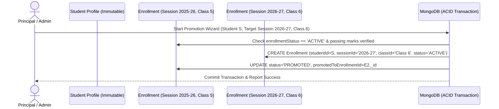

# DATABASE SCHEMA & DATA MODELING: LITTLE ANGELS SCHOOL — SCHOOL ERP

## 1. Data Architecture Principles

The database layer is designed for **MongoDB (Mongoose ODM)** using a **Hybrid Relational-Document Data Model**. 

### Key Design Anti-Pattern Avoidance: "The Giant Student Document"
A naive MongoDB schema embeds attendance, homework, exams, and fee payments inside a single `Student` document. This anti-pattern leads to:
* Document size exceeding the 16MB BSON limit over a student's 12-year academic journey (Pre-Primary to Class 10).
* Unindexable arrays and expensive concurrent write contention.
* Loss of historical data when a student is promoted to a new class.

### Our Solution: Session-Scoped Normalized Enrollments & Normalized Relationships
1. **Immutable Core Identity**: The `Student` collection stores only static profile information (name, DOB, blood group, admission number).
2. **Normalized Family Relationships (`StudentGuardian`)**: Rather than duplicating guardian arrays on Student and children arrays on Guardian, a dedicated `StudentGuardian` join collection models relationship type, primary guardian designation, and granular permissions (`canPickup`, `canReceiveFinancialNotices`, `canViewAcademicReports`).
3. **Multi-Device Auth Sessions (`RefreshSession`)**: Instead of storing a single token hash on `User`, a dedicated `RefreshSession` collection supports multiple devices, IP/User-Agent tracking, TTL expiration, and targeted/global token revocation.
4. **Session-Scoped Academic History**: The `Enrollment` collection represents a student's membership in a specific `AcademicSession + Class + Section`. Attendance, Homework Submissions, Examination Marks, and Student Fee structures reference `Enrollment`, ensuring complete historical preservation.

---

## 2. Entity Relationship & Data Flow Diagram

```mermaid
erDiagram
    User ||--o| Teacher : "authenticates as"
    User ||--o| Student : "authenticates as"
    User ||--o| Guardian : "authenticates as"
    User }|--|| Role : "assigned"
    User ||--|{ RefreshSession : "maintains active"
    Role ||--|{ Permission : "grants"

    Guardian ||--|{ StudentGuardian : "links via"
    Student ||--|{ StudentGuardian : "links via"
    Student ||--|{ Enrollment : "enrolls in session"
    AcademicSession ||--|{ Enrollment : "scopes"
    Class ||--|{ Section : "subdivides into"
    Class ||--|{ Enrollment : "assigns class"
    Section ||--|{ Enrollment : "assigns section"

    Teacher ||--|{ TeachingAssignment : "teaches"
    AcademicSession ||--|{ TeachingAssignment : "scopes"
    Class ||--|{ TeachingAssignment : "targets class"
    Section ||--|{ TeachingAssignment : "targets section"
    Subject ||--|{ TeachingAssignment : "targets subject"

    Enrollment ||--|{ Attendance : "records daily"
    TeachingAssignment ||--|{ Homework : "creates"
    Homework ||--|{ HomeworkSubmission : "receives"
    Enrollment ||--|{ HomeworkSubmission : "submits"

    AcademicSession ||--|{ Exam : "scopes"
    Exam ||--|{ ExamSubject : "includes"
    Subject ||--|{ ExamSubject : "evaluated in"
    ExamSubject ||--|{ Mark : "records marks"
    Enrollment ||--|{ Mark : "receives mark"
    Enrollment ||--|{ ReportCard : "receives term report"

    AcademicSession ||--|{ FeeStructure : "defines"
    Class ||--|{ FeeStructure : "applies to"
    FeeStructure ||--|{ Invoice : "generates"
    Enrollment ||--|{ Invoice : "billed"
    Enrollment ||--|| StudentFeeLedger : "has account"
    Invoice ||--|{ Payment : "allocated from"
    Payment ||--|| Receipt : "generates"
```

---

## 3. Comprehensive Entity Dictionary & Schema Definitions

Every collection includes standard timestamp fields (`createdAt`, `updatedAt`) and an indexed `schoolId` identifier (`default: "LAPS-GOHAD"`) for single-school extensibility.

### 3.1. Identity, Authentication & Session Collections

#### 1. `User`
Central authentication identity for all system actors.
* **Fields**:
  * `_id`: ObjectId
  * `schoolId`: String (Indexed, required, default `"LAPS-GOHAD"`)
  * `username`: String (Unique, lowercase, trimmed)
  * `email`: String (Unique sparse index, lowercase)
  * `phone`: String (Indexed, E.164 format)
  * `passwordHash`: String (Bcrypt/Argon2i hashed, `select: false`)
  * `roleId`: ObjectId -> `Role` (Indexed)
  * `userType`: Enum (`"SUPER_ADMIN" | "SCHOOL_ADMIN" | "TEACHER" | "STUDENT" | "GUARDIAN" | "STAFF"`)
  * `profileRef`: ObjectId (Polymorphic reference to Student/Teacher/Guardian/Staff `_id`)
  * `isActive`: Boolean (Default `true`)
  * `lastLoginAt`: Date
* **Indexes**:
  * `{ schoolId: 1, username: 1 }` (Unique)
  * `{ schoolId: 1, email: 1 }` (Unique sparse)
  * `{ schoolId: 1, userType: 1, isActive: 1 }`

#### 2. `RefreshSession` (Multi-Device Authentication Session)
Manages multi-device refresh tokens, session families, rotation, revocation, and security auditing.
* **Fields**:
  * `_id`: ObjectId
  * `userId`: ObjectId -> `User` (Indexed, required)
  * `sessionFamilyId`: String (UUID, indexed — groups token rotations for a single device/login session)
  * `refreshTokenHash`: String (Hashed secure token, `select: false`)
  * `expiresAt`: Date (Indexed for MongoDB TTL automatic cleanup)
  * `isRevoked`: Boolean (Default `false`)
  * `deviceInfo`: String (e.g., `"Chrome on Windows 11"`, `"Safari on iPhone"`)
  * `ipAddress`: String
  * `userAgent`: String
  * `createdAt`: Date (Default `Date.now`)
* **Indexes**:
  * `{ userId: 1, isRevoked: 1 }`
  * `{ sessionFamilyId: 1 }`
  * `{ expiresAt: 1 }` (TTL Index — automatically removes expired sessions)
* **Rotation & Reuse Detection**: Each device login creates a new `sessionFamilyId`. On refresh, a new token is issued with the same `sessionFamilyId` and the previous token is marked `isRevoked = true`. If an already-revoked token is replayed, the system logs `SUSPICIOUS_REFRESH_REUSE` and revokes only that `sessionFamilyId` (`isRevoked: true` for all records with that `sessionFamilyId`), without revoking unrelated valid device sessions. `logout-all` remains the explicit mechanism for revoking every session family belonging to the account.

#### 3. `Role`
RBAC role definition.
* **Fields**:
  * `_id`: ObjectId
  * `schoolId`: String (Indexed)
  * `name`: String (e.g., `"SUPER_ADMIN"`, `"TEACHER"`, `"STUDENT"`, `"GUARDIAN"`, `"ACCOUNTANT"`)
  * `description`: String
  * `isSystemRole`: Boolean (Default `false` — cannot be deleted if true)
* **Indexes**:
  * `{ schoolId: 1, name: 1 }` (Unique)

#### 4. `Permission`
Atomic authorization capabilities mapped to roles.
* **Fields**:
  * `_id`: ObjectId
  * `roleId`: ObjectId -> `Role` (Indexed)
  * `module`: Enum (`"ACADEMIC" | "ATTENDANCE" | "HOMEWORK" | "EXAM" | "FEE" | "COMMUNICATION" | "USER" | "CMS" | "AUDIT"`)
  * `action`: Enum (`"CREATE" | "READ" | "UPDATE" | "DELETE" | "PUBLISH" | "APPROVE" | "EXPORT"`)
  * `resource`: String (e.g., `"homework"`, `"attendance"`, `"marks"`, `"fee_payment"`)
  * `scope`: Enum (`"GLOBAL" | "ASSIGNED_CLASS" | "ASSIGNED_SUBJECT" | "OWN_CHILD" | "SELF"`)
* **Indexes**:
  * `{ roleId: 1, resource: 1, action: 1 }` (Unique)

---

### 3.2. Institutional & Academic Organization Collections

#### 5. `AcademicSession`
Defines school academic years with **configurable start and end dates** (no hardcoded April–March assumption) and historical preservation.
* **Fields**:
  * `_id`: ObjectId
  * `name`: String (e.g., `"2026-2027"`, `"2027-2028"`)
  * `startDate`: Date (Configurable)
  * `endDate`: Date (Configurable)
  * `isCurrent`: Boolean (Default `false`)
  * `status`: Enum (`"PLANNED" | "ACTIVE" | "ARCHIVED"`) (Default `"PLANNED"`)
  * `isPromotionLocked`: Boolean (Default `false`)
  * `createdBy`: ObjectId -> `User`
  * `updatedBy`: ObjectId -> `User`
  * `archivedBy`: ObjectId -> `User` (Optional)
  * `archivedAt`: Date (Optional)
  * `createdAt`: Date (Default `Date.now`)
  * `updatedAt`: Date (Default `Date.now`)
* **Indexes**:
  * `{ name: 1 }` (Unique)
  * `{ isCurrent: 1 }`
  * `{ status: 1 }`
* **Session Activation Rule**: When a session is activated (`status = "ACTIVE"`, `isCurrent = true`), the backend atomically unsets `isCurrent: false` on any previously active session within a MongoDB transaction.
* **Soft-Delete Only & Archive Behavior**: Master data is **never physically deleted** from the database. Endpoints perform soft-deletion (`status: "ARCHIVED"`, setting `archivedBy` and `archivedAt`).

#### 6. `Class`
Academic grade levels configurable from Pre-Primary up to Class 10 (no hardcoded enum constraints).
* **Fields**:
  * `_id`: ObjectId
  * `name`: String (e.g., `"Nursery"`, `"LKG"`, `"UKG"`, `"Class 1"`, `"Class 10"`)
  * `code`: String (Auto-generated if not provided, e.g., `"CLS-NUR"`, `"CLS-LKG"`, `"CLS-01"`, `"CLS-10"`)
  * `level`: Enum (`"PRE_PRIMARY" | "PRIMARY" | "MIDDLE" | "SECONDARY"`)
  * `orderSequence`: Number (For sorted UI rendering, e.g., 1 for Nursery, 2 for LKG, 3 for UKG, 4 for Class 1 ... 13 for Class 10)
  * `status`: Enum (`"ACTIVE" | "ARCHIVED"`) (Default `"ACTIVE"`)
  * `createdBy`: ObjectId -> `User`
  * `updatedBy`: ObjectId -> `User`
  * `archivedBy`: ObjectId -> `User` (Optional)
  * `archivedAt`: Date (Optional)
  * `createdAt`: Date (Default `Date.now`)
  * `updatedAt`: Date (Default `Date.now`)
* **Indexes**:
  * `{ code: 1 }` (Unique)
  * `{ name: 1 }` (Unique)
  * `{ orderSequence: 1 }`
  * `{ status: 1 }`

#### 7. `Section`
Subdivision of a class scoped to an academic session (`Academic Session -> Class -> Section`).
* **Fields**:
  * `_id`: ObjectId
  * `academicSessionId`: ObjectId -> `AcademicSession` (Indexed, required)
  * `classId`: ObjectId -> `Class` (Indexed, required)
  * `name`: String (e.g., `"A"`, `"B"`, `"C"`)
  * `roomNumber`: String (Optional)
  * `maxCapacity`: Number (Default `40`)
  * `status`: Enum (`"ACTIVE" | "ARCHIVED"`) (Default `"ACTIVE"`)
  * `createdBy`: ObjectId -> `User`
  * `updatedBy`: ObjectId -> `User`
  * `archivedBy`: ObjectId -> `User` (Optional)
  * `archivedAt`: Date (Optional)
  * `createdAt`: Date (Default `Date.now`)
  * `updatedAt`: Date (Default `Date.now`)
* **Indexes**:
  * `{ academicSessionId: 1, classId: 1, name: 1 }` (Unique — prevents duplicate section names within a class for a session)
  * `{ classId: 1, status: 1 }`

#### 8. `Subject`
Global master curriculum subjects prepared for Homework, Attendance, Timetable, and Marks integration. **Subject is a global master entity not bound directly to Class; class-subject mapping will be introduced separately.**
* **Fields**:
  * `_id`: ObjectId
  * `name`: String (e.g., `"Mathematics"`, `"General Science"`, `"Hindi"`)
  * `code`: String (Auto-generated if not provided, e.g., `"SUB-MATH"`, `"SUB-SCI"`, `"SUB-ENG"`)
  * `shortName`: String (e.g., `"MATH"`, `"SCI"`, `"ENG"`, `"HIN"`)
  * `subjectType`: Enum (`"THEORY" | "PRACTICAL" | "CO_CURRICULAR"`) (Default `"THEORY"`)
  * `isOptional`: Boolean (Default `false`)
  * `status`: Enum (`"ACTIVE" | "ARCHIVED"`) (Default `"ACTIVE"`)
  * `createdBy`: ObjectId -> `User`
  * `updatedBy`: ObjectId -> `User`
  * `archivedBy`: ObjectId -> `User` (Optional)
  * `archivedAt`: Date (Optional)
  * `createdAt`: Date (Default `Date.now`)
  * `updatedAt`: Date (Default `Date.now`)
* **Indexes**:
  * `{ code: 1 }` (Unique global subject code)
  * `{ name: 1 }` (Unique)
  * `{ status: 1 }`

---

### 3.3. Student, Guardian & Teacher Core Profiles

#### 9. `Student`
Independent student profile representing demographic and biographical information. **Do NOT store class or section inside Student** (`Enrollment` manages historical and active class membership).
* **Fields**:
  * `_id`: ObjectId
  * `admissionNumber`: String (Unique institutional ID, e.g., `"LAPS-2026-0001"`, auto-generated sequentially by year prefix — never ObjectId)
  * `admissionDate`: Date (Default `Date.now`)
  * `firstName`: String (Required)
  * `middleName`: String (Optional)
  * `lastName`: String (Required)
  * `gender`: Enum (`"MALE" | "FEMALE" | "OTHER"`)
  * `dateOfBirth`: Date (Required)
  * `bloodGroup`: String (Optional, e.g., `"O+"`, `"B+"`)
  * `category`: Enum (`"GENERAL" | "OBC" | "SC" | "ST" | "OTHER"`) (Optional)
  * `religion`: String (Optional)
  * `nationality`: String (Default `"Indian"`)
  * `photoUrl`: String (Optional avatar URL)
  * `email`: String (Optional, unique sparse)
  * `phone`: String (Optional)
  * `address`: String (Required)
  * `city`: String (Default `"Gohad"`)
  * `state`: String (Default `"Madhya Pradesh"`)
  * `country`: String (Default `"India"`)
  * `pinCode`: String (Required)
  * `emergencyContacts`: Array<{ name: String; relationship: String; phone: String }> (Required collection of emergency contacts)
  * `documents`: Array<{ title: String; category?: String; fileUrl: String; uploadedAt: Date }> (Metadata array storing document titles and file URLs only — no binary storage)
  * `status`: Enum (`"ACTIVE" | "ARCHIVED"`) (Default `"ACTIVE"` — **Promotion, transfer, withdrawal, completion, and alumni status must be tracked ONLY in Enrollment**)
  * `createdBy`: ObjectId -> `User`
  * `updatedBy`: ObjectId -> `User`
  * `archivedBy`: ObjectId -> `User` (Optional)
  * `archivedAt`: Date (Optional)
  * `createdAt`: Date (Default `Date.now`)
  * `updatedAt`: Date (Default `Date.now`)
* **Indexes**:
  * `{ admissionNumber: 1 }` (Unique)
  * `{ email: 1 }` (Unique sparse)
  * `{ status: 1 }`
  * `{ firstName: 1, lastName: 1 }`
* **Reserved Extension Points (Documentation Only)**:
  * Designed to seamlessly integrate with future **Student Documents** (transfer certificate scans, birth certificate verification), **Medical Records** (allergies, health checkup logs), and **Certificates** (bonafide, TC, graduation certificates) modules without schema breaking changes.

#### 10. `Guardian`
Guardian profile supporting Father, Mother, Legal Guardian, or Other relatives.
* **Fields**:
  * `_id`: ObjectId
  * `name`: String (Required)
  * `relationship`: Enum (`"FATHER" | "MOTHER" | "LEGAL_GUARDIAN" | "OTHER"`) (Primary relationship category)
  * `phone`: String (Required, indexed)
  * `email`: String (Optional, unique sparse)
  * `occupation`: String (Optional)
  * `annualIncome`: Number (Optional)
  * `photoUrl`: String (Optional)
  * `sameAsStudentAddress`: Boolean (Default `false` — avoids unnecessary address duplication when guardian resides with student)
  * `address`: String (Required if `sameAsStudentAddress` is false)
  * `emergencyContacts`: Array<{ name: String; relationship: String; phone: String }> (Collection of emergency contacts)
  * `status`: Enum (`"ACTIVE" | "ARCHIVED"`) (Default `"ACTIVE"`)
  * `createdBy`: ObjectId -> `User`
  * `updatedBy`: ObjectId -> `User`
  * `archivedBy`: ObjectId -> `User` (Optional)
  * `archivedAt`: Date (Optional)
  * `createdAt`: Date (Default `Date.now`)
  * `updatedAt`: Date (Default `Date.now`)
* **Indexes**:
  * `{ phone: 1 }`
  * `{ email: 1 }` (Unique sparse)
  * `{ status: 1 }`

#### 11. `StudentGuardian` (Normalized Relationship Model)
**CRITICAL ENTITY**: Normalized join entity linking `Student` and `Guardian` without array embedding. Supports Many-to-Many relationships (`One Student -> Many Guardians`, `One Guardian -> Many Students`).
* **Fields**:
  * `_id`: ObjectId
  * `studentId`: ObjectId -> `Student` (Indexed, required)
  * `guardianId`: ObjectId -> `Guardian` (Indexed, required)
  * `relationship`: Enum (`"FATHER" | "MOTHER" | "LEGAL_GUARDIAN" | "OTHER"`) (Required)
  * `isPrimaryGuardian`: Boolean (Default `false` — exactly one primary guardian per student enforced)
  * `pickupPermission`: Boolean (Default `true`)
  * `emergencyContactPermission`: Boolean (Default `true`)
  * `createdBy`: ObjectId -> `User`
  * `updatedBy`: ObjectId -> `User`
  * `createdAt`: Date (Default `Date.now`)
  * `updatedAt`: Date (Default `Date.now`)
* **Indexes**:
  * `{ studentId: 1, guardianId: 1 }` (Unique — prevents duplicate relationship rows)
  * `{ studentId: 1, isPrimaryGuardian: 1 }` (Indexed for fast primary guardian lookup)
  * `{ guardianId: 1 }`

#### 12. `Teacher`
Academic teacher profile linked to `User` account (Demographic & professional profile only — **does NOT include payroll, salary, or leave management fields**). `Teacher` is an academic profile entity, not the authentication account itself.
* **Fields**:
  * `_id`: ObjectId
  * `userId`: ObjectId -> `User` (Indexed, optional sparse — links to authentication account)
  * `employeeId`: String (Unique, auto-generated if not provided, e.g., `"TCH-0001"`, `"TCH-0002"`)
  * `firstName`: String
  * `lastName`: String
  * `email`: String (Indexed, unique sparse)
  * `phone`: String
  * `qualification`: String (e.g., `"B.Ed, M.Sc Mathematics"`)
  * `designation`: Enum (`"PRT" | "TGT" | "PGT" | "HEAD_MISTRESS" | "ASSISTANT_TEACHER"`)
  * `joiningDate`: Date
  * `isClassTeacher`: Boolean (Default `false`)
  * `photoUrl`: String (Optional avatar URL)
  * `status`: Enum (`"ACTIVE" | "ON_LEAVE" | "INACTIVE" | "ARCHIVED"`) (Default `"ACTIVE"`)
  * `createdBy`: ObjectId -> `User`
  * `updatedBy`: ObjectId -> `User`
  * `archivedBy`: ObjectId -> `User` (Optional)
  * `archivedAt`: Date (Optional)
  * `createdAt`: Date (Default `Date.now`)
  * `updatedAt`: Date (Default `Date.now`)
* **Indexes**:
  * `{ employeeId: 1 }` (Unique)
  * `{ email: 1 }` (Unique sparse)
  * `{ userId: 1 }` (Unique sparse)
  * `{ status: 1 }`

#### 13. `Staff`
Non-teaching administrative staff (Receptionist, Accountant, Librarian).
* **Fields**:
  * `_id`: ObjectId
  * `schoolId`: String
  * `employeeId`: String (Unique)
  * `firstName`: String
  * `lastName`: String
  * `department`: Enum (`"FINANCE" | "RECEPTION" | "LIBRARY" | "TRANSPORT" | "ADMIN"`)
  * `phone`: String
* **Indexes**:
  * `{ schoolId: 1, employeeId: 1 }` (Unique)

---

### 3.4. Enrollment & Teaching Assignment Architecture (Historical Core)

#### 14. `Enrollment`
**CRITICAL ENTITY**: Represents where a student studies for a single academic session (`Student -> Academic Session -> Class -> Section -> Roll Number -> Enrollment Status`). **Never overwrite history** — every academic year creates a new `Enrollment` record.
* **Fields**:
  * `_id`: ObjectId
  * `studentId`: ObjectId -> `Student` (Indexed, required)
  * `academicSessionId`: ObjectId -> `AcademicSession` (Indexed, required)
  * `classId`: ObjectId -> `Class` (Indexed, required)
  * `sectionId`: ObjectId -> `Section` (Indexed, required)
  * `rollNumber`: Number (Unique per academic session + class + section)
  * `enrollmentDate`: Date (Default `Date.now`)
  * `enrollmentStatus`: Enum (`"ACTIVE" | "PROMOTED" | "TRANSFERRED" | "WITHDRAWN" | "COMPLETED" | "ARCHIVED"`) (Default `"ACTIVE"`)
  * `promotedToEnrollmentId`: ObjectId -> `Enrollment` (Optional self-reference for tracking promotion chain forward)
  * `previousEnrollmentId`: ObjectId -> `Enrollment` (Optional self-reference for tracking historical chain backward)
  * `remarks`: String (Optional notes on transfer/withdrawal/promotion)
  * `createdBy`: ObjectId -> `User`
  * `updatedBy`: ObjectId -> `User`
  * `archivedBy`: ObjectId -> `User` (Optional)
  * `archivedAt`: Date (Optional)
  * `createdAt`: Date (Default `Date.now`)
  * `updatedAt`: Date (Default `Date.now`)
* **Indexes**:
  * `{ academicSessionId: 1, studentId: 1 }` (Unique — a student can have at most one enrollment per academic session)
  * `{ academicSessionId: 1, classId: 1, sectionId: 1, rollNumber: 1 }` (Unique — prevents duplicate roll numbers in the same section of a session)
  * `{ studentId: 1, enrollmentStatus: 1 }`

#### 15. `TeachingAssignment`
**CRITICAL FOUNDATIONAL ANCHOR**: Maps authorization scopes for teachers per academic session (`Teacher -> Academic Session -> Class -> Section -> Subject`). Every future module (Homework, Attendance, Marks, Timetable) relies on this entity for scoped access control.
* **Fields**:
  * `_id`: ObjectId
  * `teacherId`: ObjectId -> `Teacher` (Indexed, required)
  * `academicSessionId`: ObjectId -> `AcademicSession` (Indexed, required)
  * `classId`: ObjectId -> `Class` (Indexed, required)
  * `sectionId`: ObjectId -> `Section` (Indexed, required)
  * `subjectId`: ObjectId -> `Subject` (Indexed, required)
  * `isClassTeacher`: Boolean (Default `false` — grants section-wide attendance and report card rights)
  * `status`: Enum (`"ACTIVE" | "ARCHIVED"`) (Default `"ACTIVE"`)
  * `createdBy`: ObjectId -> `User`
  * `updatedBy`: ObjectId -> `User`
  * `archivedBy`: ObjectId -> `User` (Optional)
  * `archivedAt`: Date (Optional)
  * `createdAt`: Date (Default `Date.now`)
  * `updatedAt`: Date (Default `Date.now`)
* **Indexes**:
  * `{ academicSessionId: 1, classId: 1, sectionId: 1, subjectId: 1 }` (Unique for active assignments — ensures exactly one primary subject teacher per section per session)
  * `{ academicSessionId: 1, teacherId: 1, classId: 1, sectionId: 1, subjectId: 1 }` (Unique — prevents assigning the same teacher twice to the same subject/section)
  * `{ teacherId: 1, academicSessionId: 1, status: 1 }`

---

### 3.5. Curriculum, Timetable & Academic Calendar Collections (Phase 5)

#### 16. `AcademicTerm`
Optional academic term layer beneath Academic Session (`Academic Session -> Academic Term`) supporting future examination blocks, term-wise grading, and report card compilation.
* **Fields**:
  * `_id`: ObjectId
  * `academicSessionId`: ObjectId -> `AcademicSession` (Indexed, required)
  * `name`: String (e.g., `"Term 1"`, `"Term 2"`, `"Mid-Term Semester"`, `"Annual Semester"`)
  * `code`: String (e.g., `"TRM-1"`, `"TRM-2"`)
  * `startDate`: String (`"YYYY-MM-DD"`, required)
  * `endDate`: String (`"YYYY-MM-DD"`, required)
  * `orderSequence`: Number (Required, e.g., 1 for Term 1, 2 for Term 2)
  * `status`: Enum (`"ACTIVE" | "ARCHIVED"`) (Default `"ACTIVE"`)
  * `createdBy`: ObjectId -> `User`
  * `updatedBy`: ObjectId -> `User`
  * `archivedBy`: ObjectId -> `User` (Optional)
  * `archivedAt`: Date (Optional)
  * `createdAt`: Date (Default `Date.now`)
  * `updatedAt`: Date (Default `Date.now`)
* **Indexes**:
  * `{ academicSessionId: 1, code: 1 }` (Unique)
  * `{ academicSessionId: 1, orderSequence: 1 }`
  * `{ status: 1 }`

#### 17. `ClassSubject`
Maps global master `Subject` records to a specific `Class` within an `AcademicSession`. Supports mandatory/optional subject distinction, display ordering, curriculum period constraints, and Teacher Assignment Compatibility validation.
* **Fields**:
  * `_id`: ObjectId
  * `academicSessionId`: ObjectId -> `AcademicSession` (Indexed, required)
  * `classId`: ObjectId -> `Class` (Indexed, required)
  * `subjectId`: ObjectId -> `Subject` (Indexed, required)
  * `isMandatory`: Boolean (Default `true` — required for all students in class)
  * `isOptional`: Boolean (Default `false` — elective subject)
  * `subjectGroup`: String (Optional, e.g., `"ELECTIVE_GRP_A"` for grouping mutually exclusive elective subjects)
  * `minPeriodsPerWeek`: Number (Optional — curriculum constraint for minimum required weekly teaching periods)
  * `maxPeriodsPerWeek`: Number (Optional — curriculum constraint for maximum allowed weekly teaching periods)
  * `orderSequence`: Number (Default `1` — controls UI rendering order)
  * `status`: Enum (`"ACTIVE" | "ARCHIVED"`) (Default `"ACTIVE"`)
  * `createdBy`: ObjectId -> `User`
  * `updatedBy`: ObjectId -> `User`
  * `archivedBy`: ObjectId -> `User` (Optional)
  * `archivedAt`: Date (Optional)
  * `createdAt`: Date (Default `Date.now`)
  * `updatedAt`: Date (Default `Date.now`)
* **Indexes**:
  * `{ academicSessionId: 1, classId: 1, subjectId: 1 }` (Unique — prevents duplicate mapping of the same subject to a class in a session)
  * `{ classId: 1, orderSequence: 1 }`
  * `{ status: 1 }`

#### 18. `Room`
Dedicated institutional room and laboratory catalog replacing free-text room numbers.
* **Fields**:
  * `_id`: ObjectId
  * `name`: String (e.g., `"Room 101"`, `"Chemistry Lab"`, `"Auditorium"`, `"Sports Field"`)
  * `code`: String (Unique, e.g., `"RM-101"`, `"LAB-CHEM"`, `"AUD-01"`)
  * `capacity`: Number (Default `40`)
  * `building`: String (Optional, e.g., `"Main Wing"`, `"Science Block"`)
  * `floor`: String (Optional, e.g., `"Ground Floor"`, `"First Floor"`)
  * `roomType`: Enum (`"CLASSROOM" | "LAB" | "AUDITORIUM" | "SPORTS" | "OTHER"`) (Default `"CLASSROOM"`)
  * `status`: Enum (`"ACTIVE" | "ARCHIVED"`) (Default `"ACTIVE"`)
  * `createdBy`: ObjectId -> `User`
  * `updatedBy`: ObjectId -> `User`
  * `archivedBy`: ObjectId -> `User` (Optional)
  * `archivedAt`: Date (Optional)
  * `createdAt`: Date (Default `Date.now`)
  * `updatedAt`: Date (Default `Date.now`)
* **Indexes**:
  * `{ code: 1 }` (Unique)
  * `{ name: 1 }` (Unique)
  * `{ status: 1 }`

#### 19. `BellSchedule`
Configurable bell schedules within an academic session supporting Regular, Examination, Half-Day, and Special Event schedules. Supports global assignment, class-scoped assignment, and date-range validity.
* **Fields**:
  * `_id`: ObjectId
  * `academicSessionId`: ObjectId -> `AcademicSession` (Indexed, required)
  * `name`: String (e.g., `"Regular Mon-Fri"`, `"Examination Schedule"`, `"Half-Day Saturday"`, `"Winter Timings"`)
  * `scheduleType`: Enum (`"REGULAR" | "EXAM" | "HALF_DAY" | "SPECIAL_EVENT"`) (Default `"REGULAR"`)
  * `scopeType`: Enum (`"GLOBAL" | "CLASS"`) (Default `"GLOBAL"`)
  * `targetClassIds`: Array<ObjectId -> `Class`> (Optional, required when `scopeType === "CLASS"`)
  * `validFrom`: String (Optional `"YYYY-MM-DD"` date range start)
  * `validTo`: String (Optional `"YYYY-MM-DD"` date range end)
  * `isDefault`: Boolean (Default `false` — automatically toggles off other defaults for the session when enabled)
  * `status`: Enum (`"ACTIVE" | "ARCHIVED"`) (Default `"ACTIVE"`)
  * `createdBy`: ObjectId -> `User`
  * `updatedBy`: ObjectId -> `User`
  * `archivedBy`: ObjectId -> `User` (Optional)
  * `archivedAt`: Date (Optional)
  * `createdAt`: Date (Default `Date.now`)
  * `updatedAt`: Date (Default `Date.now`)
* **Indexes**:
  * `{ academicSessionId: 1, name: 1 }` (Unique)
  * `{ academicSessionId: 1, isDefault: 1 }`
  * `{ academicSessionId: 1, scopeType: 1, validFrom: 1, validTo: 1 }`
  * `{ status: 1 }`

#### 20. `TimetablePeriod`
Individual period and break interval definitions scoped to a `BellSchedule`.
* **Fields**:
  * `_id`: ObjectId
  * `academicSessionId`: ObjectId -> `AcademicSession` (Indexed, required)
  * `bellScheduleId`: ObjectId -> `BellSchedule` (Indexed, required)
  * `name`: String (e.g., `"Period 1"`, `"Morning Assembly"`, `"Lunch Break"`, `"Period 8"`)
  * `sequence`: Number (Required, positive integer e.g., 1, 2, 3...)
  * `startTime`: String (`"HH:MM"`, 24-hr format, e.g., `"08:00"`)
  * `endTime`: String (`"HH:MM"`, 24-hr format, e.g., `"08:45"`)
  * `isBreak`: Boolean (Default `false` — indicates non-teaching interval like lunch or assembly)
  * `status`: Enum (`"ACTIVE" | "ARCHIVED"`) (Default `"ACTIVE"`)
  * `createdBy`: ObjectId -> `User`
  * `updatedBy`: ObjectId -> `User`
  * `archivedBy`: ObjectId -> `User` (Optional)
  * `archivedAt`: Date (Optional)
  * `createdAt`: Date (Default `Date.now`)
  * `updatedAt`: Date (Default `Date.now`)
* **Indexes**:
  * `{ bellScheduleId: 1, sequence: 1 }` (Unique — enforces strict sequential period numbering)
  * `{ bellScheduleId: 1, startTime: 1, endTime: 1 }` (Indexed for time-overlap detection)
  * `{ status: 1 }`

#### 21. `Timetable` (Conflict-Checked Versioned Weekly Schedule Matrix)
Weekly timetable slot assignment linking a Section, Day of Week, Period, ClassSubject, Room, and Teacher (`TeachingAssignment`). Implements automated conflict prevention, draft/published versioning, and teacher workload computation.
* **Fields**:
  * `_id`: ObjectId
  * `academicSessionId`: ObjectId -> `AcademicSession` (Indexed, required)
  * `classId`: ObjectId -> `Class` (Indexed, required)
  * `sectionId`: ObjectId -> `Section` (Indexed, required)
  * `dayOfWeek`: Enum (`"MONDAY" | "TUESDAY" | "WEDNESDAY" | "THURSDAY" | "FRIDAY" | "SATURDAY" | "SUNDAY"`) (Required)
  * `timetablePeriodId`: ObjectId -> `TimetablePeriod` (Indexed, required)
  * `classSubjectId`: ObjectId -> `ClassSubject` (Indexed, required)
  * `subjectId`: ObjectId -> `Subject` (Indexed, required — denormalized for fast query)
  * `teachingAssignmentId`: ObjectId -> `TeachingAssignment` (Indexed, required — validates teacher-subject-section authorization)
  * `teacherId`: ObjectId -> `Teacher` (Indexed, required — denormalized for teacher conflict detection)
  * `roomId`: ObjectId -> `Room` (Indexed, optional — links to dedicated `Room` catalog)
  * `status`: Enum (`"DRAFT" | "PUBLISHED" | "ARCHIVED"`) (Default `"DRAFT"` — Teachers can only access `PUBLISHED` timetables)
  * `createdBy`: ObjectId -> `User`
  * `updatedBy`: ObjectId -> `User`
  * `archivedBy`: ObjectId -> `User` (Optional)
  * `archivedAt`: Date (Optional)
  * `createdAt`: Date (Default `Date.now`)
  * `updatedAt`: Date (Default `Date.now`)
* **Indexes & Conflict Prevention Guards (for active/published rows)**:
  * `{ academicSessionId: 1, sectionId: 1, dayOfWeek: 1, timetablePeriodId: 1, status: 1 }` (Unique for `DRAFT`/`PUBLISHED` — **Section Conflict Prevention**: prevents double-booking a section with two different subjects/teachers at the same period)
  * `{ academicSessionId: 1, teacherId: 1, dayOfWeek: 1, timetablePeriodId: 1, status: 1 }` (Unique for `DRAFT`/`PUBLISHED` — **Teacher Conflict Prevention**: prevents assigning the same teacher to two different sections/rooms at the same period)
  * `{ academicSessionId: 1, roomId: 1, dayOfWeek: 1, timetablePeriodId: 1, status: 1 }` (Unique sparse for `DRAFT`/`PUBLISHED` — **Room Conflict Prevention**: prevents booking the same room for two different classes at the same period)
  * `{ teacherId: 1, academicSessionId: 1, status: 1 }` (Indexed for fast `MY_TIMETABLE_ONLY` teacher queries and computed workload metrics)

#### 22. `AcademicCalendarEvent`
Institutional calendar events supporting working days, school holidays, half days, exam blocks, vacation periods, special celebrations, and recurring schedules.
* **Fields**:
  * `_id`: ObjectId
  * `academicSessionId`: ObjectId -> `AcademicSession` (Indexed, required)
  * `title`: String (e.g., `"Independence Day"`, `"Mid-Term Exam Week"`, `"Annual Sports Day"`, `"Winter Vacation"`)
  * `eventType`: Enum (`"HOLIDAY" | "HALF_DAY" | "EXAM_BLOCK" | "VACATION" | "SPECIAL_EVENT" | "EMERGENCY_CLOSURE" | "WORKING_DAY"`) (Required)
  * `startDate`: String (`"YYYY-MM-DD"`, required, indexed)
  * `endDate`: String (`"YYYY-MM-DD"`, required, indexed)
  * `isWorkingDay`: Boolean (Default `false` for holiday/vacation, `true` for working day/special event)
  * `isRecurring`: Boolean (Default `false`)
  * `recurrenceRule`: Object (Optional `{ frequency: "WEEKLY" | "MONTHLY" | "YEARLY", interval: Number, count: Number, untilDate: String }`)
  * `appliesToAllClasses`: Boolean (Default `true`)
  * `targetClassIds`: Array<ObjectId -> `Class`> (Optional, for grade-scoped events/exam blocks)
  * `description`: String (Optional)
  * `status`: Enum (`"ACTIVE" | "ARCHIVED"`) (Default `"ACTIVE"`)
  * `createdBy`: ObjectId -> `User`
  * `updatedBy`: ObjectId -> `User`
  * `archivedBy`: ObjectId -> `User` (Optional)
  * `archivedAt`: Date (Optional)
  * `createdAt`: Date (Default `Date.now`)
  * `updatedAt`: Date (Default `Date.now`)
* **Indexes**:
  * `{ academicSessionId: 1, startDate: 1, endDate: 1 }`
  * `{ eventType: 1, status: 1 }`

#### 23. `WorkingDayRule`
Academic session working day rules supporting Monday-Friday, Monday-Saturday, custom schedules, half-days, and emergency closure overrides.
* **Fields**:
  * `_id`: ObjectId
  * `academicSessionId`: ObjectId -> `AcademicSession` (Indexed, required, unique per session)
  * `workingDaysPattern`: Enum (`"MON_TO_FRI" | "MON_TO_SAT" | "CUSTOM"`) (Default `"MON_TO_SAT"`)
  * `customWorkingDays`: Array<Enum (`"MONDAY" | "TUESDAY" | "WEDNESDAY" | "THURSDAY" | "FRIDAY" | "SATURDAY" | "SUNDAY"`)> (Optional, used when `"CUSTOM"`)
  * `halfDaysOfWeek`: Array<Enum (`"MONDAY" | "TUESDAY" | "WEDNESDAY" | "THURSDAY" | "FRIDAY" | "SATURDAY" | "SUNDAY"`)> (Optional, e.g., Saturday as half-day)
  * `emergencyClosureActive`: Boolean (Default `false` — overrides all working days when active)
  * `emergencyClosureReason`: String (Optional)
  * `status`: Enum (`"ACTIVE" | "ARCHIVED"`) (Default `"ACTIVE"`)
  * `createdBy`: ObjectId -> `User`
  * `updatedBy`: ObjectId -> `User`
  * `archivedBy`: ObjectId -> `User` (Optional)
  * `archivedAt`: Date (Optional)
  * `createdAt`: Date (Default `Date.now`)
  * `updatedAt`: Date (Default `Date.now`)
* **Indexes**:
  * `{ academicSessionId: 1 }` (Unique — one working day configuration per academic session)

#### 24. `Holiday`
Dedicated institutional holiday catalog supporting National, State, School, Optional holidays, and emergency closures.
* **Fields**:
  * `_id`: ObjectId
  * `academicSessionId`: ObjectId -> `AcademicSession` (Indexed, required)
  * `title`: String (e.g., `"Republic Day"`, `"Diwali"`, `"MP State Foundation Day"`, `"Collector Declared Holiday"`)
  * `holidayType`: Enum (`"NATIONAL" | "STATE" | "SCHOOL" | "OPTIONAL" | "EMERGENCY_CLOSURE"`) (Required)
  * `startDate`: String (`"YYYY-MM-DD"`, required, indexed)
  * `endDate`: String (`"YYYY-MM-DD"`, required, indexed)
  * `isOptionalHoliday`: Boolean (Default `false`)
  * `affectsAttendance`: Boolean (Default `true` — automatically marks calendar as official non-working holiday for attendance calculation)
  * `description`: String (Optional)
  * `status`: Enum (`"ACTIVE" | "ARCHIVED"`) (Default `"ACTIVE"`)
  * `createdBy`: ObjectId -> `User`
  * `updatedBy`: ObjectId -> `User`
  * `archivedBy`: ObjectId -> `User` (Optional)
  * `archivedAt`: Date (Optional)
  * `createdAt`: Date (Default `Date.now`)
  * `updatedAt`: Date (Default `Date.now`)
* **Indexes**:
  * `{ academicSessionId: 1, startDate: 1, endDate: 1 }`
  * `{ holidayType: 1, status: 1 }`

---

### 3.6. Attendance & Leave Management Collections (Phase 6)

#### 25. `Attendance`
Represents the attendance marking session for a class/section on a specific date (either `DAILY` for class teacher or `PERIOD` for subject teacher). Attendance MUST depend on `AcademicSession -> Published Timetable -> TeachingAssignment -> Enrollment -> AcademicCalendar -> WorkingDayRule -> Holiday`. Attendance NEVER maintains its own schedule.
* **Future Analytics Materialized Summary Strategy (Planning Only)**: For large-scale multi-year reporting, daily attendance entries will be aggregated nightly (or upon session lock) into a materialized summary collection/cache keyed by `(academicSessionId, studentId, month, year)`. This avoids scanning millions of `AttendanceEntry` rows for session-wide attendance percentage calculations and defaulter detection (`< 75%`).
* **Fields**:
  * `_id`: ObjectId
  * `academicSessionId`: ObjectId -> `AcademicSession` (Required, indexed)
  * `classId`: ObjectId -> `Class` (Required, indexed)
  * `sectionId`: ObjectId -> `Section` (Required, indexed)
  * `attendanceType`: Enum (`"DAILY" | "PERIOD"`) (Default `"DAILY"`)
  * `date`: String (`"YYYY-MM-DD"`, required, indexed)
  * `timetablePeriodId`: ObjectId -> `TimetablePeriod` (Optional, required if `attendanceType === "PERIOD"`)
  * `subjectId`: ObjectId -> `Subject` (Optional, required if `attendanceType === "PERIOD"`)
  * `teachingAssignmentId`: ObjectId -> `TeachingAssignment` (Required, links to authorized Teacher and scope)
  * `sessionStatus`: Enum (`"DRAFT" | "SUBMITTED" | "LOCKED" | "FROZEN"`) (Default `"DRAFT"` — lifecycle transitions from DRAFT -> SUBMITTED -> LOCKED -> FROZEN)
  * `markedByUserId`: ObjectId -> `User` (Teacher or Admin who marked attendance)
  * `markedAt`: Date (Default `Date.now`)
  * `isLocked`: Boolean (Default `false` — synced with `sessionStatus === "LOCKED" | "FROZEN"`)
  * `lockedAt`: Date (Optional)
  * `lockedByUserId`: ObjectId -> `User` (Optional)
  * `lockReason`: String (Optional, e.g., `"AUTO_LOCK_TIME"`, `"AUTO_LOCK_DAY"`, `"ADMIN_LOCK"`)
  * `isFrozen`: Boolean (Default `false` — set when report-card generation freezes attendance)
  * `frozenAt`: Date (Optional)
  * `frozenByUserId`: ObjectId -> `User` (Optional)
  * `freezeReason`: String (Optional, e.g., `"REPORT_CARD_GENERATED"`)
  * `status`: Enum (`"ACTIVE" | "ARCHIVED"`)
  * `createdBy`: ObjectId -> `User`
  * `updatedBy`: ObjectId -> `User`
  * `archivedBy`: ObjectId -> `User`
  * `archivedAt`: Date
  * `createdAt`: Date
  * `updatedAt`: Date
* **Indexes**:
  * `{ academicSessionId: 1, classId: 1, sectionId: 1, date: 1, attendanceType: 1, timetablePeriodId: 1 }` (Unique — ensures exactly one attendance session per section per date for daily, or per section per date per period for period-wise)
  * `{ teachingAssignmentId: 1, date: 1 }`
  * `{ status: 1, sessionStatus: 1, isLocked: 1, isFrozen: 1 }`

#### 26. `AttendanceEntry`
Individual student attendance record within an `Attendance` session.
* **Fields**:
  * `_id`: ObjectId
  * `attendanceId`: ObjectId -> `Attendance` (Required, indexed)
  * `academicSessionId`: ObjectId -> `AcademicSession` (Required, indexed)
  * `enrollmentId`: ObjectId -> `Enrollment` (Required, indexed)
  * `studentId`: ObjectId -> `Student` (Required, indexed)
  * `classId`: ObjectId -> `Class` (Required)
  * `sectionId`: ObjectId -> `Section` (Required)
  * `studentName`: String (Historical snapshot of First Name + Last Name at time of attendance)
  * `rollNumber`: String (Optional historical snapshot of student roll number)
  * `className`: String (Historical snapshot of class name, e.g., `"Class 10"`)
  * `sectionName`: String (Historical snapshot of section name, e.g., `"Section A"`)
  * `date`: String (`"YYYY-MM-DD"`, required, indexed)
  * `attendanceStatus`: Enum (`"PRESENT" | "ABSENT" | "LATE" | "HALF_DAY" | "MEDICAL_LEAVE" | "APPROVED_LEAVE" | "UNAPPROVED_LEAVE" | "EXCUSED"`) (Required, default `"PRESENT"`)
  * `attendanceSource`: Enum (`"MANUAL" | "LEAVE" | "SYSTEM" | "IMPORT" | "BIOMETRIC_RESERVED"`) (Default `"MANUAL"`)
  * `lateMinutes`: Number (Optional, default `0` — records arrival delay in minutes for punctuality reporting)
  * `remarks`: String (Optional, max 200 chars)
  * `leaveRequestId`: ObjectId -> `LeaveRequest` (Optional, linked if status is `APPROVED_LEAVE` or `MEDICAL_LEAVE`)
  * `statusHistory`: Array of `{ oldStatus: string, newStatus: string, changedBy: ObjectId, changedAt: Date, reason: string }` (Preserves audit trail of corrections and overrides)
  * `status`: Enum (`"ACTIVE" | "ARCHIVED"`)
  * `createdBy`: ObjectId -> `User`
  * `updatedBy`: ObjectId -> `User`
  * `archivedBy`: ObjectId -> `User`
  * `archivedAt`: Date
  * `createdAt`: Date
  * `updatedAt`: Date
* **Indexes**:
  * `{ attendanceId: 1, studentId: 1 }` (Unique — one entry per student per attendance session)
  * `{ academicSessionId: 1, studentId: 1, date: 1 }`
  * `{ classId: 1, sectionId: 1, date: 1, attendanceStatus: 1 }`
  * `{ attendanceSource: 1 }`

#### 27. `LeaveRequest`
Represents a leave application submitted for a Student or a Teacher with approval workflows and attachment metadata.
* **Fields**:
  * `_id`: ObjectId
  * `academicSessionId`: ObjectId -> `AcademicSession` (Required, indexed)
  * `applicantType`: Enum (`"STUDENT" | "TEACHER"`) (Required)
  * `studentId`: ObjectId -> `Student` (Optional, required if `applicantType === "STUDENT"`)
  * `enrollmentId`: ObjectId -> `Enrollment` (Optional, required if `applicantType === "STUDENT"`)
  * `teacherId`: ObjectId -> `Teacher` (Optional, required if `applicantType === "TEACHER"`)
  * `leaveType`: Enum (`"CASUAL" | "MEDICAL" | "EMERGENCY" | "SPORTS" | "OFFICIAL" | "OTHER"`) (Required controlled enum)
  * `startDate`: String (`"YYYY-MM-DD"`, required)
  * `endDate`: String (`"YYYY-MM-DD"`, required)
  * `totalDays`: Number (Required, computed)
  * `reason`: String (Required, max 500 chars)
  * `attachmentUrl`: String (Optional — URL/metadata for doctor certificate or leave letter)
  * `leaveStatus`: Enum (`"PENDING" | "APPROVED" | "REJECTED" | "CANCELLED"`) (Default `"PENDING"`)
  * `reviewedByUserId`: ObjectId -> `User` (Optional — Class Teacher, School Admin, or Super Admin who reviewed)
  * `reviewedAt`: Date (Optional)
  * `reviewerRemarks`: String (Optional)
  * `status`: Enum (`"ACTIVE" | "ARCHIVED"`)
  * `createdBy`: ObjectId -> `User`
  * `updatedBy`: ObjectId -> `User`
  * `archivedBy`: ObjectId -> `User`
  * `archivedAt`: Date
  * `createdAt`: Date
  * `updatedAt`: Date
* **Indexes**:
  * `{ academicSessionId: 1, studentId: 1, startDate: 1, endDate: 1 }`
  * `{ academicSessionId: 1, teacherId: 1, startDate: 1, endDate: 1 }`
  * `{ leaveStatus: 1 }`

#### 28. `AttendanceCorrection`
Formal correction request submitted by a Teacher to modify attendance after lock or initial submission, requiring Admin approval.
* **Fields**:
  * `_id`: ObjectId
  * `academicSessionId`: ObjectId -> `AcademicSession` (Required)
  * `attendanceId`: ObjectId -> `Attendance` (Required, indexed)
  * `attendanceEntryId`: ObjectId -> `AttendanceEntry` (Required, indexed)
  * `studentId`: ObjectId -> `Student` (Required)
  * `requestedByUserId`: ObjectId -> `User` (Teacher requesting correction)
  * `oldStatus`: Enum (`"PRESENT" | "ABSENT" | "LATE" | "HALF_DAY" | "MEDICAL_LEAVE" | "APPROVED_LEAVE" | "UNAPPROVED_LEAVE" | "EXCUSED"`)
  * `newStatus`: Enum (`"PRESENT" | "ABSENT" | "LATE" | "HALF_DAY" | "MEDICAL_LEAVE" | "APPROVED_LEAVE" | "UNAPPROVED_LEAVE" | "EXCUSED"`)
  * `reason`: String (Required, max 500 chars)
  * `correctionStatus`: Enum (`"PENDING" | "APPROVED" | "REJECTED"`) (Default `"PENDING"`)
  * `reviewedByUserId`: ObjectId -> `User` (Admin who approved/rejected)
  * `reviewedAt`: Date (Optional)
  * `reviewerRemarks`: String (Optional)
  * `status`: Enum (`"ACTIVE" | "ARCHIVED"`)
  * `createdBy`: ObjectId -> `User`
  * `updatedBy`: ObjectId -> `User`
  * `archivedBy`: ObjectId -> `User`
  * `archivedAt`: Date
  * `createdAt`: Date
  * `updatedAt`: Date
* **Indexes**:
  * `{ attendanceEntryId: 1, correctionStatus: 1 }`
  * `{ academicSessionId: 1, correctionStatus: 1 }`

#### 29. `AttendanceLockRule`
Configurable rule governing automatic attendance locking after a specific cutoff time or number of days.
* **Fields**:
  * `_id`: ObjectId
  * `academicSessionId`: ObjectId -> `AcademicSession` (Required, indexed, unique)
  * `lockAfterHours`: Number (Optional, e.g., 24 — locks attendance 24 hours after marking)
  * `lockAfterTimeOfDay`: String (Optional, e.g., `"17:00"` — locks daily attendance at 5:00 PM on the same day)
  * `allowTeacherCorrectionRequest`: Boolean (Default `true`)
  * `adminOverrideEnabled`: Boolean (Default `true` — Admins can always override lock)
  * `status`: Enum (`"ACTIVE" | "ARCHIVED"`)
  * `createdBy`: ObjectId -> `User`
  * `updatedBy`: ObjectId -> `User`
  * `archivedBy`: ObjectId -> `User`
  * `archivedAt`: Date
  * `createdAt`: Date
  * `updatedAt`: Date
* **Indexes**:
  * `{ academicSessionId: 1 }` (Unique)

### 3.7. Homework, Assignments & Study Material Collections (Phase 7)

#### 30. `Homework`
Homework, assignments, projects, activities, and reading tasks created by authorized teachers. Homework strictly depends on `AcademicSession` -> `Published Timetable` -> `TeachingAssignment` -> `ClassSubject` -> `Enrollment` and never maintains an independent schedule or class-subject mapping.
* **Fields**:
  * `_id`: ObjectId
  * `academicSessionId`: ObjectId -> `AcademicSession` (Indexed, Required)
  * `teachingAssignmentId`: ObjectId -> `TeachingAssignment` (Indexed, Required)
  * `classSubjectId`: ObjectId -> `ClassSubject` (Indexed, Required)
  * `classId`: ObjectId -> `Class` (Indexed, Required)
  * `sectionId`: ObjectId -> `Section` (Indexed, Required)
  * `subjectId`: ObjectId -> `Subject` (Indexed, Required)
  * `teacherId`: ObjectId -> `Teacher` (Indexed, Required)
  * `title`: String (Required, max 200 chars)
  * `description`: String (Optional, detailed description)
  * `instructions`: String (Optional, submission guidelines)
  * `homeworkType`: Enum (`"HOMEWORK" | "ASSIGNMENT" | "PROJECT" | "ACTIVITY" | "READING"`, Default `"HOMEWORK"`)
  * `maxAttempts`: Number (Default `1`, positive integer supporting multi-attempt assignments)
  * `attachments`: Array of `HomeworkAttachment` objects:
    * `type`: Enum (`"PDF" | "IMAGE" | "VIDEO" | "LINK" | "ZIP" | "DOCUMENT"`)
    * `url`: String (Required URL to storage or web resource; stores URLs only)
    * `title`: String (Optional label)
    * `fileName`: String (Required metadata)
    * `fileSize`: Number (Required size in bytes)
    * `mimeType`: String (Required MIME type)
    * `uploadedAt`: Date (Required upload timestamp)
  * `assignedDate`: Date (Required)
  * `dueDate`: Date (Required, must be `>= assignedDate`)
  * `scheduledPublishAt`: Date (Optional release date/time when `status === "SCHEDULED"`)
  * `maxMarks`: Number (Optional, positive integer or decimal)
  * `status`: Enum (`"DRAFT" | "SCHEDULED" | "PUBLISHED" | "CLOSED" | "ARCHIVED"`, Default `"DRAFT"`)
  * `createdBy`: ObjectId -> `User`
  * `updatedBy`: ObjectId -> `User`
  * `createdAt`: Date
  * `updatedAt`: Date
* **Indexes**:
  * `{ classId: 1, sectionId: 1, status: 1, dueDate: 1 }`
  * `{ teacherId: 1, academicSessionId: 1, status: 1 }`
  * `{ teachingAssignmentId: 1, dueDate: -1 }`
  * `{ status: 1, scheduledPublishAt: 1 }` (Index for cron job automatic scheduled publishing)
* **Validation & Lifecycle Rules**:
  * A Teacher can only create or publish homework for a `teachingAssignmentId` where they are assigned to that section and subject AND where there is an active `PUBLISHED` Timetable slot (`Timetable.status === "PUBLISHED"`).
  * State transitions support `DRAFT` -> `SCHEDULED` -> `PUBLISHED` -> `CLOSED` -> `ARCHIVED`. When `status === "SCHEDULED"`, an automated worker job publishes the assignment when `scheduledPublishAt <= now`.
  * Soft deletion is executed via `PATCH /:id/archive` setting `status: "ARCHIVED"`.

#### 31. `HomeworkSubmission`
Student submission record and teacher evaluation for a published homework assignment.
* **Fields**:
  * `_id`: ObjectId
  * `homeworkId`: ObjectId -> `Homework` (Indexed, Required)
  * `enrollmentId`: ObjectId -> `Enrollment` (Indexed, Required)
  * `studentId`: ObjectId -> `Student` (Indexed, Required)
  * `currentAttempt`: Number (Default `1`, tracks attempt number against `homework.maxAttempts`)
  * `plagiarismStatus`: Enum (`"NOT_CHECKED" | "CHECKED"`, Default `"NOT_CHECKED"`, reserved for future plagiarism detection integration)
  * `attachments`: Array of attachment objects with extended metadata:
    * `type`: Enum (`"PDF" | "IMAGE" | "VIDEO" | "LINK" | "ZIP" | "DOCUMENT"`)
    * `url`: String (Required URL; stores URLs only)
    * `title`: String (Optional)
    * `fileName`: String (Required)
    * `fileSize`: Number (Required)
    * `mimeType`: String (Required)
    * `uploadedAt`: Date (Required)
  * `remarks`: String (Optional student comment)
  * `submittedAt`: Date (Required)
  * `isLate`: Boolean (Calculated automatically: `true` if `submittedAt > homework.dueDate`)
  * `lateMinutes`: Number (Optional integer tracking arrival delay after due date)
  * `status`: Enum (`"DRAFT" | "SUBMITTED" | "EVALUATED" | "RETURNED" | "ARCHIVED"`, Default `"SUBMITTED"`)
  * `evaluation`: Embedded `HomeworkEvaluation` object (Optional until evaluated):
    * `rubricTemplateId`: ObjectId -> `RubricTemplate` (Optional reference to reusable template)
    * `marks`: Number (Optional, must be `<= homework.maxMarks`)
    * `grade`: String (Optional, e.g., `"A+"`, `"A"`, `"B"`, `"C"`, `"D"`, `"E"`)
    * `remarks`: String (Teacher feedback)
    * `rubric`: Array of `{ criterion: String, marksAwarded: Number, maxMarks: Number, comment?: String }`
    * `evaluatedBy`: ObjectId -> `User`
    * `evaluatedAt`: Date
    * `returnedForResubmission`: Boolean (Default `false`)
  * `createdBy`: ObjectId -> `User`
  * `updatedBy`: ObjectId -> `User`
  * `createdAt`: Date
  * `updatedAt`: Date
* **Indexes**:
  * `{ homeworkId: 1, enrollmentId: 1, currentAttempt: 1 }` (Unique compound index across attempts)
  * `{ studentId: 1, status: 1, submittedAt: -1 }`
  * `{ homeworkId: 1, status: 1, isLate: 1 }`
* **Validation & Evaluation Workflow Rules**:
  * Students can submit only for their own active `enrollmentId`.
  * If `returnedForResubmission === true` and `currentAttempt < homework.maxAttempts`, the student can upload a revised attempt (`currentAttempt + 1`).
  * Soft deletion is executed via `PATCH /:id/archive` setting `status: "ARCHIVED"`.

#### 32. `StudyMaterial`
Downloadable learning notes, presentations, and study resources uploaded by authorized teachers with complete version history preservation and release/expiration windows.
* **Fields**:
  * `_id`: ObjectId
  * `academicSessionId`: ObjectId -> `AcademicSession` (Indexed, Required)
  * `teachingAssignmentId`: ObjectId -> `TeachingAssignment` (Indexed, Required)
  * `classSubjectId`: ObjectId -> `ClassSubject` (Indexed, Required)
  * `classId`: ObjectId -> `Class` (Indexed, Required)
  * `sectionId`: ObjectId -> `Section` (Indexed, Required)
  * `subjectId`: ObjectId -> `Subject` (Indexed, Required)
  * `uploaderTeacherId`: ObjectId -> `Teacher` (Indexed, Required)
  * `title`: String (Required, max 200 chars)
  * `description`: String (Optional)
  * `materialType`: Enum (`"NOTES" | "PDF" | "PRESENTATION" | "VIDEO" | "LINK" | "REFERENCE_MATERIAL"`, Required)
  * `fileUrl`: String (Required URL; stores URLs only)
  * `fileMimeType`: String (Optional MIME descriptor)
  * `publishAt`: Date (Optional release date/time window start)
  * `expireAt`: Date (Optional expiration window end)
  * `versionHistory`: Array of immutable snapshot objects:
    * `version`: Number (Integer version index)
    * `fileUrl`: String
    * `materialType`: Enum (`"NOTES" | "PDF" | "PRESENTATION" | "VIDEO" | "LINK" | "REFERENCE_MATERIAL"`)
    * `changedAt`: Date
    * `changedBy`: ObjectId -> `User`
    * `changelog`: String (Description of changes in this version)
  * `currentVersion`: Number (Default `1`)
  * `status`: Enum (`"PUBLISHED" | "ARCHIVED"`, Default `"PUBLISHED"`)
  * `createdBy`: ObjectId -> `User`
  * `updatedBy`: ObjectId -> `User`
  * `createdAt`: Date
  * `updatedAt`: Date
* **Indexes**:
  * `{ classId: 1, sectionId: 1, subjectId: 1, status: 1 }`
  * `{ uploaderTeacherId: 1, academicSessionId: 1 }`
  * `{ publishAt: 1, expireAt: 1 }`
* **Version History & Lifecycle Rules**:
  * Whenever a teacher updates `fileUrl` or `materialType`, the previous state is pushed to `versionHistory` and `currentVersion` is incremented.
  * Soft deletion is executed via `PATCH /:id/archive` setting `status: "ARCHIVED"`.

#### 33. `RubricTemplate`
Reusable rubric template definitions for teachers and departments so evaluations can reference templates instead of duplicating rubric criteria.
* **Fields**:
  * `_id`: ObjectId
  * `academicSessionId`: ObjectId -> `AcademicSession` (Indexed, Required)
  * `title`: String (Required, e.g., `"Standard Essay Rubric"`, `"Lab Project Grading 50 pts"`)
  * `description`: String (Optional)
  * `subjectId`: ObjectId -> `Subject` (Optional, subject scoping)
  * `createdByTeacherId`: ObjectId -> `Teacher` (Indexed, Required)
  * `criteria`: Array of objects:
    * `criterion`: String (Required title)
    * `maxMarks`: Number (Required positive integer)
    * `description`: String (Optional scoring guidance)
  * `totalMaxMarks`: Number (Calculated sum of criteria `maxMarks`)
  * `isShared`: Boolean (Default `false` — whether available to other teachers teaching the same subject)
  * `status`: Enum (`"ACTIVE" | "ARCHIVED"`, Default `"ACTIVE"`)
  * `createdBy`: ObjectId -> `User`
  * `updatedBy`: ObjectId -> `User`
  * `createdAt`: Date
  * `updatedAt`: Date
* **Indexes**:
  * `{ createdByTeacherId: 1, status: 1 }`
  * `{ subjectId: 1, isShared: 1, status: 1 }`

#### Materialized Analytics Summary Strategy (Homework & Study Material)
Similar to Attendance Analytics, Homework Analytics uses a **Materialized Summary Strategy** (`HomeworkSummaryCache` collection or summary document structure) keyed by `(academicSessionId, teacherId, classId, subjectId, month, year)` to avoid expensive on-the-fly aggregations across thousands of submissions:
* **Pre-aggregated counters**: Tracks `totalAssigned`, `submissionCount`, `lateSubmissionCount`, `pendingEvaluationCount`, and running `totalMarksAwarded` / `averageMarks`.
* **Incremental Refresh**: When a student submits homework or a teacher completes an evaluation, an asynchronous event hook incrementally increments the corresponding counters in the materialized summary document.

---

### 3.8. Examination, Assessment & Marks Management Collections (Phase 8)

#### 34. `Exam`
Top-level examination definition scoped to an academic session and term.
* **Fields**:
  * `_id`: ObjectId
  * `name`: String (Required, Indexed, e.g., `"Mid-Term Examination 2026-27"`, `"Final Examination"`)
  * `academicSessionId`: ObjectId -> `AcademicSession` (Required, Indexed)
  * `academicTermId`: ObjectId -> `AcademicTerm` (Required, Indexed)
  * `examType`: Enum (`"UNIT_TEST" | "MID_TERM" | "FINAL" | "PRACTICAL" | "QUIZ" | "MOCK"`)
  * `status`: Enum (`"DRAFT" | "SCHEDULED" | "PUBLISHED" | "COMPLETED" | "ARCHIVED"`, Default `"DRAFT"`)
  * `startDate`: Date
  * `endDate`: Date
  * `description`: String (Optional)
  * `instructions`: String (Optional)
  * `publishedAt`: Date (Optional)
  * `publishedBy`: ObjectId -> `User` (Optional)
  * `createdBy`: ObjectId -> `User`
  * `updatedBy`: ObjectId -> `User`
  * `createdAt`: Date
  * `updatedAt`: Date
  * `archivedAt`: Date
  * `archivedBy`: ObjectId -> `User`
* **Indexes**:
  * `{ academicSessionId: 1, academicTermId: 1, status: 1 }`
  * `{ name: 1, academicSessionId: 1 }` (Unique among non-archived exams)

#### 35. `ExamSchedule`
Examination timetable schedule slots per class/section with conflict detection.
* **Fields**:
  * `_id`: ObjectId
  * `examId`: ObjectId -> `Exam` (Required, Indexed)
  * `academicSessionId`: ObjectId -> `AcademicSession` (Required, Indexed)
  * `academicTermId`: ObjectId -> `AcademicTerm` (Required, Indexed)
  * `classSubjectId`: ObjectId -> `ClassSubject` (Required, Indexed)
  * `classId`: ObjectId -> `Class` (Required, Indexed)
  * `sectionId`: ObjectId -> `Section` (Optional, Indexed — if null, applies to all sections of class)
  * `subjectId`: ObjectId -> `Subject` (Required, Indexed)
  * `date`: Date (Required, Indexed)
  * `startTime`: String (`"HH:mm"`, Required, e.g., `"09:00"`)
  * `endTime`: String (`"HH:mm"`, Required, e.g., `"12:00"`)
  * `durationMinutes`: Number (Required)
  * `roomId`: ObjectId -> `Room` (Optional)
  * `room`: String (Optional room display name)
  * `invigilatorId`: ObjectId -> `Teacher` (Optional)
  * `maximumMarks`: Number (Required, Default 100)
  * `passingMarks`: Number (Required, Default 33)
  * `status`: Enum (`"SCHEDULED" | "RESCHEDULED" | "CANCELLED" | "COMPLETED" | "ARCHIVED"`)
  * `createdBy`: ObjectId -> `User`
  * `updatedBy`: ObjectId -> `User`
  * `createdAt`: Date
  * `updatedAt`: Date
* **Indexes & Conflict Detection Rules**:
  * `{ examId: 1, classId: 1, sectionId: 1, subjectId: 1 }`
  * **Room Overlap Conflict**: Prevents assigning the same `roomId` to overlapping slots on the same `date`.
  * **Invigilator Overlap Conflict**: Prevents assigning the same `invigilatorId` to overlapping slots on the same `date`.
  * **Student Schedule Overlap Conflict**: Prevents scheduling overlapping exam slots for the same `classId` / `sectionId` on the same `date`.

#### 36. `AssessmentComponent`
Granular assessment breakdown components (Theory, Practical, Project, Oral, Internal) for a subject in an exam.
* **Fields**:
  * `_id`: ObjectId
  * `examId`: ObjectId -> `Exam` (Required, Indexed)
  * `classSubjectId`: ObjectId -> `ClassSubject` (Required, Indexed)
  * `componentName`: String (`"THEORY" | "PRACTICAL" | "PROJECT" | "ORAL" | "ASSIGNMENT" | "INTERNAL" | "OTHER"`)
  * `weightage`: Number (0-100%, total sum across subject components = 100)
  * `maximumMarks`: Number (Positive, Required, e.g., 70 for Theory, 30 for Practical)
  * `passingMarks`: Number (Positive, Required, e.g., 23 for Theory, 10 for Practical)
  * `isMandatoryToPass`: Boolean (Default `true` — whether failure in this component fails the subject)
  * `orderSequence`: Number (Default 0)
  * `status`: Enum (`"ACTIVE" | "ARCHIVED"`)
* **Indexes**:
  * `{ examId: 1, classSubjectId: 1, status: 1 }`

#### 37. `MarksEntry`
Student marks entry record for a `ClassSubject` in an `Exam`.
* **ARCHITECTURAL DEPENDENCY CONTRACT**: Marks depend strictly on `AcademicSession` -> `AcademicTerm` -> `ClassSubject` -> `TeachingAssignment` -> `Enrollment`. Does NOT duplicate any academic mapping.
* **Fields**:
  * `_id`: ObjectId
  * `examId`: ObjectId -> `Exam` (Required, Indexed)
  * `academicSessionId`: ObjectId -> `AcademicSession` (Required, Indexed)
  * `academicTermId`: ObjectId -> `AcademicTerm` (Required, Indexed)
  * `classSubjectId`: ObjectId -> `ClassSubject` (Required, Indexed)
  * `teachingAssignmentId`: ObjectId -> `TeachingAssignment` (Required, Indexed — verifies teacher authority)
  * `enrollmentId`: ObjectId -> `Enrollment` (Required, Indexed)
  * `studentId`: ObjectId -> `Student` (Required, Indexed)
  * `componentMarks`: Array of embedded objects:
    * `assessmentComponentId`: ObjectId -> `AssessmentComponent`
    * `componentName`: String
    * `marksObtained`: Number (0 <= marksObtained <= component maximumMarks)
    * `isAbsent`: Boolean (Default `false`)
    * `isMedical`: Boolean (Default `false`)
    * `isExempt`: Boolean (Default `false`)
  * `totalMarksObtained`: Number (Sum of component marks obtained)
  * `maximumMarksTotal`: Number (Sum of component maximum marks)
  * `percentage`: Number (`(totalMarksObtained / maximumMarksTotal) * 100`)
  * `grade`: String (Resolved automatically from active `GradeScale`)
  * `gradePoint`: Number
  * `isAbsent`: Boolean (True if absent in all mandatory components)
  * `isMedical`: Boolean
  * `isExempt`: Boolean
  * `graceMarksAwarded`: Number (Default 0)
  * `remarks`: String (Optional teacher comment)
  * `status`: Enum (`"DRAFT" | "SUBMITTED" | "LOCKED" | "PUBLISHED" | "ARCHIVED"`)
  * `submittedAt`: Date
  * `submittedBy`: ObjectId -> `User`
  * `lockedAt`: Date
  * `lockedBy`: ObjectId -> `User`
  * `publishedAt`: Date
  * `publishedBy`: ObjectId -> `User`
  * `history`: Array of embedded audit records (`{ modifiedBy, modifiedAt, previousTotal, newTotal, reason, status }`)
* **Indexes**:
  * `{ examId: 1, enrollmentId: 1, classSubjectId: 1 }` (Unique among non-archived entries)
  * `{ examId: 1, teachingAssignmentId: 1, status: 1 }`

#### 38. `GradeScale`
Configurable grading scale mapping percentage ranges to letter grades and grade points.
* **Fields**:
  * `_id`: ObjectId
  * `name`: String (Required, e.g., `"Standard CBSE 10-Point Scale"`, `"Primary Letter Scale"`)
  * `academicSessionId`: ObjectId -> `AcademicSession` (Required, Indexed)
  * `classIds`: Array of ObjectId -> `Class` (Optional; empty implies school-wide default for session)
  * `isDefault`: Boolean (Default `false`)
  * `scaleType`: Enum (`"PERCENTAGE" | "ABSOLUTE" | "GPA" | "CUSTOM"`)
  * `grades`: Array of embedded grade interval objects:
    * `grade`: String (e.g., `"A1"`, `"A2"`, `"B1"`, `"B2"`, `"C1"`, `"C2"`, `"D"`, `"E1"`, `"E2"`)
    * `gradePoint`: Number (e.g., 10.0, 9.0, 8.0...)
    * `minPercentage`: Number (0-100)
    * `maxPercentage`: Number (0-100)
    * `description`: String (e.g., `"Outstanding"`, `"Needs Improvement"`)
    * `isPassing`: Boolean
  * `status`: Enum (`"ACTIVE" | "ARCHIVED"`)
* **Indexes**:
  * `{ academicSessionId: 1, isDefault: 1, status: 1 }`

#### 39. `Result`
Consolidated student examination result across all enrolled subjects.
* **Fields**:
  * `_id`: ObjectId
  * `examId`: ObjectId -> `Exam` (Required, Indexed)
  * `academicSessionId`: ObjectId -> `AcademicSession` (Required, Indexed)
  * `academicTermId`: ObjectId -> `AcademicTerm` (Required, Indexed)
  * `enrollmentId`: ObjectId -> `Enrollment` (Required, Indexed)
  * `studentId`: ObjectId -> `Student` (Required, Indexed)
  * `classId`: ObjectId -> `Class` (Required, Indexed)
  * `sectionId`: ObjectId -> `Section` (Required, Indexed)
  * `subjectResults`: Array of embedded subject result objects:
    * `classSubjectId`: ObjectId -> `ClassSubject`
    * `subjectId`: ObjectId -> `Subject`
    * `subjectName`: String
    * `subjectCode`: String
    * `marksEntryId`: ObjectId -> `MarksEntry`
    * `totalMarksObtained`: Number
    * `maximumMarks`: Number
    * `passingMarks`: Number
    * `percentage`: Number
    * `grade`: String
    * `gradePoint`: Number
    * `isPassed`: Boolean
    * `isAbsent`: Boolean
    * `isExempt`: Boolean
    * `graceMarks`: Number
  * `overallTotalObtained`: Number (Sum of subject totals obtained, excluding exempt subjects)
  * `overallMaximumMarks`: Number (Sum of subject max marks)
  * `overallPercentage`: Number
  * `overallGrade`: String
  * `overallGradePoint`: Number (CGPA / GPA)
  * `rankInClass`: Number
  * `rankInSection`: Number
  * `resultStatus`: Enum (`"PASS" | "FAIL" | "COMPARTMENT" | "WITHHELD" | "EXEMPT"`)
  * `graceRulesApplied`: Array of embedded grace records (`{ subjectId, graceMarksAwarded, ruleReason }`)
  * `status`: Enum (`"DRAFT" | "CALCULATED" | "LOCKED" | "PUBLISHED" | "ARCHIVED"`)
  * `calculatedAt`: Date
  * `calculatedBy`: ObjectId -> `User`
  * `publishedAt`: Date
  * `publishedBy`: ObjectId -> `User`
* **Indexes**:
  * `{ examId: 1, enrollmentId: 1 }` (Unique among non-archived results)
  * `{ examId: 1, classId: 1, sectionId: 1, rankInClass: 1 }`

#### 40. `ReEvaluationRequest`
Formal re-evaluation, recounting, or answer script scrutiny request workflow.
* **Fields**:
  * `_id`: ObjectId
  * `examId`: ObjectId -> `Exam` (Required, Indexed)
  * `academicSessionId`: ObjectId -> `AcademicSession` (Required, Indexed)
  * `academicTermId`: ObjectId -> `AcademicTerm` (Required, Indexed)
  * `marksEntryId`: ObjectId -> `MarksEntry` (Required, Indexed)
  * `enrollmentId`: ObjectId -> `Enrollment` (Required, Indexed)
  * `studentId`: ObjectId -> `Student` (Required, Indexed)
  * `classSubjectId`: ObjectId -> `ClassSubject` (Required, Indexed)
  * `requestType`: Enum (`"RE_COUNTING" | "RE_EVALUATION" | "ANSWER_SCRIPT_VIEW"`)
  * `reason`: String (Required)
  * `previousMarks`: Number
  * `previousGrade`: String
  * `revisedMarks`: Number (Optional)
  * `revisedGrade`: String (Optional)
  * `marksChanged`: Boolean (Default `false`)
  * `status`: Enum (`"SUBMITTED" | "UNDER_REVIEW" | "APPROVED_FOR_EVALUATION" | "COMPLETED" | "REJECTED" | "ARCHIVED"`)
  * `reviewedBy`: ObjectId -> `User`
  * `reviewedAt`: Date
  * `evaluatorTeacherId`: ObjectId -> `Teacher`
  * `evaluationRemarks`: String
  * `completedAt`: Date
  * `auditTrail`: Array of embedded audit objects (`{ action, timestamp, userId, previousMarks, newMarks, comment }`)
* **Indexes**:
  * `{ examId: 1, studentId: 1, status: 1 }`
  * `{ marksEntryId: 1, requestType: 1 }`

#### 41. `ExamAnalyticsSummary` (Materialized Summary Cache)
Materialized pre-aggregated examination analytics cache keyed by session, exam, class, section, subject, and teacher.
* **Fields**:
  * `_id`: ObjectId
  * `academicSessionId`: ObjectId -> `AcademicSession` (Required, Indexed)
  * `examId`: ObjectId -> `Exam` (Required, Indexed)
  * `classId`: ObjectId -> `Class` (Required, Indexed)
  * `sectionId`: ObjectId -> `Section` (Optional, Indexed)
  * `subjectId`: ObjectId -> `Subject` (Optional, Indexed)
  * `teacherId`: ObjectId -> `Teacher` (Optional, Indexed)
  * `totalStudents`: Number
  * `totalPassed`: Number
  * `totalFailed`: Number
  * `totalCompartment`: Number
  * `totalAbsent`: Number
  * `passPercentage`: Number
  * `averagePercentage`: Number
  * `averageMarks`: Number
  * `highestMarks`: Number
  * `lowestMarks`: Number
  * `gradeDistribution`: Object (`{ "A1": count, "A2": count, ... }`)
  * `topPerformers`: Array of embedded objects (`{ enrollmentId, studentId, studentName, rollNumber, totalObtained, percentage, rank }`)
  * `lastCalculatedAt`: Date
* **Indexes**:
  * `{ academicSessionId: 1, examId: 1, classId: 1, sectionId: 1, subjectId: 1, teacherId: 1 }` (Unique cache key)

---

### 3.9. Report Cards, Academic Transcripts & Promotion Collections (Phase 9)

#### 42. `ReportCard`
Compiled end-of-term printable student report card with full revision history and attendance integration.
* **Fields**:
  * `_id`: ObjectId
  * `reportCardNumber`: String (Unique, e.g., `"RC-2026-T1-001"`)
  * `academicSessionId`: ObjectId -> `AcademicSession` (Indexed)
  * `academicTermId`: ObjectId -> `AcademicTerm` (Indexed)
  * `examId`: ObjectId -> `Exam` (Indexed)
  * `enrollmentId`: ObjectId -> `Enrollment` (Indexed)
  * `studentId`: ObjectId -> `Student` (Indexed)
  * `classId`: ObjectId -> `Class` (Indexed)
  * `sectionId`: ObjectId -> `Section` (Indexed)
  * `templateId`: ObjectId -> `ReportCardTemplate`
  * `subjectResults`: Array<{
      `classSubjectId`: ObjectId,
      `subjectName`: String,
      `theoryMarks`: Number,
      `practicalMarks`: Number,
      `internalMarks`: Number,
      `totalMarks`: Number,
      `maximumMarks`: Number,
      `percentage`: Number,
      `grade`: String,
      `gradePoint`: Number,
      `remarks`: String
    }>
  * `attendanceSummary`: {
      `workingDays`: Number,
      `presentDays`: Number,
      `absentDays`: Number,
      `leaveDays`: Number,
      `lateDays`: Number,
      `attendancePercentage`: Number
    }
  * `meritRanking`: {
      `rankInClass`: Number,
      `rankInSection`: Number,
      `overallPercentage`: Number,
      `gpa`: Number
    }
  * `remarks`: {
      `classTeacherRemarks`: String,
      `principalRemarks`: String,
      `autoRemarks`: String
    }
  * `promotionDecisionId`: ObjectId -> `PromotionDecision` (Optional)
  * `versionNumber`: Number (Default `1`)
  * `versionHistory`: Array<{
      `versionNumber`: Number,
      `generatedAt`: Date,
      `generatedBy`: ObjectId,
      `changeReason`: String,
      `pdfUrl`: String
    }>
  * `pdfUrl`: String
  * `status`: Enum (`"DRAFT" | "PUBLISHED" | "ARCHIVED"`)
  * `publishedAt`: Date
  * `publishedBy`: ObjectId -> `User`
  * `createdBy`: ObjectId -> `User`
  * `updatedBy`: ObjectId -> `User`
* **Indexes**:
  * `{ examId: 1, enrollmentId: 1 }` (Unique)
  * `{ reportCardNumber: 1 }` (Unique)
  * `{ academicSessionId: 1, classId: 1, sectionId: 1, status: 1 }`
  * `{ studentId: 1, status: 1 }`

#### 43. `ReportCardTemplate`
Customizable layout, branding, and signature configuration for printable report cards.
* **Fields**:
  * `_id`: ObjectId
  * `name`: String (e.g., `"Standard High School Term Report Template"`)
  * `description`: String
  * `academicSessionId`: ObjectId -> `AcademicSession` (Indexed)
  * `classIds`: Array<ObjectId -> `Class`> (Optional scoping)
  * `isDefault`: Boolean (Default `false`)
  * `branding`: {
      `schoolLogoUrl`: String,
      `headerText`: String,
      `footerText`: String,
      `watermarkText`: String,
      `customCss`: String
    }
  * `signatures`: {
      `showPrincipalSignature`: Boolean,
      `principalSignatureUrl`: String,
      `principalTitle`: String,
      `showClassTeacherSignature`: Boolean,
      `classTeacherTitle`: String
    }
  * `layout`: {
      `showGradingScale`: Boolean,
      `showMarksBreakdown`: Boolean,
      `showAttendance`: Boolean,
      `showRemarks`: Boolean,
      `showPromotionSection`: Boolean,
      `showClassRank`: Boolean,
      `showSectionRank`: Boolean
    }
  * `status`: Enum (`"ACTIVE" | "ARCHIVED"`)
  * `createdBy`: ObjectId -> `User`
  * `updatedBy`: ObjectId -> `User`
* **Indexes**:
  * `{ name: 1, academicSessionId: 1 }` (Unique)
  * `{ academicSessionId: 1, isDefault: 1 }`

#### 44. `ReportCardVersion`
Audit snapshot of a previously generated report card version.
* **Fields**:
  * `_id`: ObjectId
  * `reportCardId`: ObjectId -> `ReportCard` (Indexed)
  * `versionNumber`: Number
  * `generatedAt`: Date
  * `generatedBy`: ObjectId -> `User`
  * `changeReason`: String
  * `snapshotData`: Object
  * `pdfUrl`: String
  * `createdBy`: ObjectId -> `User`
  * `updatedBy`: ObjectId -> `User`
* **Indexes**:
  * `{ reportCardId: 1, versionNumber: 1 }` (Unique)

#### 45. `PromotionDecision`
End-of-term or end-of-year student promotion determination.
* **Fields**:
  * `_id`: ObjectId
  * `academicSessionId`: ObjectId -> `AcademicSession` (Indexed)
  * `academicTermId`: ObjectId -> `AcademicTerm` (Indexed)
  * `enrollmentId`: ObjectId -> `Enrollment` (Indexed)
  * `studentId`: ObjectId -> `Student` (Indexed)
  * `fromClassId`: ObjectId -> `Class`
  * `fromSectionId`: ObjectId -> `Section`
  * `toClassId`: ObjectId -> `Class` (Optional when DETAINED or COMPLETED)
  * `toSectionId`: ObjectId -> `Section` (Optional)
  * `promotionStatus`: Enum (`"PROMOTED" | "PROMOTED_CONDITIONALLY" | "DETAINED" | "COMPLETED" | "TC_ELIGIBLE"`)
  * `remarks`: String
  * `decidedBy`: ObjectId -> `User`
  * `decidedAt`: Date
  * `status`: Enum (`"DRAFT" | "APPROVED" | "ARCHIVED"`)
  * `createdBy`: ObjectId -> `User`
  * `updatedBy`: ObjectId -> `User`
* **Indexes**:
  * `{ academicSessionId: 1, enrollmentId: 1 }` (Unique)
  * `{ fromClassId: 1, fromSectionId: 1, status: 1 }`

---

### 3.10. Fee Management & Finance Collections (Phase 10)

#### 46. `FinancialYear` (Optional / Planning Only)
Optional master reference for fiscal accounting years without changing the current Academic Session dependency.
* **Fields**:
  * `_id`: ObjectId
  * `code`: String (Unique, Indexed, e.g., `"FY-2026-27"`, `"FY-2027-28"`)
  * `name`: String (e.g., `"Financial Year 2026-27"`)
  * `startDate`: Date (Required)
  * `endDate`: Date (Required)
  * `status`: Enum (`"ACTIVE" | "CLOSED" | "ARCHIVED"`, Default `"ACTIVE"`)
  * `createdBy`: ObjectId -> `User`
  * `updatedBy`: ObjectId -> `User`
  * `createdAt`: Date
  * `updatedAt`: Date
* **Indexes**:
  * `{ code: 1 }` (Unique)
  * `{ status: 1 }`

#### 47. `FeeHead`
Master catalog of fee categories and charge heads.
* **Fields**:
  * `_id`: ObjectId
  * `name`: String (Required, Indexed, e.g., `"Tuition Fee"`, `"Examination Fee"`, `"Library Fee"`, `"Sports Fee"`)
  * `code`: String (Unique, Indexed, e.g., `"TUITION"`, `"EXAM"`, `"LIBRARY"`, `"SPORTS"`, `"DEV"`, `"ADMISSION"`)
  * `category`: Enum (`"ADMISSION" | "TUITION" | "EXAMINATION" | "LIBRARY" | "LABORATORY" | "SPORTS" | "DEVELOPMENT" | "TRANSPORT" | "CUSTOM"`, Default `"TUITION"`)
  * `frequency`: Enum (`"ONE_TIME" | "MONTHLY" | "QUARTERLY" | "BI_ANNUALLY" | "ANNUALLY"`, Default `"QUARTERLY"`)
  * `isRefundable`: Boolean (Default `false`)
  * `description`: String (Optional)
  * `status`: Enum (`"ACTIVE" | "ARCHIVED"`, Default `"ACTIVE"`)
  * `createdBy`: ObjectId -> `User` (Required)
  * `updatedBy`: ObjectId -> `User` (Required)
  * `createdAt`: Date
  * `updatedAt`: Date
* **Indexes**:
  * `{ code: 1 }` (Unique)
  * `{ name: 1 }` (Unique)
  * `{ category: 1, status: 1 }`

#### 48. `FeeStructure`
Master template of fee charges per academic session and class.
* **Fields**:
  * `_id`: ObjectId
  * `name`: String (Required, e.g., `"Class 10 Regular Fee Structure 2026-27"`)
  * `academicSessionId`: ObjectId -> `AcademicSession` (Required, Indexed)
  * `financialYearId`: ObjectId -> `FinancialYear` (Optional reference for future accounting)
  * `classId`: ObjectId -> `Class` (Required, Indexed)
  * `feeComponents`: Array<{
      `feeHeadId`: ObjectId -> `FeeHead` (Required),
      `amount`: Number (Required positive integer in INR),
      `isOptional`: Boolean (Default `false`),
      `isTransport`: Boolean (Default `false`)
    }>
  * `totalAmount`: Number (Sum of mandatory component amounts)
  * `installments`: Array<{
      `installmentNumber`: Number (1, 2, 3, 4),
      `name`: String (`"Quarter 1"`, `"Quarter 2"`, etc.),
      `percentage`: Number (Percentage of total amount, e.g., 25),
      `amount`: Number,
      `dueDate`: Date (Required),
      `lateFeeRuleId`: ObjectId -> `LateFeeRule` (Optional)
    }>
  * `applicableDiscountIds`: Array<ObjectId -> `FeeDiscount`>
  * `status`: Enum (`"DRAFT" | "ACTIVE" | "ARCHIVED"`, Default `"DRAFT"`)
  * `createdBy`: ObjectId -> `User`
  * `updatedBy`: ObjectId -> `User`
  * `createdAt`: Date
  * `updatedAt`: Date
* **Indexes**:
  * `{ academicSessionId: 1, classId: 1, status: 1 }`
  * `{ status: 1 }`

#### 49. `FeeDiscount`
Discount and scholarship definitions (Fixed Amount, Percentage, Need Based, Merit Based, Approval Workflow).
* **Fields**:
  * `_id`: ObjectId
  * `name`: String (Required, e.g., `"Sibling Concession 10%"`, `"Merit Scholarship 5000 INR"`, `"Staff Ward Concession"`)
  * `code`: String (Unique, e.g., `"SIBLING_10"`, `"MERIT_5000"`)
  * `discountType`: Enum (`"FIXED_AMOUNT" | "PERCENTAGE"`)
  * `value`: Number (Amount in INR or percentage 0-100)
  * `category`: Enum (`"SIBLING" | "MERIT" | "NEED_BASED" | "STAFF_WARD" | "GENERAL" | "SCHOLARSHIP"`)
  * `requiresApproval`: Boolean (Default `true`)
  * `applicableFeeHeadIds`: Array<ObjectId -> `FeeHead`> (Empty = applies to total fee)
  * `status`: Enum (`"ACTIVE" | "ARCHIVED"`, Default `"ACTIVE"`)
  * `createdBy`: ObjectId -> `User`
  * `updatedBy`: ObjectId -> `User`
  * `createdAt`: Date
  * `updatedAt`: Date
* **Indexes**:
  * `{ code: 1 }` (Unique)
  * `{ category: 1, status: 1 }`

#### 50. `LateFeeRule`
Late fee calculation rules (Fixed, Percentage, Per Day, Grace Period).
* **Fields**:
  * `_id`: ObjectId
  * `name`: String (Required, e.g., `"Standard Late Fee 50 INR/Day"`, `"5% Flat After Grace Period"`)
  * `ruleType`: Enum (`"FIXED" | "PERCENTAGE" | "PER_DAY"`)
  * `amountOrPercentage`: Number (in INR or %)
  * `gracePeriodDays`: Number (Default `0`)
  * `maxLateFeeLimit`: Number (Optional cap in INR)
  * `status`: Enum (`"ACTIVE" | "ARCHIVED"`, Default `"ACTIVE"`)
  * `createdBy`: ObjectId -> `User`
  * `updatedBy`: ObjectId -> `User`
  * `createdAt`: Date
  * `updatedAt`: Date
* **Indexes**:
  * `{ name: 1 }` (Unique)
  * `{ status: 1 }`

#### 51. `Invoice`
Student fee billing invoice generated per enrollment and installment/term.
* **Fields**:
  * `_id`: ObjectId
  * `invoiceNumber`: String (Unique sequence, e.g., `"INV-202607-0001"`)
  * `academicSessionId`: ObjectId -> `AcademicSession` (Required, Indexed)
  * `financialYearId`: ObjectId -> `FinancialYear` (Optional reference for future accounting)
  * `enrollmentId`: ObjectId -> `Enrollment` (Required, Indexed)
  * `studentId`: ObjectId -> `Student` (Required, Indexed)
  * `classId`: ObjectId -> `Class` (Required, Indexed)
  * `feeStructureId`: ObjectId -> `FeeStructure`
  * `installmentNumber`: Number (1, 2, 3, etc.)
  * `title`: String (`"Q1 Fee Invoice 2026-27"`)
  * `dueDate`: Date (Required, Indexed)
  * `lineItems`: Array<{
      `feeHeadId`: ObjectId -> `FeeHead`,
      `feeHeadName`: String (Snapshot of FeeHead.name so historical invoices remain unchanged even if fee structures are modified later),
      `feeHeadCode`: String (Snapshot of FeeHead.code),
      `baseAmount`: Number (Snapshot of FeeStructure component amount),
      `discountAmount`: Number (Concession amount applied to this line item),
      `discountName`: String (Snapshot of discount name),
      `netAmount`: Number (`baseAmount - discountAmount`)
    }>
  * `baseTotal`: Number (Sum of lineItems baseAmount)
  * `discountTotal`: Number (Total concessions/scholarships applied)
  * `lateFeeAmount`: Number (Calculated dynamically or accrued after due date)
  * `netTotal`: Number (`baseTotal - discountTotal + lateFeeAmount`)
  * `paidAmount`: Number (Running total of payments allocated to this invoice)
  * `outstandingAmount`: Number (`netTotal - paidAmount`)
  * `status`: Enum (`"DRAFT" | "GENERATED" | "ISSUED" | "PARTIALLY_PAID" | "PAID" | "OVERDUE" | "WAIVED" | "CANCELLED"`, Default `"DRAFT"`)
  * `appliedDiscounts`: Array<{
      `discountId`: ObjectId -> `FeeDiscount`,
      `discountName`: String,
      `amount`: Number,
      `approvedBy`: ObjectId -> `User`
    }>
  * `waivedDetails`: {
      `auditReason`: String (Mandatory audit reason for fee waiver),
      `approvedBy`: ObjectId -> `User` (Mandatory approver metadata),
      `waivedAt`: Date,
      `waivedAmount`: Number
    }
  * `cancelledDetails`: {
      `auditReason`: String (Mandatory audit reason for invoice cancellation),
      `approvedBy`: ObjectId -> `User` (Mandatory approver metadata),
      `cancelledAt`: Date
    }
  * `remarks`: String
  * `createdBy`: ObjectId -> `User`
  * `updatedBy`: ObjectId -> `User`
  * `createdAt`: Date
  * `updatedAt`: Date
* **Indexes**:
  * `{ invoiceNumber: 1 }` (Unique)
  * `{ academicSessionId: 1, enrollmentId: 1, installmentNumber: 1 }` (Unique per installment)
  * `{ studentId: 1, status: 1 }`
  * `{ status: 1, dueDate: 1 }`

#### 52. `Payment`
Immutable transaction ledger for fee payments against student invoices.
* **Fields**:
  * `_id`: ObjectId
  * `paymentTransactionId`: String (Unique sequence, e.g., `"PAY-20260730-0042"`)
  * `academicSessionId`: ObjectId -> `AcademicSession` (Required, Indexed)
  * `financialYearId`: ObjectId -> `FinancialYear` (Optional reference for future accounting)
  * `enrollmentId`: ObjectId -> `Enrollment` (Required, Indexed)
  * `studentId`: ObjectId -> `Student` (Required, Indexed)
  * `paidByGuardianId`: ObjectId -> `Guardian` (Optional)
  * `recordedByUserId`: ObjectId -> `User` (Required, Accountant/Staff)
  * `amountPaid`: Number (Required positive integer in INR)
  * `paymentMode`: Enum (`"CASH" | "UPI" | "CARD" | "BANK_TRANSFER" | "CHEQUE" | "ONLINE_GATEWAY"`)
  * `referenceNumber`: String (Cheque #, UPI UTR, Bank transaction ID)
  * `paymentDate`: Date (Required, Indexed)
  * `allocations`: Array<{
      `invoiceId`: ObjectId -> `Invoice`,
      `amountAllocated`: Number
    }>
  * `status`: Enum (`"ACTIVE" | "REVERSED" | "COMPLETED" | "PENDING_CLEARANCE" | "BOUNCED" | "REFUNDED"`, Default `"ACTIVE"`)
  * `refundDetails`: {
      `auditReason`: String (Mandatory audit reason for refund),
      `approvedBy`: ObjectId -> `User` (Mandatory approver metadata),
      `refundedAt`: Date,
      `refundedAmount`: Number
    }
  * `reversalDetails`: {
      `auditReason`: String (Mandatory audit reason for reversal),
      `approvedBy`: ObjectId -> `User` (Mandatory approver metadata),
      `reversedAt`: Date
    }
  * `remarks`: String
  * `createdBy`: ObjectId -> `User`
  * `updatedBy`: ObjectId -> `User`
  * `createdAt`: Date
  * `updatedAt`: Date
* **Indexes**:
  * `{ paymentTransactionId: 1 }` (Unique)
  * `{ studentId: 1, paymentDate: -1 }`
  * `{ enrollmentId: 1, status: 1 }`

#### 53. `Receipt`
Printable PDF receipt generated for each completed payment transaction.
* **Fields**:
  * `_id`: ObjectId
  * `receiptNumber`: String (Unique sequence, e.g., `"REC-2026-00084"`)
  * `paymentId`: ObjectId -> `Payment` (Unique indexed)
  * `invoiceIds`: Array<ObjectId -> `Invoice`>
  * `enrollmentId`: ObjectId -> `Enrollment` (Indexed)
  * `studentId`: ObjectId -> `Student` (Indexed)
  * `issuedDate`: Date (Required)
  * `totalAmount`: Number
  * `paymentMode`: String
  * `pdfUrl`: String (Protected path to printable receipt PDF)
  * `verificationHash`: String (Reserved for digital cryptographic verification — planning only)
  * `qrCodeUrl`: String (Reserved for QR code verification URL — planning only)
  * `versionNumber`: Number (Default `1`)
  * `versionHistory`: Array<{
      `versionNumber`: Number,
      `generatedAt`: Date,
      `generatedBy`: ObjectId -> `User`,
      `changeReason`: String,
      `pdfUrl`: String
    }>
  * `status`: Enum (`"ACTIVE" | "CANCELLED"`, Default `"ACTIVE"`)
  * `createdBy`: ObjectId -> `User`
  * `updatedBy`: ObjectId -> `User`
  * `createdAt`: Date
  * `updatedAt`: Date
* **Indexes**:
  * `{ receiptNumber: 1 }` (Unique)
  * `{ paymentId: 1 }` (Unique)
  * `{ studentId: 1, issuedDate: -1 }`

#### 54. `ReceiptVersion` (Immutable Audit Snapshot)
Immutable snapshot table preserving historical receipt versions when corrections occur.
* **Fields**:
  * `_id`: ObjectId
  * `receiptId`: ObjectId -> `Receipt` (Required, Indexed)
  * `versionNumber`: Number (Required)
  * `generatedAt`: Date (Required)
  * `generatedBy`: ObjectId -> `User` (Required)
  * `changeReason`: String (Required audit reason for receipt correction)
  * `snapshotData`: Object (Complete JSON payload of receipt before correction)
  * `pdfUrl`: String (Archived PDF URL)
  * `verificationHash`: String (Reserved for verification hash snapshot)
  * `qrCodeUrl`: String (Reserved for QR code URL snapshot)
  * `createdBy`: ObjectId -> `User`
  * `updatedBy`: ObjectId -> `User`
  * `createdAt`: Date
  * `updatedAt`: Date
* **Indexes**:
  * `{ receiptId: 1, versionNumber: 1 }` (Unique)

#### 55. `StudentFeeLedger`
Aggregated financial account ledger per student enrollment tracking invoices, payments, receipts, waivers, adjustments, refunds, advance balance, and outstanding balance.
* **Fields**:
  * `_id`: ObjectId
  * `academicSessionId`: ObjectId -> `AcademicSession` (Required, Indexed)
  * `financialYearId`: ObjectId -> `FinancialYear` (Optional reference for future accounting)
  * `enrollmentId`: ObjectId -> `Enrollment` (Required, Indexed)
  * `studentId`: ObjectId -> `Student` (Required, Indexed)
  * `classId`: ObjectId -> `Class` (Indexed)
  * `totalInvoiced`: Number (Cumulative net total of all invoices)
  * `totalPaid`: Number (Cumulative payments received)
  * `totalWaived`: Number (Cumulative waived amounts)
  * `totalRefunded`: Number (Cumulative refunded amounts)
  * `advanceBalance`: Number (Unallocated advance payments credit)
  * `outstandingBalance`: Number (`totalInvoiced - totalPaid - totalWaived + totalRefunded - advanceBalance`)
  * `ledgerEntries`: Array<{
      `entryId`: String,
      `date`: Date,
      `entryType`: Enum (`"INVOICE" | "PAYMENT" | "WAIVER" | "ADJUSTMENT" | "REFUND"`),
      `referenceId`: ObjectId,
      `referenceNumber`: String,
      `description`: String,
      `debit`: Number,
      `credit`: Number,
      `runningBalance`: Number
    }>
  * `lastUpdatedAt`: Date
  * `createdBy`: ObjectId -> `User`
  * `updatedBy`: ObjectId -> `User`
  * `createdAt`: Date
  * `updatedAt`: Date
* **Indexes**:
  * `{ academicSessionId: 1, enrollmentId: 1 }` (Unique)
  * `{ studentId: 1 }`
  * `{ outstandingBalance: -1 }`

#### 56. `FinancialSummary` (Materialized Summary Cache)
Materialized financial summary cache for executive dashboards and reports instead of calculating on every request.
* **Fields**:
  * `_id`: ObjectId
  * `academicSessionId`: ObjectId -> `AcademicSession` (Required, Indexed)
  * `financialYearId`: ObjectId -> `FinancialYear` (Optional reference)
  * `classId`: ObjectId -> `Class` (Optional, null = school-wide aggregate)
  * `totalInvoiced`: Number
  * `totalCollected`: Number
  * `totalWaived`: Number
  * `totalOutstanding`: Number
  * `defaultersCount`: Number
  * `collectionByMode`: {
      `cash`: Number,
      `upi`: Number,
      `card`: Number,
      `bankTransfer`: Number,
      `cheque`: Number,
      `onlineGateway`: Number
    }
  * `lastCalculatedAt`: Date
  * `createdAt`: Date
  * `updatedAt`: Date
* **Indexes**:
  * `{ academicSessionId: 1, classId: 1 }` (Unique)
  * `{ lastCalculatedAt: 1 }`

---

### 3.11. Communication, CMS & Admissions Collections

#### 57. `Notice`
Public and portal circulars.
* **Fields**:
  * `_id`: ObjectId
  * `title`: String
  * `content`: String
  * `targetAudience`: Array<Enum (`"ALL" | "TEACHERS" | "STUDENTS" | "PARENTS"`)>
  * `targetClassIds`: Array<ObjectId -> `Class`> (Optional scoping)
  * `attachmentUrl`: String
  * `isPublicWebsiteNotice`: Boolean (Default `false`)
  * `publishDate`: Date
  * `expiryDate`: Date (Optional TTL indexing)
* **Indexes**:
  * `{ publishDate: -1, isPublicWebsiteNotice: 1 }`

#### 58. `Event`
School event calendar items.
* **Fields**:
  * `_id`: ObjectId
  * `title`: String
  * `description`: String
  * `eventStartDate`: Date
  * `eventEndDate`: Date
  * `location`: String (`"School Auditorium"`, `"Sports Ground"`)
  * `isPublic`: Boolean (Default `true`)
  * `coverImageUrl`: String
* **Indexes**:
  * `{ eventStartDate: 1 }`

#### 59. `AdmissionEnquiry`
Prospective student enquiry leads.
* **Fields**:
  * `_id`: ObjectId
  * `enquiryNumber`: String (Unique, e.g., `"ENQ-2026-015"`)
  * `studentFirstName`: String
  * `studentLastName`: String
  * `seekingClass`: String (`"Pre-Primary Nursery"`, `"Class 6"`)
  * `parentName`: String
  * `phone`: String
  * `email`: String
  * `status`: Enum (`"NEW" | "CONTACTED" | "CAMPUS_VISITED" | "APPLICATION_SUBMITTED" | "ADMITTED" | "REJECTED"`)
  * `assignedStaffId`: ObjectId -> `User`
  * `notes`: Array<{ noteText: String, createdBy: ObjectId, createdAt: Date }>
  * `enquiryDate`: Date
* **Indexes**:
  * `{ status: 1, enquiryDate: -1 }`

#### 60. `GalleryAlbum`
CMS photo gallery album container.
* **Fields**:
  * `_id`: ObjectId
  * `title`: String (`"Annual Sports Day 2025"`, `"Science Exhibition"`)
  * `description`: String
  * `coverImageUrl`: String
  * `isPublished`: Boolean (Default `true`)
* **Indexes**:
  * `{ isPublished: 1 }`

#### 61. `GalleryImage`
Individual photos within a GalleryAlbum.
* **Fields**:
  * `_id`: ObjectId
  * `albumId`: ObjectId -> `GalleryAlbum` (Indexed)
  * `imageUrl`: String (Cloudinary CDN URL)
  * `caption`: String
  * `order`: Number
* **Indexes**:
  * `{ albumId: 1, order: 1 }`

#### 62. `Document`
Secure repository for private student/teacher documents.
* **Fields**:
  * `_id`: ObjectId
  * `ownerType`: Enum (`"STUDENT" | "TEACHER" | "SCHOOL"`)
  * `ownerId`: ObjectId (Indexed — Student or Teacher ID)
  * `documentType`: Enum (`"BIRTH_CERTIFICATE" | "TRANSFER_CERTIFICATE" | "ID_PROOF" | "MEDICAL_REPORT"`)
  * `fileName`: String
  * `storageKey`: String (Private disk or S3 path)
  * `mimeType`: String
  * `fileSizeBytes`: Number
  * `isVerified`: Boolean (Default `false`)
* **Indexes**:
  * `{ ownerType: 1, ownerId: 1, documentType: 1 }`

#### 63. `AuditLog`
Immutable security and administrative audit ledger.
* **Fields**:
  * `_id`: ObjectId
  * `actorUserId`: ObjectId -> `User` (Indexed)
  * `actionCode`: String (e.g., `"FEE_PAYMENT_RECORDED"`, `"MARK_UPDATED"`, `"STUDENT_PROMOTED"`, `"USER_LOGIN"`)
  * `targetEntityType`: String (`"Payment"`, `"Mark"`, `"Enrollment"`)
  * `targetEntityId`: ObjectId
  * `ipAddress`: String
  * `userAgent`: String
  * `timestamp`: Date (Default `Date.now`)
  * `beforeState`: Object (JSON snapshot before mutation)
  * `afterState`: Object (JSON snapshot after mutation)
* **Indexes**:
  * `{ timestamp: -1 }`
  * `{ targetEntityType: 1, targetEntityId: 1 }`
  * `{ actorUserId: 1, timestamp: -1 }`
---

## 4. Deep-Dive: Academic History & Promotion Strategy

To solve the "historical data loss" problem when students promote from Class 1 to Class 2, our schema enforces a **Promotion Chain Workflow**:



### Key Advantages of this Strategy:
1. **Zero Data Overwriting**: The `Student` profile remains unchanged.
2. **Historical Integrity**: A query for `Attendance.find({ studentId: S._id, academicSessionId: "2025-26" })` correctly returns Class 5 attendance without interference from Class 6 records.
3. **Auditable Transition**: Every promotion is executed inside a MongoDB ACID transaction and generates a `"STUDENT_PROMOTED"` `AuditLog` entry.
