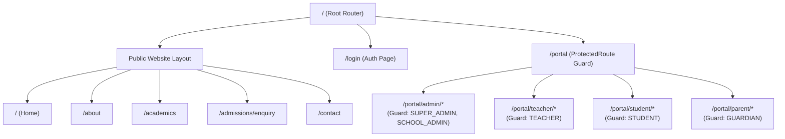
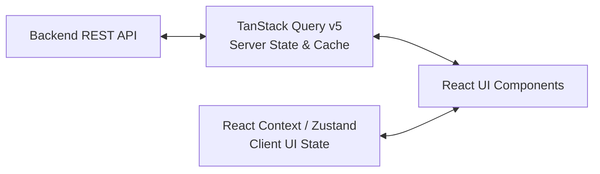

# FRONTEND ARCHITECTURE: LITTLE ANGELS SCHOOL — SCHOOL ERP & PUBLIC WEBSITE

## 1. Core Structural Organization (Vite + React + TypeScript)
The frontend is built as a unified Single-Page Application (SPA) using **Vite**, **React 18+**, and **TypeScript**. It houses two visual layouts within a cohesive route tree:
1. **Public Website Layout**: SEO-optimized, responsive marketing and informational pages.
2. **ERP Portal AppLayout**: High-density SaaS administration dashboard with collapsible sidebar, top navigation bar, breadcrumb trail, and role-based views.

```
src/
├── assets/                 # Static branding, logos, default placeholder graphics
├── components/             # Reusable UI Design System & generic building blocks
│   ├── ui/                 # Atomic design tokens (Button, Card, Modal, Badge, Toast)
│   ├── form/               # Zod-integrated React Hook Form inputs (Input, Select, DatePicker)
│   ├── table/              # Server-driven DataTable with sorting, filtering, and pagination
│   └── feedback/           # Skeletons, empty states, error boundaries, spinners
├── layouts/                # Master UI Layout wrappers
│   ├── PublicLayout.tsx    # Header, Navigation Navbar, Content Outlet, Footer
│   └── ERPLayout.tsx       # Sidebar, Topbar, Session Selector, Breadcrumbs, Content Outlet
├── lib/                    # API client, HTTP interceptors, utils, constants
│   ├── api.ts              # Axios / Fetch client with environment-configurable base URL & auto-refresh
│   └── queryClient.ts      # TanStack Query queryClient config and defaults
├── modules/                # Feature modules (Domain-driven component grouping)
│   ├── public/             # Home, About, Academics, Facilities, Contact, AdmissionForm
│   ├── auth/               # Login, ForgotPassword, ResetPassword, Profile, MultiDeviceSessions
│   ├── admin/              # Dashboard, Classes, Teachers, Students, StudentGuardian, FeeStructures, CMS
│   ├── teacher/            # AttendanceSheet, MarkEntryTable, HomeworkWizard
│   ├── student/            # StudentDashboard, HomeworkFeed, MyAttendance, MyReportCard
│   └── guardian/           # GuardianDashboard, ChildSelector (via StudentGuardian), FeeReceiptViewer
├── router/                 # React Router v6+ route configuration & routing guards
│   ├── index.tsx           # Router tree definition
│   └── ProtectedRoute.tsx  # RBAC Guard & Session Authenticator
└── store/                  # Client UI state (Auth session context, Theme, Sidebar state)
```

---

## 2. Router Tree & Role-Based Guard Architecture



### 2.1. Guard Implementation Strategy (`<ProtectedRoute />`)
```tsx
// Role-aware routing guard preventing unauthorized client navigation
interface ProtectedRouteProps {
  allowedRoles: Array<'SUPER_ADMIN' | 'SCHOOL_ADMIN' | 'TEACHER' | 'STUDENT' | 'GUARDIAN'>;
}

export const ProtectedRoute: React.FC<ProtectedRouteProps> = ({ allowedRoles }) => {
  const { user, isAuthenticated, isLoading } = useAuth();

  if (isLoading) return <FullPageSkeletonLoader />;
  if (!isAuthenticated || !user) return <Navigate to="/login" replace />;
  if (!allowedRoles.includes(user.roleName)) {
    return <Navigate to="/portal/unauthorized" replace />;
  }

  return <ERPLayout />;
};
```

---

## 3. Environment-Configurable API Layer & Security Client (`lib/api.ts`)

To ensure clean multi-environment portability without hard-coded production URLs, the Axios/Fetch client is configured using Vite environment variables:

```typescript
// src/lib/api.ts
import axios from 'axios';

export const apiClient = axios.create({
  baseURL: import.meta.env.VITE_API_BASE_URL || 'http://localhost:5000/api/v1',
  withCredentials: true, // Required for sending HTTP-Only RefreshToken cookies
  headers: {
    'Content-Type': 'application/json',
  },
});
```

* **Incremental Security in Frontend Client**: From Phase 1 onwards, `withCredentials: true` ensures secure HTTP-only refresh cookies are sent automatically. Axios interceptors detect `401 AUTH_TOKEN_EXPIRED` responses and seamlessly execute a refresh token rotation request before retrying failed requests.

---

## 4. State Management Architecture

The application strictly separates **Server State** from **Client UI State**, eliminating the anti-pattern of caching API responses in Redux or Zustand.



### 4.1. Server State Management: TanStack Query v5
* **Purpose**: Manages all asynchronous API data, caching, background refetching, pagination, and optimistic mutations.
* **Query Key Factories**: Standardized factories ensure deterministic cache invalidation after mutations:
  ```ts
  export const attendanceKeys = {
    all: ['attendance'] as const,
    list: (filters: Record<string, unknown>) => [...attendanceKeys.all, 'list', filters] as const,
    summary: (studentId: string, session: string) => [...attendanceKeys.all, 'summary', studentId, session] as const,
  };
  ```
* **Stale Time Policy**:
  * Static dropdowns (Classes, Sections, Fee Heads): `staleTime: 24 * 60 * 60 * 1000` (24 hours).
  * Dynamic transactional data (Attendance, Fee payments): `staleTime: 5 * 60 * 1000` (5 minutes).

### 4.2. Client UI State Management: React Context / Zustand
* **Purpose**: Manages purely client-side UI preferences that have no database equivalent:
  * Active Authentication Session (`user`, `tokenExpiry`, `activeAcademicSession`).
  * ERP Navigation Sidebar Collapse State (`isSidebarCollapsed`).
  * Theme preference (`"light" | "dark" | "system"`).
  * Active Child Selection for Parent Portal (`selectedChildId` loaded from `StudentGuardian` relationships).

### 4.3. Form State & Schema Validation: React Hook Form + Zod
* Every input form (Attendance batch marking, Mark entry table, Online admission inquiry) uses **React Hook Form** wrapped with **Zod** schema resolvers.
* Guarantees zero unnecessary re-renders during high-speed typing in marks sheets.

---

## 5. UI Layout Architecture: Public Layout vs. ERP SaaS Layout

### 5.1. Public Website Layout (`<PublicLayout />`)
* **Header**: Top announcement bar (phone number, admissions status) + Sticky navigation bar with Little Angels School emblem.
* **Navigation Links**: `Home`, `About`, `Academics`, `Facilities`, `Events`, `Notices`, `Admissions`, `Contact`, and an emphasized `Portal Login` call-to-action button.
* **Footer**: Institutional contact info, Google Maps embed link, social media links, mandatory privacy links, and copyright text.

### 5.2. ERP SaaS Layout (`<ERPLayout />`)
* **Responsive Collapsible Sidebar**:
  * Displays school brand and user role badge at the top.
  * Organizes navigation into collapsible domain groups: *Academic*, *Attendance*, *Examinations*, *Finance*, *Communication*, *Administration*, and *Account Settings* (including Multi-Device Sessions).
  * On mobile/tablet, the sidebar converts to a smooth drawer off-canvas menu.
* **Top Executive Bar**:
  * **Academic Session Switcher**: Dropdown allowing Admin/Teachers to toggle between configurable academic sessions (`2025-26`, `2026-27`) without relogging.
  * **Global Search Box**: Instant search across student admission numbers, teacher names, and circular titles.
  * **Notification Bell**: Dropdown list of unread circulars and homework due alerts.
  * **User Profile Avatar**: Dropdown with *My Profile*, *Multi-Device Sessions*, and *Log Out Everywhere*.
* **Breadcrumb Trail**: Dynamic breadcrumb navigation (e.g., `Portal > Academic > Classes > Class 10 - Sec A`).
