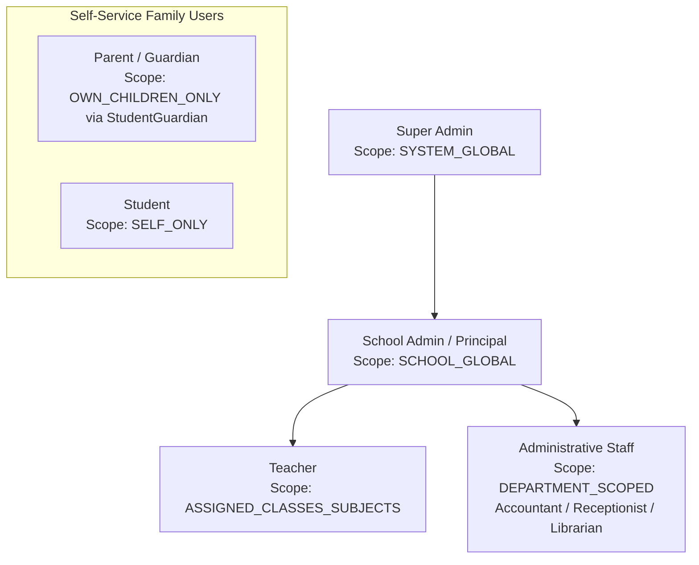

# RBAC & PERMISSION ARCHITECTURE: LITTLE ANGELS SCHOOL — SCHOOL ERP

## 1. Security Philosophy: Backend Enforcement vs. Frontend Hiding

A critical security principle in this architecture is that **Frontend role checks are UI conveniences, NOT security controls**. Hiding a button or route in the React SPA does not prevent an attacker from sending an HTTP POST or PATCH request directly to the backend API.

Every endpoint in the Express API is protected by a two-layer authorization pipeline:
1. **Role-Based Action Verification (`requirePermission(module, action, resource)`)**: Checks if the user's role has the required atomic permission in the `Permission` collection.
2. **Dynamic Scope & Ownership Enforcement (`enforceScope(scopeType)`)**: Validates that the target resource belongs to the user's authorized domain scope (e.g., matching `TeachingAssignment` or `StudentGuardian` relationship rows).

---

## 2. Comprehensive Role Hierarchy & Access Matrix



### 2.1. Dynamic Permission Matrix (CRUD / Publish / Approve / Export)

| Module / Resource | Super Admin | School Admin / Principal | Teacher | Student | Parent / Guardian | Accountant (Future) | Receptionist (Future) |
| :--- | :--- | :--- | :--- | :--- | :--- | :--- | :--- |
| **User & Roles (`user`, `role`)** | ALL | CREATE, READ, UPDATE | READ (Self) | READ (Self) | READ (Self) | READ (Self) | READ (Self) |
| **Academic Session (`session`)** | ALL | CREATE, READ, UPDATE, LOCK | READ | READ | READ | READ | READ |
| **Classes / Sections (`class`)** | ALL | ALL | READ | READ | READ | READ | READ |
| **Teacher Assign (`assignment`)**| ALL | ALL | READ (Self) | NONE | NONE | NONE | NONE |
| **Student Profile (`student`)** | ALL | ALL | READ (Assigned Classes)| READ (Self) | READ (Children via StudentGuardian)| READ | READ |
| **Attendance (`attendance`)** | ALL | ALL | CREATE, READ, UPDATE (Assigned Sections)| READ (Self) | READ (Children) | NONE | NONE |
| **Homework (`homework`)** | ALL | ALL | CREATE, READ, UPDATE, PUBLISH (Assigned)| READ (Assigned) | READ (Children's)| NONE | NONE |
| **Exam & Rules (`exam`, `rule`)**| ALL | ALL (Approve Results)| READ (Assigned) | READ | READ | NONE | NONE |
| **Marks (`mark`)** | ALL | ALL | CREATE, UPDATE (Assigned Subject + Lock)| READ (Self) | READ (Children) | NONE | NONE |
| **Report Card (`report_card`)** | ALL | CREATE, APPROVE, PUBLISH| CREATE (Class Teacher)| READ (Self) | READ (Children via StudentGuardian)| NONE | NONE |
| **Fee Structure (`fee_struct`)** | ALL | ALL | READ | READ | READ | ALL | READ |
| **Fee Payment (`payment`)** | ALL | READ, RECORD, CANCEL* | NONE | READ (Self) | READ (Children) | CREATE, READ, UPDATE*| NONE |
| **Notices & Events (`notice`)** | ALL | ALL (Publish) | CREATE (Draft), READ | READ | READ | READ | READ |
| **Admissions (`enquiry`)** | ALL | ALL | NONE | NONE | NONE | NONE | ALL |
| **CMS / Gallery (`cms`)** | ALL | ALL (Publish) | NONE | READ | READ | NONE | NONE |
| **Audit Log (`audit`)** | ALL | READ | NONE | NONE | NONE | READ (Finance only)| NONE |

*\*Note: Payment modifications or cancellations require an auditable credit note adjustment.*

---

## 3. Granular Resource Scoping Rules (Preventing IDOR)

### 3.1. Teacher Scoping (`ASSIGNED_CLASSES_SUBJECTS`)
When a Teacher requests to mark attendance (`POST /api/v1/attendance`), enter marks (`POST /api/v1/marks`), or view students (`GET /api/v1/students` / `GET /api/v1/enrollments`), the middleware executes:
1. Extract target `classId` and `sectionId` from the request filters or target student enrollment.
2. Query `TeachingAssignment.find({ teacherId: req.user.profileRef, academicSessionId: req.currentSession._id, status: 'ACTIVE' })` to retrieve authorized section IDs.
3. **Student Directory & Profiles Read-Only Access (Phase 4)**: A Teacher can only view `Student`, `Guardian`, `StudentGuardian`, and `Enrollment` records where the student has an active enrollment in one of the teacher's assigned `(classId, sectionId)` scopes. Any attempt to read students outside these sections returns `403 Forbidden`. Teachers have **no write, archive, promote, transfer, or withdraw permissions** for student master records.
4. **Marking Attendance / Marks**: For operational entry, query `TeachingAssignment.findOne({ teacherId: req.user.profileRef, academicSessionId: req.currentSession._id, classId, sectionId, subjectId })`.
5. **Class Teacher Exception**: Marking daily class attendance or compiling a terminal `ReportCard` requires `TeachingAssignment.isClassTeacher === true` for that section.

### 3.2. Parent / Guardian Scoping (`OWN_CHILDREN_ONLY` via `StudentGuardian`)
When a Guardian requests a child's fee receipt (`GET /api/v1/fees/receipts/:receiptId`) or report card:
1. Extract the target `studentId` from the resource (`Receipt.studentId` or `ReportCard.studentId`).
2. Query `StudentGuardian.findOne({ guardianId: req.user.profileRef, studentId })`.
3. If no matching relationship row is found, return `403 Forbidden: Resource access denied`.
4. **Granular Guardian Permission Checks**: Furthermore, the middleware checks specific flags on the `StudentGuardian` document:
   * Accessing report cards checks `canViewAcademicReports === true`.
   * Accessing fee receipts checks `canReceiveFinancialNotices === true`.

### 3.3. Student Scoping (`SELF_ONLY`)
When a Student requests attendance or marks:
1. Ensure `targetStudentId === req.user.profileRef`.
2. Any attempt to access `/api/v1/students/:otherId/...` fails immediately at the routing guard.

### 3.4. Teacher Timetable & Academic Calendar Scoping (`MY_TIMETABLE_ONLY` — Phase 5)
When a Teacher accesses curriculum, timetable, bell schedules, periods, or academic calendar endpoints:
1. **Read-Only Institutional Access**: Teachers have read-only access (`GET`) to active `ClassSubject`, `BellSchedule`, `TimetablePeriod`, `AcademicCalendar`, and `Holiday` records for the current session. Teachers have **no create, update, archive, or delete permissions** for master curriculum or calendar entities (`403 Forbidden`).
2. **Personal Timetable Isolation (`GET /api/v1/timetables/my-timetable`)**: When a Teacher requests their timetable, the controller automatically injects `teacherId: req.user.profileRef` into the query filter, returning only timetable slots where the teacher is assigned.
3. **Admin Timetable Matrix Protection**: Any attempt by a Teacher to query `/api/v1/timetables?teacherId=<otherTeacherId>` or access another teacher's schedule matrix returns `403 Forbidden: Cannot view timetable of another teacher`. Teachers may only query `GET /api/v1/timetables?sectionId=<sectionId>` for sections where they have an active `TeachingAssignment`.
4. **Published Timetable Isolation & Workload Metrics**: Teachers can only access timetable slots where `status === "PUBLISHED"`. Drafted or archived slots (`status === "DRAFT" | "ARCHIVED"`) are automatically excluded from teacher queries. Teachers can query their own workload metrics (`GET /api/v1/timetables/workload/:teacherId` where `teacherId === req.user.profileRef`).

### 3.5. Attendance & Leave Scoping (`ATTENDANCE_LEAVE_SCOPE` — Phase 6)
When a Teacher or Admin accesses attendance, attendance corrections, lock rules, or leave requests:
1. **Attendance Marking Authorization**:
   * For **Daily Attendance (`DAILY`)**: A Teacher can mark daily attendance (`POST /api/v1/attendance`) only for sections where they are the assigned Class Teacher (`TeachingAssignment.isClassTeacher === true`).
   * For **Period Attendance (`PERIOD`)**: A Teacher can mark period attendance only for sections and subjects where they have an active `TeachingAssignment` AND where there is an active `PUBLISHED` Timetable slot (`Timetable.status === "PUBLISHED"`) assigning them to that period on that day of the week.
   * Teachers can never manually choose subjects or periods they are not assigned (`403 Forbidden`).
2. **Attendance on Holidays and Emergency Closures**: Attempting to mark attendance on an official holiday (`Holiday.affectsAttendance === true`) or emergency closure date returns `400 Bad Request` or `409 Conflict`.
3. **Attendance Lifecycle & Corrections (`DRAFT` → `SUBMITTED` → `LOCKED` → `FROZEN`)**:
   * Initial saving creates an attendance session in `DRAFT` state. Submitting transitions it to `SUBMITTED`, and auto-lock or manual admin lock transitions it to `LOCKED`.
   * Once locked (`sessionStatus === "LOCKED"` or `isLocked === true`), Teachers cannot modify entries directly. Modifying a locked entry requires either an Admin override (`SUPER_ADMIN` or `SCHOOL_ADMIN`) or an approved `AttendanceCorrection` request submitted by the Teacher with a mandatory reason.
4. **Attendance Freeze & Admin Reopen Capability**:
   * When report cards are generated for an academic term or session, all related attendance sessions are transitioned to `FROZEN` (`sessionStatus === "FROZEN"`, `isFrozen === true`).
   * A frozen attendance session cannot be modified by Teachers or standard Admins. Modifying a frozen session requires an authorized Admin (`SUPER_ADMIN` or `SCHOOL_ADMIN`) to explicitly invoke the reopen endpoint (`PATCH /api/v1/attendance/:id/reopen`) with a mandatory audit reason, transitioning `sessionStatus` back to `LOCKED` or `SUBMITTED`.
5. **Leave Approval Workflows**:
   * **Student Leaves**: Can be reviewed and approved/rejected by the student's assigned Class Teacher, `SCHOOL_ADMIN`, or `SUPER_ADMIN`. Uses the controlled `leaveType` enum (`CASUAL`, `MEDICAL`, `EMERGENCY`, `SPORTS`, `OFFICIAL`, `OTHER`).
   * **Teacher Leaves**: Can only be reviewed and approved/rejected by `SCHOOL_ADMIN` or `SUPER_ADMIN`.
   * When an approved student leave overlaps with an attendance session, the student's attendance entry is automatically recorded or updated with `attendanceSource: "LEAVE"` and status `APPROVED_LEAVE` or `MEDICAL_LEAVE`.

---

## 4. Permission Middleware Enforcement Contract

In Express route files, authorization is declared explicitly using middleware factories:

```typescript
// Example: Mark Entry Endpoint
router.post(
  '/api/v1/marks',
  authenticateJwt,
  requirePermission('EXAM', 'CREATE', 'mark'),
  enforceTeacherSubjectScope(), // Validates that Teacher teaches req.body.subjectId in req.body.sectionId
  validateBody(CreateMarkSchema),
  MarksController.recordMarks
);

// Example: Parent View Report Card
router.get(
  '/api/v1/report-cards/:studentId/:examId',
  authenticateJwt,
  requirePermission('EXAM', 'READ', 'report_card'),
  enforceGuardianScope('canViewAcademicReports'), // Validates StudentGuardian relationship & permission flag
  ReportCardController.getStudentReportCard
);
```
