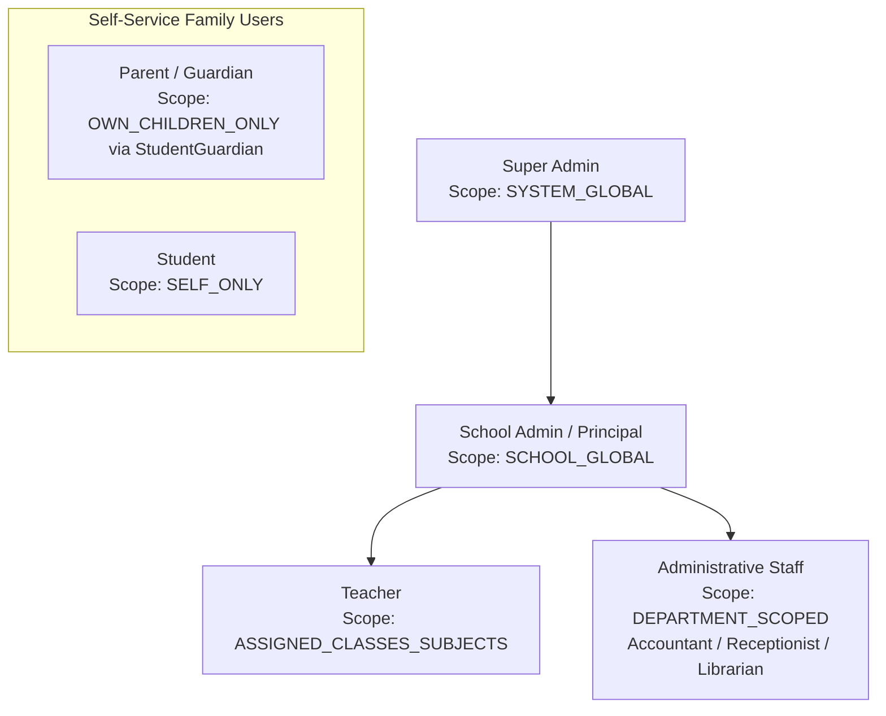

# RBAC & PERMISSION ARCHITECTURE: LITTLE ANGELS SCHOOL — SCHOOL ERP

## 1. Security Philosophy: Backend Enforcement vs. Frontend Hiding

A critical security principle in this architecture is that **Frontend role checks are UI conveniences, NOT security controls**. Hiding a button or route in the React SPA does not prevent an attacker from sending an HTTP POST or PATCH request directly to the backend API.

Every endpoint in the Express API is protected by a two-layer authorization pipeline:
1. **Role-Based Action Verification (`requirePermission(module, action, resource)`)**: Checks if the user's role has the required atomic permission in the `Permission` collection.
2. **Dynamic Scope & Ownership Enforcement (`enforceScope(scopeType)`)**: Validates that the target resource belongs to the user's authorized domain scope (e.g., matching `TeachingAssignment` or `StudentGuardian` relationship rows).

---

## 2. Comprehensive Role Hierarchy & Access Matrix



### 2.1. Dynamic Permission Matrix (CRUD / Publish / Approve / Export)

| Module / Resource | Super Admin | School Admin / Principal | Teacher | Student | Parent / Guardian | Accountant (Future) | Receptionist (Future) |
| :--- | :--- | :--- | :--- | :--- | :--- | :--- | :--- |
| **User & Roles (`user`, `role`)** | ALL | CREATE, READ, UPDATE | READ (Self) | READ (Self) | READ (Self) | READ (Self) | READ (Self) |
| **Academic Session (`session`)** | ALL | CREATE, READ, UPDATE, LOCK | READ | READ | READ | READ | READ |
| **Classes / Sections (`class`)** | ALL | ALL | READ | READ | READ | READ | READ |
| **Teacher Assign (`assignment`)**| ALL | ALL | READ (Self) | NONE | NONE | NONE | NONE |
| **Student Profile (`student`)** | ALL | ALL | READ (Assigned Classes)| READ (Self) | READ (Children via StudentGuardian)| READ | READ |
| **Attendance (`attendance`)** | ALL | ALL | CREATE, READ, UPDATE (Assigned Sections)| READ (Self) | READ (Children) | NONE | NONE |
| **Homework (`homework`)** | ALL | ALL | CREATE, READ, UPDATE, PUBLISH (Assigned)| READ (Assigned) | READ (Children's)| NONE | NONE |
| **Exam & Rules (`exam`, `rule`)**| ALL | ALL (Approve Results)| READ (Assigned) | READ | READ | NONE | NONE |
| **Marks (`mark`)** | ALL | ALL | CREATE, UPDATE (Assigned Subject + Lock)| READ (Self) | READ (Children) | NONE | NONE |
| **Report Card (`report_card`)** | ALL | CREATE, APPROVE, PUBLISH| CREATE (Class Teacher)| READ (Self) | READ (Children via StudentGuardian)| NONE | NONE |
| **Fee Structure (`fee_struct`)** | ALL | ALL | READ | READ | READ | ALL | READ |
| **Fee Payment (`payment`)** | ALL | READ, RECORD, CANCEL* | NONE | READ (Self) | READ (Children) | CREATE, READ, UPDATE*| NONE |
| **Notices & Events (`notice`)** | ALL | ALL (Publish) | CREATE (Draft), READ | READ | READ | READ | READ |
| **Admissions (`enquiry`)** | ALL | ALL | NONE | NONE | NONE | NONE | ALL |
| **CMS / Gallery (`cms`)** | ALL | ALL (Publish) | NONE | READ | READ | NONE | NONE |
| **Audit Log (`audit`)** | ALL | READ | NONE | NONE | NONE | READ (Finance only)| NONE |

*\*Note: Payment modifications or cancellations require an auditable credit note adjustment.*

---

## 3. Granular Resource Scoping Rules (Preventing IDOR)

### 3.1. Teacher Scoping (`ASSIGNED_CLASSES_SUBJECTS`)
When a Teacher requests to mark attendance (`POST /api/v1/attendance`) or enter marks (`POST /api/v1/marks`), the middleware executes:
1. Extract `classId`, `sectionId`, and `subjectId` from the payload.
2. Query `TeachingAssignment.findOne({ teacherId: req.user.profileRef, academicSessionId: req.currentSession._id, classId, sectionId, subjectId })`.
3. If no matching assignment is found, the backend throws `403 Forbidden: User is not authorized for this academic scope`.
4. **Class Teacher Exception**: Marking daily class attendance or compiling a terminal `ReportCard` requires `TeachingAssignment.isClassTeacher === true` for that section.

### 3.2. Parent / Guardian Scoping (`OWN_CHILDREN_ONLY` via `StudentGuardian`)
When a Guardian requests a child's fee receipt (`GET /api/v1/fees/receipts/:receiptId`) or report card:
1. Extract the target `studentId` from the resource (`Receipt.studentId` or `ReportCard.studentId`).
2. Query `StudentGuardian.findOne({ guardianId: req.user.profileRef, studentId })`.
3. If no matching relationship row is found, return `403 Forbidden: Resource access denied`.
4. **Granular Guardian Permission Checks**: Furthermore, the middleware checks specific flags on the `StudentGuardian` document:
   * Accessing report cards checks `canViewAcademicReports === true`.
   * Accessing fee receipts checks `canReceiveFinancialNotices === true`.

### 3.3. Student Scoping (`SELF_ONLY`)
When a Student requests attendance or marks:
1. Ensure `targetStudentId === req.user.profileRef`.
2. Any attempt to access `/api/v1/students/:otherId/...` fails immediately at the routing guard.

---

## 4. Permission Middleware Enforcement Contract

In Express route files, authorization is declared explicitly using middleware factories:

```typescript
// Example: Mark Entry Endpoint
router.post(
  '/api/v1/marks',
  authenticateJwt,
  requirePermission('EXAM', 'CREATE', 'mark'),
  enforceTeacherSubjectScope(), // Validates that Teacher teaches req.body.subjectId in req.body.sectionId
  validateBody(CreateMarkSchema),
  MarksController.recordMarks
);

// Example: Parent View Report Card
router.get(
  '/api/v1/report-cards/:studentId/:examId',
  authenticateJwt,
  requirePermission('EXAM', 'READ', 'report_card'),
  enforceGuardianScope('canViewAcademicReports'), // Validates StudentGuardian relationship & permission flag
  ReportCardController.getStudentReportCard
);
```
