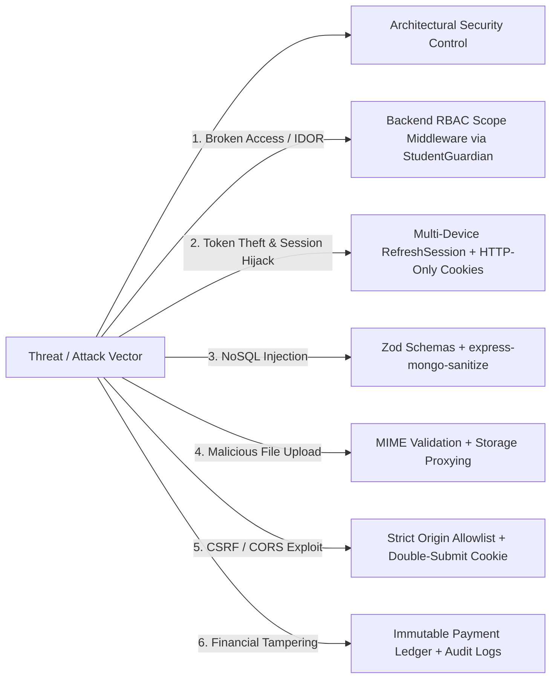
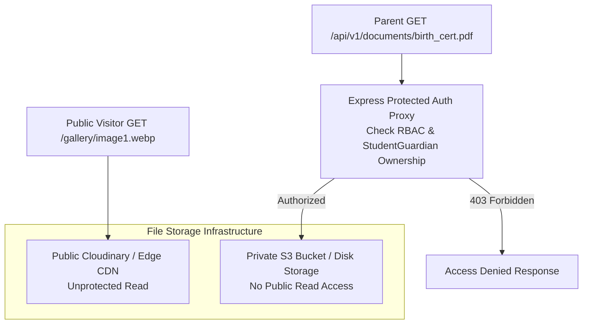

# SECURITY & PRIVACY ARCHITECTURE: LITTLE ANGELS SCHOOL

## 1. Zero-Trust Security Posture & Incremental Implementation
Because the Little Angels School ERP processes sensitive personal, demographic, academic, and financial information belonging to minors (students from Pre-Primary to Class 10) and their parents, security and data privacy are architected as first-class domain constraints.

### 1.1. Core Principle: Incremental Security Implementation (No Postponement)
A critical architectural mandate is that **security controls must be implemented incrementally, not postponed until Phase 17**.
* **Phase 1 Foundation**: Sets up secure HTTP headers (Helmet), environment-configurable CORS allowlists, and NoSQL injection sanitization (`express-mongo-sanitize`).
* **Phase 2 Authentication**: Implements Bcrypt/Argon2i password hashing, multi-device session management (`RefreshSession`), short-lived access JWTs, HTTP-only cookie handling, and auth rate limiting.
* **Phases 3–16 Domain Modules**: Every module integrates strict Zod input validation, RBAC scope checking, and immutable audit logging at the time of development.
* **Phase 17 Final Security Hardening**: Reserved for comprehensive penetration testing, compliance verification, security audit reviews, and final infrastructure hardening.

---

## 2. Threat Model & Technical Mitigation Matrix



### 2.1. Detailed Threat Mitigations

| Threat / Attack Vector | Risk Description | Architectural Security Mitigation (Incremental) |
| :--- | :--- | :--- |
| **1. Insecure Direct Object References (IDOR)** | Parent A modifying URL parameter `/api/v1/fees/student/64c_studentB` to inspect another family's fee dues or report card. | Every student-scoped controller invokes `enforceScope('studentId')`. The backend checks the `StudentGuardian` join collection before executing DB queries. |
| **2. Session Hijacking & Multi-Device Token Theft** | Storing JWTs in `localStorage` exposes them to XSS attacks on shared school lab computers. Storing a single token hash on `User` prevents inspecting or revoking compromised sessions. | Access JWTs (15 min lifespan) live only in memory; long-lived Refresh Tokens (7 days) are stored in `Secure, HTTP-Only, SameSite=Strict` cookies and validated against the `RefreshSession` collection. Each device login represents an independent **Session Family (`sessionFamilyId`)**. When a refresh token is rotated, the same `sessionFamilyId` is preserved. If an already-invalidated token is replayed, the system logs `SUSPICIOUS_REFRESH_REUSE` and revokes only the affected `sessionFamilyId`, leaving unrelated valid device sessions intact. Supports targeted device revocation and `logout-all`. |
| **3. NoSQL Injection & Payload Contamination** | Attacker injects MongoDB query operators (`{ "$gt": "" }`) into login username or filter params to bypass authentication. | Middleware stack applies `express-mongo-sanitize` from **Phase 1** onwards to strip `$` and `.` characters from `req.body` and `req.query`, reinforced by strict Zod schema validation. |
| **4. Malicious / Arbitrary File Uploads** | Disguising `.exe` or `.html` script files as `.pdf` homework attachments to execute script payloads. | Upload endpoint validates MIME type AND inspects file **magic bytes** (file signature). Enforces 10MB file size limit and stores files on non-executing storage servers. |
| **5. Cross-Site Request Forgery (CSRF)** | Third-party site tricking logged-in Principal into sending a `POST /api/v1/students/:id/promote` request. | API enforces **SameSite=Strict** on auth cookies and checks custom `X-Requested-With` header + Origin validation on state-changing POST/PATCH requests. |
| **6. Brute Force Credential Guessing** | Attacker guessing teacher passwords on `/api/v1/auth/login`. | Implements a **Layered Authentication Rate Limiting** strategy from **Phase 2**: (1) account-level throttling by normalized `identifier + IP` (max 5 failed attempts per 15 min), (2) broader IP-based abuse protection (max 100 attempts per 15 min) so shared school NATs are not locked out by one user, and (3) dedicated refresh limiter (`/api/v1/auth/refresh`). Returns generic `"Invalid credentials"` errors. System password policy enforces **NIST SP 800-63B** guidelines (min 10 chars, max 128 chars, length over arbitrary complexity). Passwords hashed using **Bcrypt** (salt rounds = 12). |

---

## 3. Public Media vs. Private Document Isolation



### 3.1. Public Tier (CDN Direct)
* **Contents**: Gallery photos, homepage banner imagery, public circular PDFs, principal message photo.
* **Access Model**: Public CDN URLs directly accessible without authentication tokens.

### 3.2. Private Tier (Authenticated Proxy Stream)
* **Contents**: Student birth certificates, transfer certificates, medical reports, fee payment receipts, teacher ID proofs.
* **Access Model**: Zero public URLs. Files are stored in a private directory/bucket with no external read access.
* **Retrieval Flow**:
  1. Client requests `GET /api/v1/documents/:documentId/download`.
  2. Middleware authenticates user and verifies `Document.ownerId` matches user profile or guardian children via `StudentGuardian`.
  3. Server reads encrypted stream from storage provider and pipes file buffer to HTTP response with `Content-Disposition: inline/attachment`.

---

## 4. Immutable Audit Ledger Architecture (`AuditLog`)

To guarantee administrative accountability, the following sensitive events trigger an immutable `AuditLog` write via an asynchronous background emitter:
1. `USER_LOGIN`, `USER_LOGOUT`, `PASSWORD_RESET`, `ROLE_ASSIGNED`, `SESSION_REVOKED`.
2. `STUDENT_ENROLLED`, `STUDENT_PROMOTED`, `STUDENT_DETAINED`.
3. `EXAM_MARKS_ENTERED`, `EXAM_MARKS_MODIFIED`, `REPORT_CARD_PUBLISHED`.
4. `FEE_STRUCTURE_CREATED`, `FEE_PAYMENT_RECORDED`, `FEE_CONCESSION_GRANTED`.

### 4.1. Tamper-Proof Audit Payload Contract
```json
{
  "_id": "64ca8f...109e",
  "schoolId": "LAPS-GOHAD",
  "actorUserId": "64ca8e...002a",
  "actorRole": "TEACHER",
  "actionCode": "EXAM_MARKS_MODIFIED",
  "targetEntityType": "Mark",
  "targetEntityId": "64ca8f...8821",
  "ipAddress": "103.20.212.15",
  "userAgent": "Mozilla/5.0 (Windows NT 10.0; Win64; x64) Chrome/127.0.0.0",
  "timestamp": "2026-07-27T15:45:00.123Z",
  "beforeState": { "marksObtained": 65, "grade": "B" },
  "afterState": { "marksObtained": 85, "grade": "A" }
}
```
* **Immutability Guarantee**: Database user account used by the Express API is granted `insert` and `select` permissions on `audit_logs` collection, but **no `update` or `delete` privileges**, making audit entries append-only.
