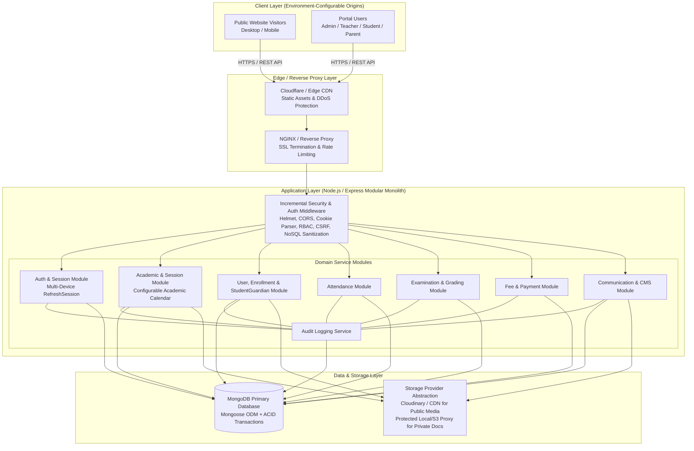
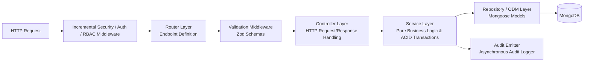

# SYSTEM ARCHITECTURE: LITTLE ANGELS SCHOOL — SCHOOL ERP & PUBLIC WEBSITE

## 1. High-Level Architectural Vision

The **Little Angels School ERP & Public Website** is architected as a **Modular Monolith** with a decoupled single-page application (SPA) frontend and a RESTful backend API. This approach delivers the high cohesion and operational simplicity required for a single-school production deployment while enforcing strict domain boundaries that enable future horizontal scaling.

---

## 2. Comprehensive Architecture Diagram

---

## 3. Technology Stack Evaluation & Architectural Refinements

The user's preferred technology stack was thoroughly evaluated against production reliability, developer velocity, security, and maintainability for an educational institution in semi-urban India.

### 3.1. Evaluation Summary Table

| Layer | Preferred Technology | Evaluation Decision | Refinements / Additions |
| :--- | :--- | :--- | :--- |
| **Frontend Core** | React + Vite | **Approved** | Adopt **TypeScript (`.tsx`/`.ts`)** for full type-safety across complex ERP data structures. |
| **Styling & Icons** | Tailwind CSS + Lucide React | **Approved** | Define a standardized design token system in `tailwind.config.ts` (colors, spacing, typography). |
| **Routing & Cache** | React Router + TanStack Query | **Approved** | Implement TanStack Query query-key factories for deterministic cache invalidation. |
| **Forms & Validation** | React Hook Form + Zod | **Approved** | Share Zod validation schemas between Frontend and Backend where feasible. |
| **Data Visualization**| Recharts | **Approved** | Wrap in responsive container components for mobile/tablet reporting dashboards. |
| **Backend Runtime** | Node.js + Express.js | **Approved** | Adopt **TypeScript (`ts-node-dev`/`tsx`)**, structured logging (**Pino/Winston**), and **Helmet**. |
| **Database & ODM** | MongoDB + Mongoose | **Approved** | Use Mongoose schemas with strict indexing, ACID multi-document transactions for financials/promotions. |
| **File Storage** | Cloudinary / Abstraction | **Approved & Refined**| Design `IFileStorageService` with dual providers (`Cloudinary` for public, protected Disk/S3 for private). |

### 3.2. Detailed Explanation of Architectural Refinements & Core Principles

#### Refinement 1: Full-Stack TypeScript Adoption
* **What Should Change**: Write both the React frontend and Express backend in **TypeScript** instead of vanilla JavaScript.
* **Why**: Educational ERP systems contain complex, interconnected data structures (e.g., grading rules, attendance matrices, fee installment structures). Vanilla JavaScript leads to frequent runtime errors and DTO drift between frontend and backend.
* **Advantages**: End-to-end type safety, autocompletion, refactoring safety, self-documenting code.
* **Disadvantages**: Slightly increased build step complexity.

#### Refinement 2: Incremental Security Architecture (Built-In from Phase 1)
* **What Should Change**: Do not postpone security headers, CORS allowlists, NoSQL injection sanitization, or rate limiting to a late Phase 17. Implement **incremental security from Phase 1 onward**.
* **Why**: Production educational software must protect minor records at every iteration. Every module must be deployed with Helmet HTTP hardening, `express-mongo-sanitize`, strict Zod schema validation, and RBAC middleware. Phase 17 is reserved for **final security hardening, penetration testing, and audit verification**.
* **Advantages**: Zero unprotected development builds; secure-by-default architecture.
* **Disadvantages**: Requires configuring middleware in Phase 1/2.

#### Refinement 3: Environment-Configurable Origins & URLs
* **What Should Change**: All frontend/backend production origins, CORS allowlists, and API URLs must be **100% environment-configurable** (`process.env.API_BASE_URL`, `process.env.FRONTEND_ORIGIN`).
* **Why**: Hardcoding production domains breaks staging environments, local development, and future infrastructure migrations.
* **Advantages**: Clean multi-environment portability (local Docker, staging, production cloud).

#### Refinement 4: Configurable Academic Calendar
* **What Should Change**: Do not hard-code an April–March academic calendar. `AcademicSession` `startDate` and `endDate` must remain dynamically configurable by school administrators. April–March is used only as development seed data.
* **Why**: Schools may adjust term start dates or operate special summer sessions.
* **Advantages**: Zero hard-coded temporal assumptions in domain logic.

---

## 4. Backend Layered Architecture (Modular Monolith)

The Express backend strictly separates responsibilities into four layers, preventing business logic leakage and simplifying automated testing:

1. **Router Layer (`/src/routes`)**: Defines endpoint URLs, applies authentication/RBAC middleware, and attaches Zod input validators.
2. **Controller Layer (`/src/controllers`)**: Handles HTTP status codes, parses query/body params, invokes domain services, and formats the standard JSON response envelope. Contains **zero business logic**.
3. **Service Layer (`/src/services`)**: Implements institutional business rules (e.g., calculating grade letters, validating promotion prerequisites, checking teaching assignment scopes). Manages Mongoose ACID transactions for multi-document operations.
4. **Data Access / ODM Layer (`/src/models`)**: Defines Mongoose schemas, compound indexes, virtuals, and lifecycle hooks.

---

## 5. Single-School Focus with SaaS Extensibility

While Phase 1 through 20 are built specifically for **Little Angels School (Gohad)** as a single-school deployment:
1. **Tenant Identifier Retention (`schoolId`)**: Every Mongoose schema retains an indexed `schoolId` field (e.g., `{ schoolId: { type: String, required: true, default: "LAPS-GOHAD", index: true } }`).
2. **Zero Multi-Tenant SaaS Infrastructure**: We do **not** implement complex multi-tenant SaaS routing, subdomain extraction, or dynamic tenant schema switching in this single-school version. Retaining `schoolId` simply ensures that if the school ever converts this into a multi-school SaaS in the future, **zero database schema migrations** will be required.
