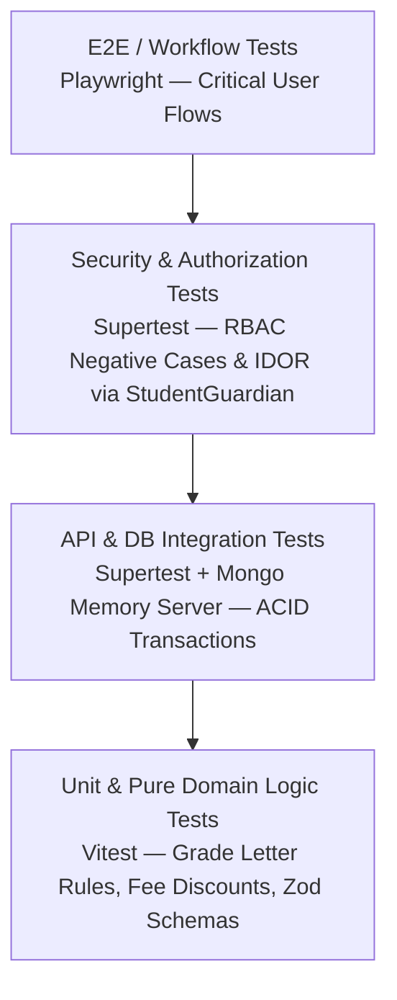

# TESTING & QUALITY ASSURANCE STRATEGY: LITTLE ANGELS SCHOOL

## 1. Testing Pyramid & Quality Philosophy
To guarantee zero regressions in financial records, examination calculations, and multi-role access control, the platform implements a **4-Layer Quality Assurance Pyramid**:

1. **Unit Tests (Vitest)**: Fast, deterministic tests for pure business logic (grade calculations, fee discount formulas, date helpers, Zod validation schemas).
2. **Integration Tests (Vitest + Supertest + MongoMemoryServer)**: Test Express controllers, Mongoose schema constraints, and MongoDB multi-document ACID transactions in isolated memory DB instances.
3. **Security & Authorization Tests (Supertest)**: Dedicated test suite validating positive and negative RBAC / IDOR enforcement rules across all endpoints.
4. **End-to-End (E2E) Workflow Tests (Playwright)**: Browser automation verifying complete cross-actor journeys (Teacher publishing homework -> Parent viewing in portal).

---

## 2. Security & Authorization Test Matrix (High Priority)

A mandatory requirement is testing **Negative Access Cases (Denial of Service & IDOR)** before testing positive success paths.

### 2.1. Mandatory Authorization Test Scenarios
* `TEST-AUTH-001`: **Teacher Class Scope Denial**
  * *Setup*: Authenticate as Teacher A (assigned only to Class 5 - Section A).
  * *Action*: Execute `POST /api/v1/attendance/batch` with payload targeting `Class 8 - Section B`.
  * *Expected Result*: HTTP `403 Forbidden` (`AUTH_SCOPE_FORBIDDEN`).
* `TEST-AUTH-002`: **Parent IDOR Denial via `StudentGuardian`**
  * *Setup*: Authenticate as Guardian A (parent of Student 001 via `StudentGuardian`).
  * *Action*: Execute `GET /api/v1/fees/student/002` (Student 002 is linked only to Guardian B).
  * *Expected Result*: HTTP `403 Forbidden` (`AUTH_SCOPE_FORBIDDEN`).
* `TEST-AUTH-003`: **Student Self-Scope Denial**
  * *Setup*: Authenticate as Student A (`001`).
  * *Action*: Execute `GET /api/v1/exams/101/report-cards/002`.
  * *Expected Result*: HTTP `403 Forbidden`.
* `TEST-AUTH-004`: **Unassigned Subject Teacher Mark Entry Denial**
  * *Setup*: Authenticate as Teacher A (teaches Hindi in Class 10 - Section A).
  * *Action*: Execute `POST /api/v1/exams/midterm/marks` for Mathematics in Class 10 - Section A.
  * *Expected Result*: HTTP `403 Forbidden`.
* `TEST-AUTH-005`: **Multi-Device `RefreshSession` Revocation Test**
  * *Setup*: Authenticate User A on Device 1 and Device 2 (two active `RefreshSession` rows in DB).
  * *Action*: On Device 1, execute `DELETE /api/v1/auth/sessions/:device2SessionId`.
  * *Expected Result*: Device 2's `RefreshSession.isRevoked` becomes `true`. Subsequent attempts by Device 2 to call `/api/v1/auth/refresh` return `401 Unauthorized` (`AUTH_SESSION_REVOKED`).

---

## 3. Critical Business Workflow Test Suites

### 3.1. Homework Lifecycle Workflow (`TEST-FLOW-HW`)
1. **Teacher Action**: Authenticate as Teacher -> Create Homework for assigned Class 6 Math (`POST /api/v1/homework`) -> Assert status is `DRAFT`.
2. **Publish**: Execute `PATCH /api/v1/homework/:id/publish` -> Assert status becomes `PUBLISHED`.
3. **Student View**: Authenticate as Student in Class 6 -> `GET /api/v1/homework` -> Assert published homework is present in feed.
4. **Parent View**: Authenticate as Guardian of Class 6 Student (verified via `StudentGuardian`) -> Assert homework is visible.

### 3.2. Attendance Batch Processing Workflow (`TEST-FLOW-ATT`)
1. **Submit Batch**: Class Teacher submits attendance for 40 students (`38 PRESENT, 2 ABSENT`).
2. **Idempotency / Unique Date Test**: Try submitting a second batch for the same Section and Date -> Assert HTTP `409 Conflict`.
3. **Parent Check**: Guardian of Absent student queries daily attendance -> Asserts status is `ABSENT`.

### 3.3. Examination Grading & Report Card Workflow (`TEST-FLOW-EXAM`)
1. **Create Exam & Rule**: Admin creates `Mid-Term` and configures `GradeRule` (`A+: 90-100%, A: 80-89%, B: 70-79%`).
2. **Teacher Enter Marks**: Teacher submits score `85` for Student 001 in Science.
3. **Compile Results**: Admin executes `POST /api/v1/exams/midterm/compile-results`.
4. **Assert Calculation**: Database asserts Student 001 overall grade is letter `"A"`, percentage is `85%`, and report card status is `DRAFT`.
5. **Publish**: Admin publishes -> Guardian queries report card API -> Asserts compiled PDF download link is accessible.

### 3.4. Fee Billing & Payment Transaction Workflow (`TEST-FLOW-FEE`)
1. **Assign Fee**: Assign `Tuition Fee - INR 5000` to Student 001 (`StudentFee` status is `UNPAID`).
2. **Record Payment**: Staff records offline Cash payment of `INR 5000` (`POST /api/v1/fees/payments`).
3. **Assert Transaction**:
   * Asserts `StudentFee.status` transforms to `PAID`.
   * Asserts `StudentFee.paidAmount` == `5000`.
   * Asserts unique `Receipt` document (`REC-2026-00001`) is generated.
   * Asserts `AuditLog` captures `"FEE_PAYMENT_RECORDED"`.

### 3.5. Academic Promotion Session Wizard (`TEST-FLOW-PROMO`)
1. **Setup**: Student 001 is enrolled in `Session 2025-26, Class 1 - Sec A, roll 15`.
2. **Promote Action**: Principal executes `POST /api/v1/enrollments/promote` to target `Session 2026-27, Class 2 - Sec A, roll 12`.
3. **Assert Historical Preservation**:
   * Querying `Enrollment.findOne({ studentId: 001, academicSessionId: "2025-26" })` returns `Class 1` with status `"PROMOTED"` and links `promotedToEnrollmentId`.
   * Querying `Enrollment.findOne({ studentId: 001, academicSessionId: "2026-27" })` returns `Class 2` with status `"ACTIVE"` and links `previousEnrollmentId`.
   * Student's independent biographical profile (`Student.firstName`, `admissionNumber`) remains unmodified.

### 3.6. Student, Guardian & Enrollment Lifecycle Suite (`TEST-FLOW-STUDENT-ENROLLMENT` - Phase 4)
1. **Admission Number Auto-Generation & Uniqueness**:
   * Create student without admissionNumber -> Asserts sequential `LAPS-{YYYY}-0001` format.
   * Create second student -> Asserts `LAPS-{YYYY}-0002`.
   * Attempt creating student with duplicate `LAPS-{YYYY}-0001` -> Asserts HTTP `409 Conflict`.
2. **Roll Number Auto-Generation & Uniqueness**:
   * Enroll student in `(session, class, section)` without rollNumber -> Asserts roll number `1`.
   * Enroll second student in same section -> Asserts roll number `2`.
   * Attempt duplicate roll number in same section -> Asserts HTTP `409 Conflict`.
3. **Unique Active Enrollment Constraint & Class Teacher Enrichment**:
   * Attempt creating a second active enrollment for the same student in the same academic session -> Asserts HTTP `409 Conflict`.
   * Query `GET /api/v1/enrollments/:id` -> Asserts response dynamically exposes `classTeacher` joined from active `TeachingAssignment` (`isClassTeacher: true`).
4. **Normalized StudentGuardian & Primary Guardian Rule**:
   * Link Father (`isPrimaryGuardian: true`) and Mother (`isPrimaryGuardian: false`) to student -> Asserts two distinct `StudentGuardian` records without embedding in `Student`.
   * Update Mother to `isPrimaryGuardian: true` -> Asserts Father automatically transitions to `isPrimaryGuardian: false`.
5. **Multi-Field Student Search**:
   * Query `GET /api/v1/students?search=FatherName` -> Asserts student returned by joining through `StudentGuardian` -> `Guardian.name`.
   * Query `GET /api/v1/students?search=GuardianPhone` -> Asserts student returned by matching linked guardian's phone number.
6. **Archive Protection Guards & Simplified Student Status**:
   * Attempt archiving a Student with an active enrollment -> Asserts HTTP `400 Bad Request` / `409 Conflict`.
   * Attempt archiving a Guardian who is the sole linked guardian for an active student -> Asserts HTTP `400 Bad Request` / `409 Conflict`.
   * Asserts `Student.status` remains `"ACTIVE"` while lifecycle states (`PROMOTED`, `TRANSFERRED`, `WITHDRAWN`, `ALUMNI`) are tracked exclusively in `Enrollment.enrollmentStatus`.
7. **Transfer & Withdrawal Wizards**:
   * Execute `POST /api/v1/enrollments/:id/transfer` -> Asserts enrollment status `"TRANSFERRED"` with remarks and date.
   * Execute `POST /api/v1/enrollments/:id/withdraw` -> Asserts enrollment status `"WITHDRAWN"`.
8. **RBAC Scope Enforcement**:
   * Authenticate as Teacher -> Read student enrolled in assigned class/section -> Asserts HTTP `200 OK`.
   * Authenticate as Teacher -> Attempt reading student outside assigned sections -> Asserts HTTP `403 Forbidden`.
   * Authenticate as Teacher -> Attempt creating, promoting, transferring, or archiving student -> Asserts HTTP `403 Forbidden`.

### 3.7. Phase 5 — Curriculum, Timetable & Academic Calendar Verification Suite

The Curriculum, Timetable, and Academic Calendar test suite guarantees database integrity, zero double-booking conflicts, and strict multi-role authorization:

1. **Duplicate Period & Overlap Validation (`TEST-CURRICULUM-001`)**:
   * Attempt creating a `TimetablePeriod` with a duplicate `sequence` within the same `bellScheduleId` -> Asserts HTTP `409 Conflict`.
   * Attempt creating a period with `startTime` and `endTime` overlapping an existing active period in the same bell schedule -> Asserts HTTP `400 Bad Request` / `409 Conflict`.
2. **Teacher Conflict Detection (`TEST-CURRICULUM-002`)**:
   * Create Timetable Slot A for Section A at Period 1 on Monday with Teacher T1 -> Asserts HTTP `201 Created`.
   * Attempt creating Timetable Slot B for Section B at Period 1 on Monday with the same Teacher T1 -> Asserts HTTP `409 Conflict: Teacher is already assigned to another class during this period`.
3. **Room Conflict Detection (`TEST-CURRICULUM-003`)**:
   * Create Timetable Slot A for Section A at Period 2 on Tuesday assigned to dedicated `roomId: R01` -> Asserts HTTP `201 Created`.
   * Attempt creating Timetable Slot B for Section B at Period 2 on Tuesday assigned to the same `roomId: R01` -> Asserts HTTP `409 Conflict: Room is already booked by another class during this period`.
4. **Section Conflict Detection (`TEST-CURRICULUM-004`)**:
   * Create Timetable Slot A for Section A at Period 3 on Wednesday for Mathematics -> Asserts HTTP `201 Created`.
   * Attempt creating Timetable Slot B for Section A at Period 3 on Wednesday for Science -> Asserts HTTP `409 Conflict: Section already has a subject scheduled during this period`.
5. **Teacher Assignment Compatibility Validation (`TEST-CURRICULUM-005`)**:
   * Attempt scheduling a timetable slot with a `teachingAssignmentId` where `subjectId`, `classId`, or `sectionId` does not match the timetable slot's section and subject -> Asserts HTTP `400 Bad Request` / `409 Conflict`.
6. **Academic Calendar & Holiday Validation (`TEST-CURRICULUM-006`)**:
   * Create an `AcademicCalendarEvent` of type `"HOLIDAY"` and a corresponding `Holiday` catalog entry -> Asserts both entries are queryable by date range.
   * Toggle `emergencyClosureActive: true` on `WorkingDayRule` -> Asserts system reflects emergency closure status for the academic session.
7. **RBAC Timetable & Calendar Scoping (`TEST-CURRICULUM-007`)**:
   * Authenticate as Teacher -> Query `GET /api/v1/timetables/my-timetable` -> Asserts HTTP `200 OK` returning only the teacher's assigned `PUBLISHED` slots.
   * Authenticate as Teacher -> Attempt querying another teacher's timetable matrix (`GET /api/v1/timetables?teacherId=<otherTeacherId>`) -> Asserts HTTP `403 Forbidden`.
   * Authenticate as Teacher -> Attempt creating, updating, or archiving a timetable slot, period, bell schedule, or holiday -> Asserts HTTP `403 Forbidden`.
8. **Academic Term & Order Sequence Validation (`TEST-CURRICULUM-008`)**:
   * Create `AcademicTerm` entries (`Term 1`, `Term 2`) under an Academic Session -> Asserts code uniqueness and sequential order index enforcement.
9. **Dedicated Room Catalog Validation (`TEST-CURRICULUM-009`)**:
   * Attempt creating two rooms with the same room `code` -> Asserts HTTP `409 Conflict`.
   * Query rooms by `roomType` and `status: "ACTIVE"` -> Asserts correct filtering.
10. **Bell Schedule Scope Validation (`TEST-CURRICULUM-010`)**:
   * Create a bell schedule with `scopeType: "CLASS"` and `targetClassIds` -> Asserts schedule is returned when querying for that class and excluded for other classes.
   * Create a bell schedule with `validFrom` / `validTo` -> Asserts queries filter out schedules outside the valid date range.
11. **Timetable Versioning & Published Isolation (`TEST-CURRICULUM-011`)**:
    * Create timetable slots with `status: "DRAFT"` -> Asserts slots are visible to Admin queries but excluded when Teacher queries `GET /api/v1/timetables/my-timetable`.
    * Execute `POST /api/v1/timetables/publish` -> Asserts slot status becomes `"PUBLISHED"` and is now visible to Teacher queries.
12. **Curriculum Constraints & Workload Computation (`TEST-CURRICULUM-012`)**:
    * Configure `ClassSubject` with `minPeriodsPerWeek: 5` and `maxPeriodsPerWeek: 6`.
    * Query `GET /api/v1/timetables/workload/:teacherId` -> Asserts correct computation of daily periods, total weekly periods, free periods, and overload status.
13. **Recurring Calendar Event Validation (`TEST-CURRICULUM-013`)**:
    * Create an `AcademicCalendarEvent` with `isRecurring: true` and `recurrenceRule: { frequency: "WEEKLY", count: 10 }` -> Asserts recurrence rule persistence and date range query matching.

### 3.8. Attendance & Leave Management Verification Suite (`TEST-ATTENDANCE-001` through `TEST-ATTENDANCE-013` — Phase 6)
1. **Duplicate Attendance Prevention (`TEST-ATTENDANCE-001`)**:
   * Mark daily attendance for Section A on `2026-08-01` -> Asserts HTTP `201 Created`.
   * Attempt marking a second daily attendance session for Section A on `2026-08-01` -> Asserts HTTP `409 Conflict: Attendance session already marked for this date/section`.
2. **Wrong Teacher Marking Attendance (`TEST-ATTENDANCE-002`)**:
   * Authenticate as Teacher B (not assigned to Section A or Subject Math).
   * Attempt `POST /api/v1/attendance` for Section A -> Asserts HTTP `403 Forbidden: Teacher not authorized to mark attendance for this section/subject`.
3. **Attendance After Timetable Archive (`TEST-ATTENDANCE-003`)**:
   * Archive a timetable slot (`status: "ARCHIVED"`) or leave it in `"DRAFT"`.
   * Attempt marking period-wise attendance for that slot -> Asserts HTTP `400 Bad Request` / `409 Conflict: Cannot mark attendance for an unpublished or archived timetable period`.
4. **Attendance on Holidays (`TEST-ATTENDANCE-004`)**:
   * Create an official holiday (`Holiday.affectsAttendance === true`) on `2026-08-15`.
   * Attempt marking attendance on `2026-08-15` -> Asserts HTTP `400 Bad Request` / `409 Conflict: Cannot mark attendance on an official holiday`.
5. **Attendance on Emergency Closure (`TEST-ATTENDANCE-005`)**:
   * Configure an emergency closure date in `AcademicCalendarEvent` or `WorkingDayRule`.
   * Attempt marking attendance on that date -> Asserts HTTP `409 Conflict: School is closed due to emergency closure`.
6. **Attendance Lifecycle, Lock & Freeze Enforcement (`TEST-ATTENDANCE-006`)**:
   * Save session in `DRAFT` -> submit (`SUBMITTED`) -> lock (`sessionStatus: "LOCKED"` or exceed `lockAfterHours`).
   * Authenticate as Teacher -> Attempt modifying a locked entry -> Asserts HTTP `403 Forbidden: Attendance session is locked`.
   * Trigger report-card generation freeze (`PATCH /api/v1/attendance/:id/freeze`) -> Asserts `sessionStatus: "FROZEN"` and `isFrozen: true`.
   * Attempt modifying frozen attendance as Teacher or standard Admin -> Asserts HTTP `403 Forbidden: Attendance session is frozen due to report card generation`.
   * Call `PATCH /api/v1/attendance/:id/reopen` with mandatory audit reason -> Asserts session transitions back to `LOCKED` / `SUBMITTED`.
7. **Attendance Correction Workflow (`TEST-ATTENDANCE-007`)**:
   * Teacher submits `POST /api/v1/attendance/corrections` with mandatory reason -> Asserts HTTP `201 Created` (`correctionStatus: "PENDING"`).
   * Admin calls `PATCH /api/v1/attendance/corrections/:id/review` with `"APPROVED"` -> Asserts `AttendanceEntry.attendanceStatus` is updated and `statusHistory` contains immutable audit record.
8. **Leave Approval, Controlled Leave Types & Automatic Attendance Linkage (`TEST-ATTENDANCE-008`)**:
   * Submit student leave request with controlled enum `leaveType: "MEDICAL"` -> Class Teacher approves -> Asserts existing or newly generated `AttendanceEntry` records for those dates are automatically updated with `attendanceSource: "LEAVE"` and status `MEDICAL_LEAVE`.
9. **Teacher Leave Review Scoping (`TEST-ATTENDANCE-009`)**:
   * Submit teacher leave request -> Attempt review as another Teacher -> Asserts HTTP `403 Forbidden`.
   * Review as `SCHOOL_ADMIN` -> Asserts HTTP `200 OK`.
10. **Bulk Attendance Marking (`TEST-ATTENDANCE-010`)**:
    * Execute `POST /api/v1/attendance/bulk` across multiple sections -> Asserts atomic transaction commit and correct entry count creation.
11. **Attendance Register Query Verification (`TEST-ATTENDANCE-011`)**:
    * Query `GET /api/v1/attendance/register` across Daily, Weekly, Monthly, and Yearly frequencies -> Asserts accurate tabulation by student, class, section, subject, and teacher.
12. **RBAC Attendance & Leave Scoping (`TEST-ATTENDANCE-012`)**:
    * Verifies `SUPER_ADMIN`, `SCHOOL_ADMIN`, and `TEACHER` isolation across attendance registers, leave requests, and lock rule configurations.
13. **Attendance Percentage & Analytics Calculation (`TEST-ATTENDANCE-013`)**:
    * Query `GET /api/v1/attendance/analytics/summary` -> Asserts accurate computation of student attendance %, class %, section %, and defaulter identification (< 75% attendance).
14. **Attendance Entry Historical Snapshots, Source & Late Minutes (`TEST-ATTENDANCE-014`)**:
    * Mark attendance with `attendanceSource: "MANUAL"`, status `LATE`, and `lateMinutes: 15` -> Asserts `AttendanceEntry` correctly stores arrival delay and historical snapshot fields (`studentName`, `rollNumber`, `className`, `sectionName`).

### 3.9. Homework, Assignments & Study Material Verification Suite (`TEST-HOMEWORK-001` through `TEST-HOMEWORK-016` — Phase 7)
1. **Duplicate & Multi-Attempt Submission Prevention (`TEST-HOMEWORK-001`)**:
   * Attempt to submit a submission beyond `maxAttempts` or a duplicate concurrent active attempt for the same `homeworkId` -> Asserts system blocks submission with `409 Conflict` / `400 Bad Request`.
2. **Late Submission Tracking (`TEST-HOMEWORK-002`)**:
   * Student submits homework after `homework.dueDate` -> Asserts `isLate === true` and `lateMinutes` accurately records the arrival delay.
3. **Evaluation Workflow & Resubmission (`TEST-HOMEWORK-003`)**:
   * Teacher evaluates submission with `marks`, `grade`, `remarks`, `rubric`, and `returnedForResubmission: true` -> Asserts submission status transitions to `RETURNED` and student is permitted to resubmit if `currentAttempt < maxAttempts`.
4. **Teacher RBAC & Timetable Scoping (`TEST-HOMEWORK-004`)**:
   * Teacher attempts to create homework for an unassigned section or an unpublished timetable -> Asserts system blocks creation with `403 RBAC_PERMISSION_DENIED`.
5. **Student RBAC Enrollment Scoping (`TEST-HOMEWORK-005`)**:
   * Student attempts to view or submit homework for an unenrolled class/section -> Asserts access is denied with `403 RBAC_PERMISSION_DENIED`.
6. **Attachment Extended Metadata & URL Validation (`TEST-HOMEWORK-006`)**:
   * Verify homework and submission attachment payloads accept valid URL strings and required extended metadata (`fileName`, `fileSize`, `mimeType`, `uploadedAt`), and reject invalid payload structures.
7. **Study Material Version History Preservation (`TEST-HOMEWORK-007`)**:
   * Teacher updates existing `StudyMaterial` file URL or type -> Asserts previous state is appended to `versionHistory` array and `currentVersion` increments.
8. **Homework Analytics Summary Calculation (`TEST-HOMEWORK-008`)**:
   * Query `/api/v1/homework/analytics/summary` -> Asserts accurate aggregation of `submission percentage`, `pending percentage`, `late percentage`, and `average marks` across classes and teachers using the Materialized Summary Cache.
9. **Unpublished Timetable Homework Block (`TEST-HOMEWORK-009`)**:
   * Teacher attempts to publish homework when timetable status is `DRAFT` or `ARCHIVED` -> Asserts rejection with `400 Bad Request` / `403 Forbidden`.
10. **Soft Delete & Archiving (`TEST-HOMEWORK-010`)**:
    * Admin or Teacher calls `PATCH /api/v1/homework/:id/archive` -> Asserts homework status transitions to `"ARCHIVED"` without hard deletion.
11. **Admin Unrestricted Institutional Override (`TEST-HOMEWORK-011`)**:
    * Verifies `SUPER_ADMIN` and `SCHOOL_ADMIN` can inspect, edit, evaluate, and archive any homework or study material across any section or subject.
12. **Study Material Class-Subject Scoping (`TEST-HOMEWORK-012`)**:
    * Query `/api/v1/study-material` with class, section, subject, and teacher filters -> Asserts correct filtering and scoping of downloadable learning resources.
13. **Scheduled Homework Automatic Publication (`TEST-HOMEWORK-013`)**:
    * Create homework with `status: "SCHEDULED"` and `scheduledPublishAt` -> Asserts assignment remains invisible to students until `scheduledPublishAt <= now`, at which point it automatically transitions to `"PUBLISHED"`.
14. **Multi-Attempt Submission Tracking (`TEST-HOMEWORK-014`)**:
    * Student submits multiple attempts for a homework assignment configured with `maxAttempts: 3` -> Asserts `currentAttempt` increments correctly (`1`, `2`, `3`) and blocks attempts when `currentAttempt > 3`.
15. **Rubric Template Reusability & Shared Scoping (`TEST-HOMEWORK-015`)**:
    * Create reusable `RubricTemplate` with `isShared: true` -> Asserts other teachers assigned to the same `subjectId` can reference `rubricTemplateId` during evaluation.
16. **Study Material Release & Expiration Windows (`TEST-HOMEWORK-016`)**:
    * Create study material with `publishAt` and `expireAt` -> Asserts student access is allowed only during the active window (`now >= publishAt` and `now <= expireAt`).
