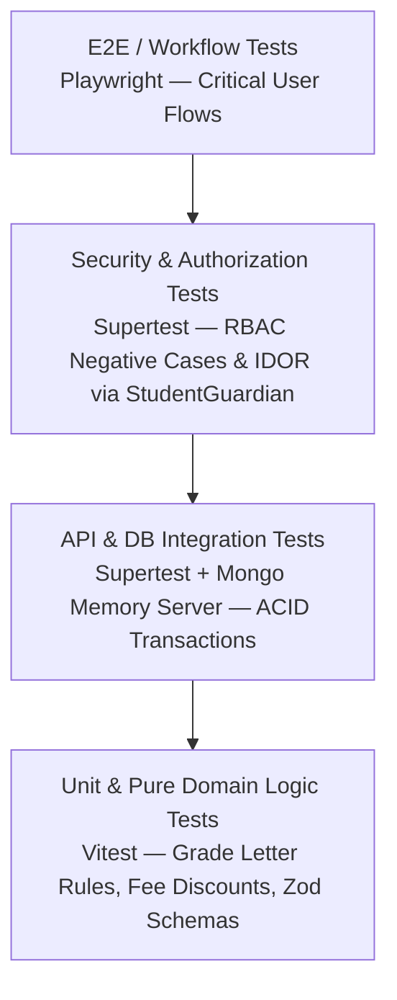

# TESTING & QUALITY ASSURANCE STRATEGY: LITTLE ANGELS SCHOOL

## 1. Testing Pyramid & Quality Philosophy
To guarantee zero regressions in financial records, examination calculations, and multi-role access control, the platform implements a **4-Layer Quality Assurance Pyramid**:

1. **Unit Tests (Vitest)**: Fast, deterministic tests for pure business logic (grade calculations, fee discount formulas, date helpers, Zod validation schemas).
2. **Integration Tests (Vitest + Supertest + MongoMemoryServer)**: Test Express controllers, Mongoose schema constraints, and MongoDB multi-document ACID transactions in isolated memory DB instances.
3. **Security & Authorization Tests (Supertest)**: Dedicated test suite validating positive and negative RBAC / IDOR enforcement rules across all endpoints.
4. **End-to-End (E2E) Workflow Tests (Playwright)**: Browser automation verifying complete cross-actor journeys (Teacher publishing homework -> Parent viewing in portal).

---

## 2. Security & Authorization Test Matrix (High Priority)

A mandatory requirement is testing **Negative Access Cases (Denial of Service & IDOR)** before testing positive success paths.

### 2.1. Mandatory Authorization Test Scenarios
* `TEST-AUTH-001`: **Teacher Class Scope Denial**
  * *Setup*: Authenticate as Teacher A (assigned only to Class 5 - Section A).
  * *Action*: Execute `POST /api/v1/attendance/batch` with payload targeting `Class 8 - Section B`.
  * *Expected Result*: HTTP `403 Forbidden` (`AUTH_SCOPE_FORBIDDEN`).
* `TEST-AUTH-002`: **Parent IDOR Denial via `StudentGuardian`**
  * *Setup*: Authenticate as Guardian A (parent of Student 001 via `StudentGuardian`).
  * *Action*: Execute `GET /api/v1/fees/student/002` (Student 002 is linked only to Guardian B).
  * *Expected Result*: HTTP `403 Forbidden` (`AUTH_SCOPE_FORBIDDEN`).
* `TEST-AUTH-003`: **Student Self-Scope Denial**
  * *Setup*: Authenticate as Student A (`001`).
  * *Action*: Execute `GET /api/v1/exams/101/report-cards/002`.
  * *Expected Result*: HTTP `403 Forbidden`.
* `TEST-AUTH-004`: **Unassigned Subject Teacher Mark Entry Denial**
  * *Setup*: Authenticate as Teacher A (teaches Hindi in Class 10 - Section A).
  * *Action*: Execute `POST /api/v1/exams/midterm/marks` for Mathematics in Class 10 - Section A.
  * *Expected Result*: HTTP `403 Forbidden`.
* `TEST-AUTH-005`: **Multi-Device `RefreshSession` Revocation Test**
  * *Setup*: Authenticate User A on Device 1 and Device 2 (two active `RefreshSession` rows in DB).
  * *Action*: On Device 1, execute `DELETE /api/v1/auth/sessions/:device2SessionId`.
  * *Expected Result*: Device 2's `RefreshSession.isRevoked` becomes `true`. Subsequent attempts by Device 2 to call `/api/v1/auth/refresh` return `401 Unauthorized` (`AUTH_SESSION_REVOKED`).

---

## 3. Critical Business Workflow Test Suites

### 3.1. Homework Lifecycle Workflow (`TEST-FLOW-HW`)
1. **Teacher Action**: Authenticate as Teacher -> Create Homework for assigned Class 6 Math (`POST /api/v1/homework`) -> Assert status is `DRAFT`.
2. **Publish**: Execute `PATCH /api/v1/homework/:id/publish` -> Assert status becomes `PUBLISHED`.
3. **Student View**: Authenticate as Student in Class 6 -> `GET /api/v1/homework` -> Assert published homework is present in feed.
4. **Parent View**: Authenticate as Guardian of Class 6 Student (verified via `StudentGuardian`) -> Assert homework is visible.

### 3.2. Attendance Batch Processing Workflow (`TEST-FLOW-ATT`)
1. **Submit Batch**: Class Teacher submits attendance for 40 students (`38 PRESENT, 2 ABSENT`).
2. **Idempotency / Unique Date Test**: Try submitting a second batch for the same Section and Date -> Assert HTTP `409 Conflict`.
3. **Parent Check**: Guardian of Absent student queries daily attendance -> Asserts status is `ABSENT`.

### 3.3. Examination Grading & Report Card Workflow (`TEST-FLOW-EXAM`)
1. **Create Exam & Rule**: Admin creates `Mid-Term` and configures `GradeRule` (`A+: 90-100%, A: 80-89%, B: 70-79%`).
2. **Teacher Enter Marks**: Teacher submits score `85` for Student 001 in Science.
3. **Compile Results**: Admin executes `POST /api/v1/exams/midterm/compile-results`.
4. **Assert Calculation**: Database asserts Student 001 overall grade is letter `"A"`, percentage is `85%`, and report card status is `DRAFT`.
5. **Publish**: Admin publishes -> Guardian queries report card API -> Asserts compiled PDF download link is accessible.

### 3.4. Fee Billing & Payment Transaction Workflow (`TEST-FLOW-FEE`)
1. **Assign Fee**: Assign `Tuition Fee - INR 5000` to Student 001 (`StudentFee` status is `UNPAID`).
2. **Record Payment**: Staff records offline Cash payment of `INR 5000` (`POST /api/v1/fees/payments`).
3. **Assert Transaction**:
   * Asserts `StudentFee.status` transforms to `PAID`.
   * Asserts `StudentFee.paidAmount` == `5000`.
   * Asserts unique `Receipt` document (`REC-2026-00001`) is generated.
   * Asserts `AuditLog` captures `"FEE_PAYMENT_RECORDED"`.

### 3.5. Academic Promotion Session Wizard (`TEST-FLOW-PROMO`)
1. **Setup**: Student 001 is enrolled in `Session 2025-26, Class 1 - Sec A, roll 15`.
2. **Promote Action**: Principal executes `POST /api/v1/enrollments/promote` to target `Session 2026-27, Class 2 - Sec A, roll 12`.
3. **Assert Historical Preservation**:
   * Querying `Enrollment.findOne({ studentId: 001, academicSessionId: "2025-26" })` returns `Class 1` with status `"PROMOTED"` and links `promotedToEnrollmentId`.
   * Querying `Enrollment.findOne({ studentId: 001, academicSessionId: "2026-27" })` returns `Class 2` with status `"ACTIVE"` and links `previousEnrollmentId`.
   * Student's independent biographical profile (`Student.firstName`, `admissionNumber`) remains unmodified.

### 3.6. Student, Guardian & Enrollment Lifecycle Suite (`TEST-FLOW-STUDENT-ENROLLMENT` - Phase 4)
1. **Admission Number Auto-Generation & Uniqueness**:
   * Create student without admissionNumber -> Asserts sequential `LAPS-{YYYY}-0001` format.
   * Create second student -> Asserts `LAPS-{YYYY}-0002`.
   * Attempt creating student with duplicate `LAPS-{YYYY}-0001` -> Asserts HTTP `409 Conflict`.
2. **Roll Number Auto-Generation & Uniqueness**:
   * Enroll student in `(session, class, section)` without rollNumber -> Asserts roll number `1`.
   * Enroll second student in same section -> Asserts roll number `2`.
   * Attempt duplicate roll number in same section -> Asserts HTTP `409 Conflict`.
3. **Unique Active Enrollment Constraint & Class Teacher Enrichment**:
   * Attempt creating a second active enrollment for the same student in the same academic session -> Asserts HTTP `409 Conflict`.
   * Query `GET /api/v1/enrollments/:id` -> Asserts response dynamically exposes `classTeacher` joined from active `TeachingAssignment` (`isClassTeacher: true`).
4. **Normalized StudentGuardian & Primary Guardian Rule**:
   * Link Father (`isPrimaryGuardian: true`) and Mother (`isPrimaryGuardian: false`) to student -> Asserts two distinct `StudentGuardian` records without embedding in `Student`.
   * Update Mother to `isPrimaryGuardian: true` -> Asserts Father automatically transitions to `isPrimaryGuardian: false`.
5. **Multi-Field Student Search**:
   * Query `GET /api/v1/students?search=FatherName` -> Asserts student returned by joining through `StudentGuardian` -> `Guardian.name`.
   * Query `GET /api/v1/students?search=GuardianPhone` -> Asserts student returned by matching linked guardian's phone number.
6. **Archive Protection Guards & Simplified Student Status**:
   * Attempt archiving a Student with an active enrollment -> Asserts HTTP `400 Bad Request` / `409 Conflict`.
   * Attempt archiving a Guardian who is the sole linked guardian for an active student -> Asserts HTTP `400 Bad Request` / `409 Conflict`.
   * Asserts `Student.status` remains `"ACTIVE"` while lifecycle states (`PROMOTED`, `TRANSFERRED`, `WITHDRAWN`, `ALUMNI`) are tracked exclusively in `Enrollment.enrollmentStatus`.
7. **Transfer & Withdrawal Wizards**:
   * Execute `POST /api/v1/enrollments/:id/transfer` -> Asserts enrollment status `"TRANSFERRED"` with remarks and date.
   * Execute `POST /api/v1/enrollments/:id/withdraw` -> Asserts enrollment status `"WITHDRAWN"`.
8. **RBAC Scope Enforcement**:
   * Authenticate as Teacher -> Read student enrolled in assigned class/section -> Asserts HTTP `200 OK`.
   * Authenticate as Teacher -> Attempt reading student outside assigned sections -> Asserts HTTP `403 Forbidden`.
   * Authenticate as Teacher -> Attempt creating, promoting, transferring, or archiving student -> Asserts HTTP `403 Forbidden`.
