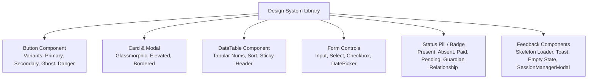

# UI/UX DESIGN SYSTEM SPECIFICATION: LITTLE ANGELS SCHOOL

## 1. Design Philosophy & Aesthetic Direction
The platform implements a unified Design System that serves two distinct audience expectations while sharing a common design token foundation:

1. **Public School Website**:
   * *Aesthetic*: Premium, trustworthy, welcoming, and academically rigorous.
   * *Visual Tone*: Blends subtle warmth suitable for Pre-Primary parents with sleek, professional authority for prospective Class 10 high school students.
   * *Signature Elements*: Deep Academic Blue primary tones, vibrant Amber accents, glassmorphic card overlays, smooth hero transitions, and prominent institutional imagery.

2. **School ERP / SaaS Administration System**:
   * *Aesthetic*: Crisp, high-density SaaS interface designed for rapid administrative productivity.
   * *Visual Tone*: Functional neutrality, high contrast readability, clear data hierarchy, and reduced visual noise.
   * *Signature Elements*: Information-dense data tables, clear status pills/badges, responsive sidebars, skeleton loaders, and contextual slide-over drawers.

---

## 2. Design Tokens: Colors, Typography & Breakpoints

### 2.1. Curated Color Palette (HSL & HEX Tokens)
```css
:root {
  /* Primary Identity: Deep Institutional Academic Navy */
  --color-primary-50:  hsl(215, 80%, 96%);
  --color-primary-500: hsl(218, 72%, 28%); /* #142858 — Primary Brand Navy */
  --color-primary-700: hsl(218, 80%, 18%);
  
  /* Accent Identity: Vibrant Scholastic Amber */
  --color-accent-400:  hsl(38, 92%, 50%);  /* #F59E0B — Call-to-Action / Highlight */
  --color-accent-600:  hsl(38, 92%, 40%);
  
  /* Neutral SaaS Surface & Dark Mode Scales */
  --color-surface-bg:    hsl(210, 20%, 98%); /* #F8FAFC */
  --color-surface-card:  hsl(0, 0%, 100%);   /* #FFFFFF */
  --color-surface-border:hsl(214, 32%, 91%); /* #E2E8F0 */
  
  /* Semantic Status Colors */
  --color-success: hsl(142, 72%, 29%); /* Present / Paid / Approved */
  --color-warning: hsl(38, 92%, 50%);  /* Late / Partial Payment / Pending */
  --color-danger:  hsl(0, 84%, 60%);   /* Absent / Overdue Fee / Defaulter */
  --color-info:    hsl(199, 89%, 48%); /* Leave / Info Notice */
}
```

### 2.2. Typography System (Google Fonts)
* **Headings (`font-heading`)**: `Outfit`, sans-serif. Modern, highly legible geometric sans with warm character curves. Used for hero titles, section headings (`h1` - `h4`), and portal numbers.
* **UI Body & Data Tables (`font-sans`)**: `Inter`, sans-serif. Industry-standard workhorse UI font with excellent tabular digit alignment (`font-variant-numeric: tabular-nums`) for fee amounts and mark sheets.

### 2.3. Responsive Breakpoint Layout Scale
* **Mobile (`< 640px`)**: Single-column vertical layout. Sidebar collapses into an off-canvas slide-over drawer; data tables switch to stacked mobile card views.
* **Tablet (`640px - 1024px`)**: Two-column layouts; portal sidebar collapses to icon-only rail.
* **Desktop (`> 1024px`)**: High-density multi-column SaaS dashboards; expanded sidebar navigation.

---

## 3. Core Component Library Specification



### 3.1. `<DataTable />` Component Contract (ERP Workhorse)
* **Mandatory Features**:
  * Sticky table headers for scrolling through 50+ student rosters.
  * Tabular numeric spacing (`tabular-nums`) so decimal columns align cleanly.
  * Integrated pagination bar (`Page X of Y | Show [20/50/100] rows`).
  * Empty state slot with call-to-action button when no records match filters.
  * Skeleton loader rows (`<TableSkeleton rows={10} />`) during asynchronous fetching.

### 3.2. `<StatusBadge />` & `<GuardianRelationshipBadge />` Semantic Mapping
* **Attendance**: 
  * `Present`: Green pill (`bg-emerald-100 text-emerald-800`)
  * `Absent`: Red pill (`bg-rose-100 text-rose-800`)
  * `Late`: Amber pill (`bg-amber-100 text-amber-800`)
  * `Leave`: Blue pill (`bg-sky-100 text-sky-800`)
* **Fee Status**:
  * `Paid`: Green pill
  * `Partial`: Amber pill
  * `Unpaid / Overdue`: Red pill
* **Guardian Relationship (`StudentGuardian`)**:
  * `Primary Guardian`: Solid deep navy pill (`bg-primary-500 text-white`)
  * `Relationship (Father/Mother/Legal Guardian)`: Outline badge with relationship label.

### 3.3. `<Modal />` & `<ConfirmDialog />` Standard
* Destructive administrative actions (e.g., *Delete Exam*, *Revoke Teaching Assignment*, *Cancel Payment*, *Revoke Remote Session*) MUST trigger a modal confirmation dialog specifying:
  1. Action consequence description.
  2. A red primary confirmation button (`"Confirm Deletion"` or `"Revoke Session"`).
  3. Secondary cancel button.

### 3.4. `<SessionManagerModal />` (Multi-Device Auth Session Inspector)
* An interactive modal allowing users to inspect all active `RefreshSession` rows.
* Displays device OS, browser icon, IP address, and last activity timestamp.
* Includes a destructive `"Revoke Session"` action button per item and a global `"Log out from all other devices"` button.

---

## 4. Responsive Mobile UX Pattern: Table-to-Card Transformation

To ensure parents and teachers can effortlessly check attendance or homework on mobile devices:
* On screens `< 768px`, standard HTML `<table>` elements automatically render as **Responsive Card Lists**.
* Each student row becomes an elevated card with label-value pairs, ensuring touch-friendly buttons for attendance toggling without horizontal scrolling.
